# 3 Sum问题
问题：给定一个整数数组A=[a_1,a_2,....,an]，找出数组中所有的三元组(a,b,c)，满足a+b+c=0三元组不允许重复
例如，(-1,0,1,2,-1,-4)  结果（-1，0，1） （-1，-1，2）

## 2sum热身：
比如这个周末你去参加线下相亲会，全场有且只有两个人才是真爱。于是我们每个人都要去找其他所有人聊天，去寻找 ta 是不是自己要找的另一半。每个人都要和每个人说话，聊聊天; 翻译一下这个过程 O(n^2)。

	public int[] twoSum(int[] arr, int target) {
        for (int i = 0; i < arr.length - 1; i++) {
            //每个人
            for (int j = i + 1; j < arr.length; j++) {
                // 都去问其他的人
                if (arr[i] + arr[j] == target) {
                    return new int[]{arr[i], arr[j]};
                }
            }
        }
        return null;
    }
怎么样可以更高效一点？
这时候要引入哈希表，其实就是一个登记册，写上你的名字和你的要求。如果每个人都提前在主持人那里登记一遍，然后只要大家依次再报出自己名字，主持人就能够识别到，ta 就是你要找的人O(n)

	public int[] twosum2(int[] arr, int target) {
        HashMap<Integer, Integer> integerIntegerHashMap = new HashMap<>();
        // 每个人登记自己想要配对的人，让主持人记住
        for (int i = 0; i < arr.length; i++) {
            integerIntegerHashMap.put(target - arr[i], arr[i]);
        }
        for (int j = 0; j < arr.length; j++) {
            // 每个人再次报数的时候，主持人看一下名单里有没有他
            Integer integer = integerIntegerHashMap.get(arr[j]);
            if (integer != null) {
                return new int[]{integer, arr[j]};
            }
        }
        return null;
    }
    
很容易看出来，上面的方案仍然可以优化。就是每个人都来问一下主持人，自己要找的人有没有来登记过，如果没有的话，就把自己的要求写下来，等着别人来找自己。O(n2)
	 
    public int[] twosum3(int[] arr, int target) {

        HashMap<Integer, Integer> integerIntegerHashMap = new HashMap<>();
        for (int j = 0; j < arr.length; j++) {
            // 每个人报出自己想要配对的人
            Integer integer = integerIntegerHashMap.get(arr[j]);
            if (integer != null) {
                // 如果有人被登记过
                return new int[]{arr[j], integer};
            } else {
                integerIntegerHashMap.put(target - arr[j], arr[j]);
            }
        }
        return null;
    }
2sum 问题最坏的情况是，第一个人和最后一个人配对，每个人都发了一次言。时间复杂度是 O(n)，空间复杂度也是 O(n)，因为主持人要用小本本记录下每个人的发言，最坏的时候，要把所有人的诉求都记一遍。
# 3sum

参加一个街篮比赛，赛前当然要组队啦，现在要想一个方法找到队友。组队还有一个要求，就是队伍的平均身高要符合要求。
我们先想一个保底的办法，再去慢慢优化。最简单的办法是，每个人都去依次拉上另一个人一起去找第三个人，这个时间复杂度是 O(n^3)
		
    public ArrayList<int[]> threeSum(int[] arr) {
        ArrayList<int[]> ints = new ArrayList<>();
        // 每个人
        for (int i = 0; i < arr.length - 2; i++) {
            // 依次拉上其他每个人
            for (int j = i + 1; j < arr.length - 1; j++) {
                // 去问剩下的每个人
                for (int k = j + 1; k < arr.length; k++) {
                    // 我们是不是可以一起组队
                    if (arr[i] + arr[j] + arr[k] == 0) {
                        ints.add(new int[]{arr[i], arr[j], arr[k]});
                    }
                }
            }

        }
        return ints;
    }

# 优化
三个数和的问可转换成两个数和等于-target问题，结合前面的热身，给我时间复杂度为O(n^2)空间复杂度o(n)

	public static HashSet<ResultBean> threeSumHash(int[] arrs) {
        HashSet<ResultBean> resultBeans = new HashSet<>();
        for (int i = 0; i < arrs.length; i++) {
            int tager = arrs[i];
            HashSet<ResultBean> twoSumHashResult = twoSumHash(-tager, arrs, i);
            resultBeans.addAll(twoSumHashResult);
        }
        return resultBeans;
    }
    
    
	public static HashSet<ResultBean> twoSumHash(int targer, int[] arr, int skip) {
        HashSet<ResultBean> resultBeans = new HashSet<>();
        HashMap<Integer, Integer> integerIntegerHashMap = new HashMap<>();
        for (int j = 0; j < arr.length; j++) {
            if (skip == j) {
                continue;
            }

            // 每个人报出自己想要配对的人
            Integer integer = integerIntegerHashMap.get(arr[j]);
            if (integer != null) {
                // 如果有人被登记过

                ResultBean resultBean = new ResultBean(new int[]{arr[j], integer, -targer});
                resultBeans.add(resultBean);
            } else {
                integerIntegerHashMap.put(targer - arr[j], arr[j]);
            }
        }
        return resultBeans;

    }

    

# 再优化
现在已经想到了可用的通用方案，根据题目的特点，看看还有哪里可以做一些优化。比如提前结束一些不可能的组合。
首先安排所有人按照顺序排队站好，这是一个需要花时间的操作，不过磨刀不误砍柴工，付出这个时间还是值得的。排序可以做到O(nlogn)，这是优于 O(n^2)的。这个就可以排除掉一些不可能的组合

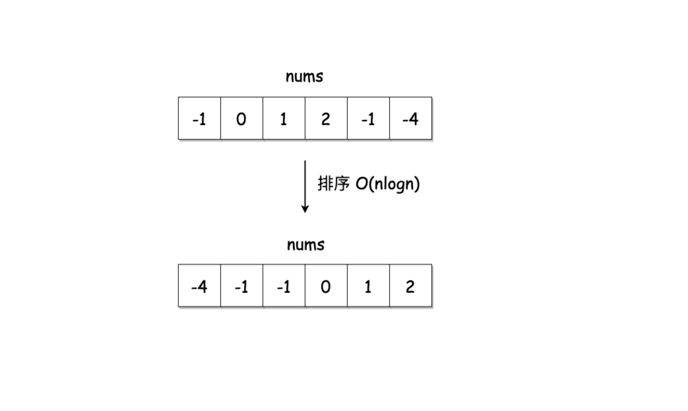

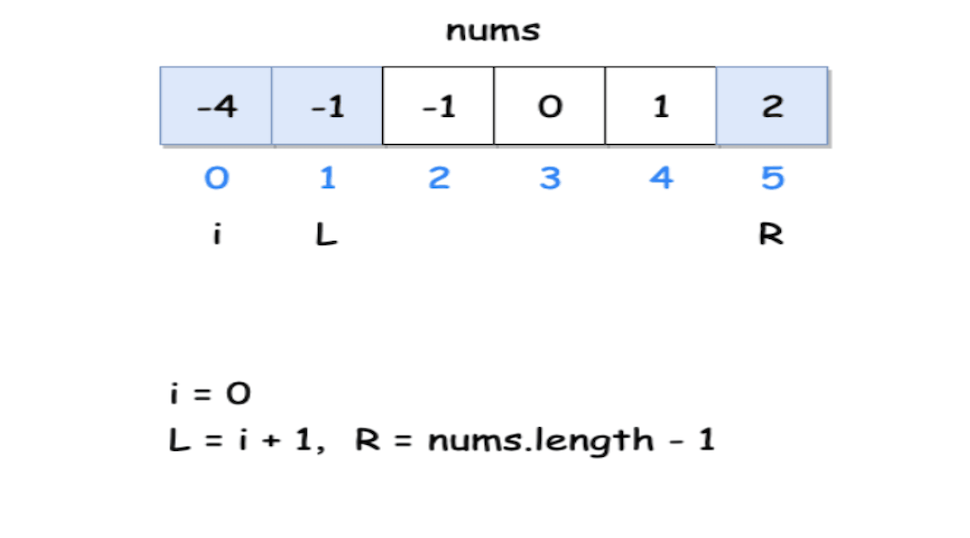
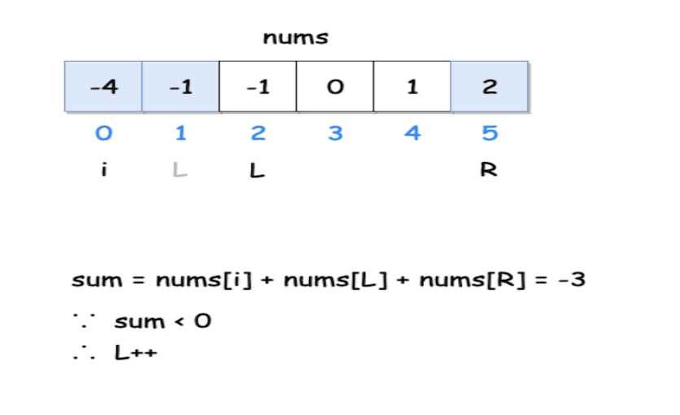
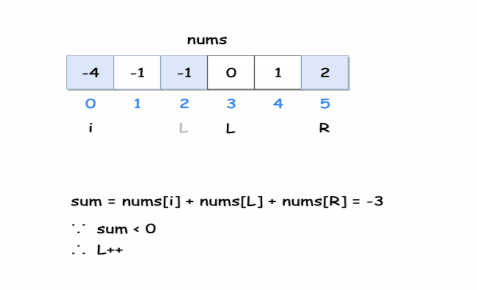
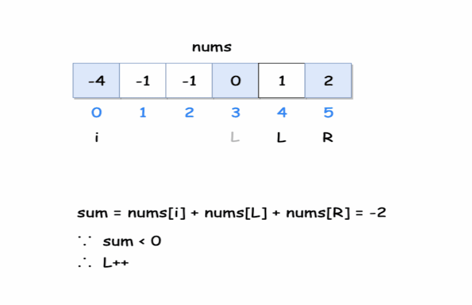
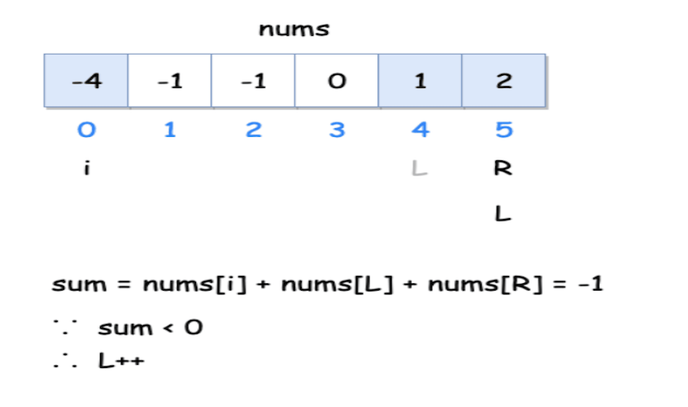
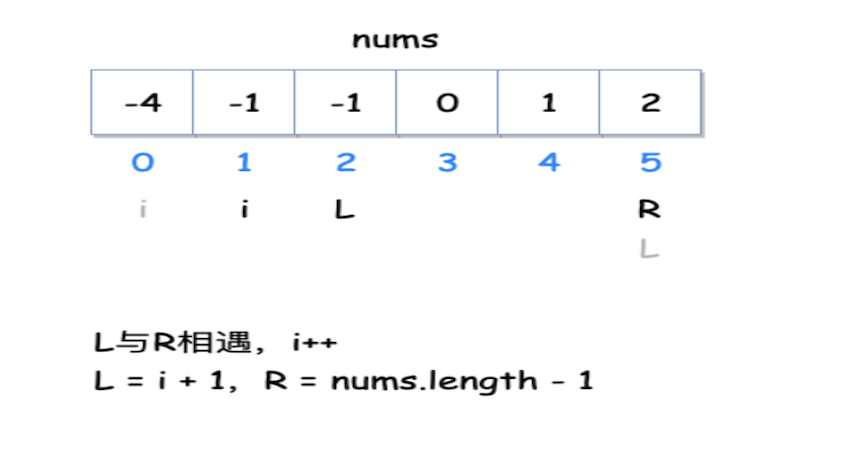
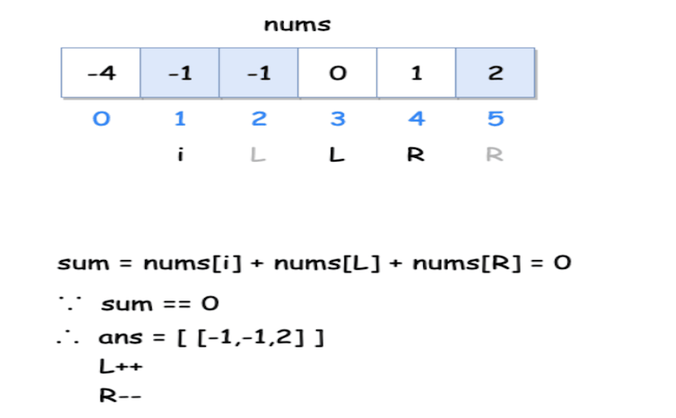
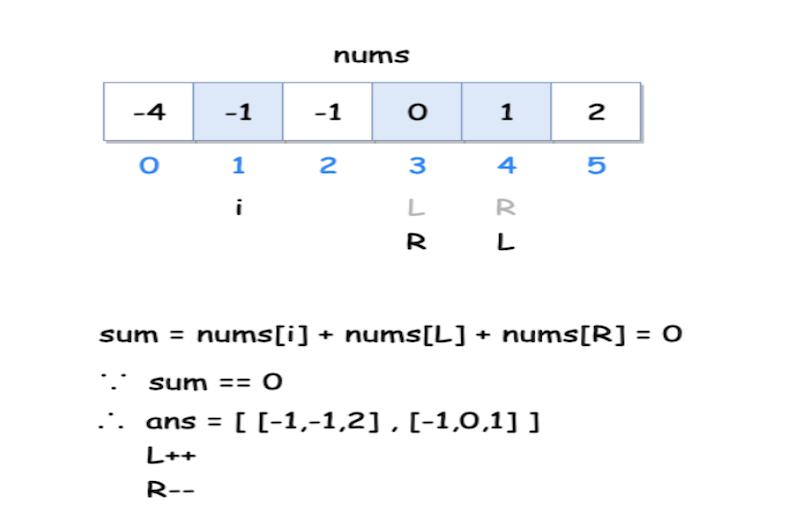
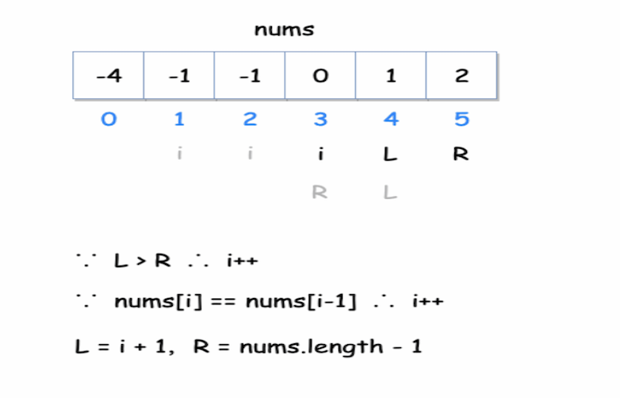
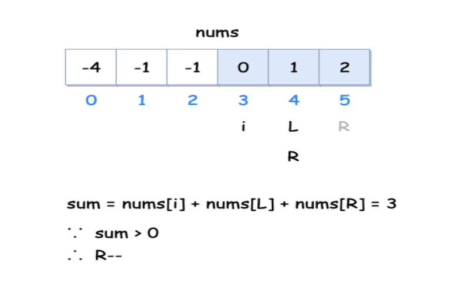

	   public static ArrayList<ResultBean> threeSum1(int[] nums) {
        ArrayList<ResultBean> result = new ArrayList<ResultBean>();
        if (nums.length < 3) {

            return result;
        }
        Arrays.sort(nums);
        for (int i = 0; i < nums.length; i++) {
            if (i > 0 && nums[i] == nums[i - 1]) {
                continue;  //选定nums[i]为第一个数，并去重
            }
            int left = i + 1;
            int right = nums.length - 1;
            while (right > left) {
                int sum = nums[i] + nums[left] + nums[right];
                if (sum == 0) {
                    ResultBean resultBean = new ResultBean(new int[]{nums[i], nums[left], nums[right]});
                    result.add(resultBean);
                    while (left < right && nums[left] == nums[left + 1]) {
                        left++;  //去重
                    }
                    while (left + 1 < right && nums[right] == nums[right - 1]) {
                        right--;
                    }
                }
                if (sum <= 0) {
                    left++;
                } else {
                    right--;
                }
            }
        }
        return result;

    }

	
# 还可以优化的地方
### 优化1: 整个数组同符号，则无解
### 优化2: 最左值为正数则一定无解
### 优化3: 三人同符号，则退出

 	public static ArrayList<ResultBean> threeSum2(int[] nums) {
        ArrayList<ResultBean> result = new ArrayList<ResultBean>();
        if (nums.length < 3) {

            return result;
        }
        Arrays.sort(nums);
        // 优化1: 整个数组同符号，则无解
        if (nums[0] * nums[nums.length - 1] > 0) {
            return result;
        }
        for (int i = 0; i < nums.length; i++) {
            // 优化2: 最左值为正数则一定无解
            if (i > 0 && nums[i] == nums[i - 1] || nums[i] > 0) {
                continue;  //选定nums[i]为第一个数，并去重
            }
            int left = i + 1;
            int right = nums.length - 1;
            while (right > left) {
                if (nums[i] * nums[right] > 0) {
                    break;// 优化3: 三人同符号，则退出
                }
                int sum = nums[i] + nums[left] + nums[right];
                if (sum == 0) {
                    ResultBean resultBean = new ResultBean(new int[]{nums[i], nums[left], nums[right]});
                    result.add(resultBean);
                    while (left < right && nums[left] == nums[left + 1]) {
                        left++;  //去重
                    }
                    while (left + 1 < right && nums[right] == nums[right - 1]) {
                        right--;
                    }
                }
                if (sum <= 0) {
                    left++;
                } else {
                    right--;
                }
            }
        }
        return result;

    }
		

[代码地址](../../code/3sum/Solution.java)

	

                                                                                                                    
