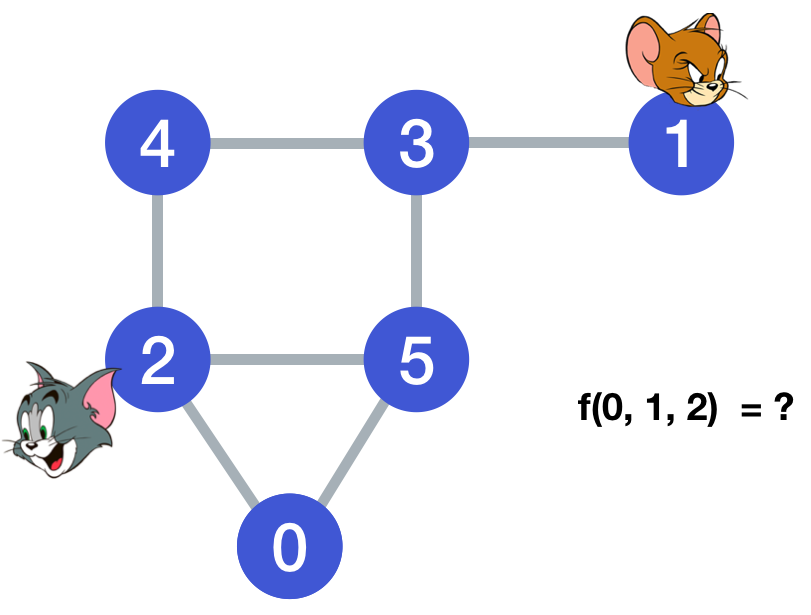
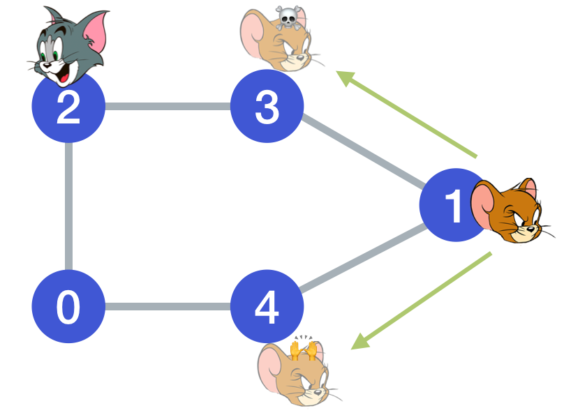
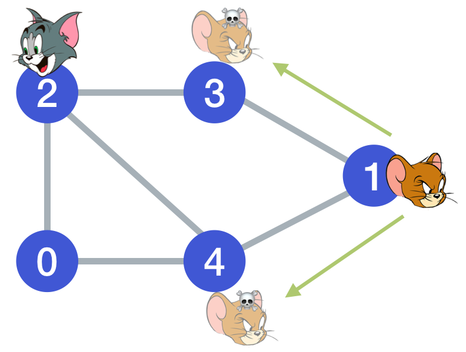
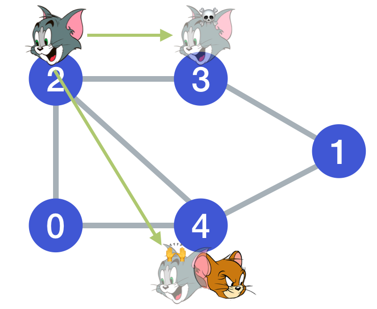
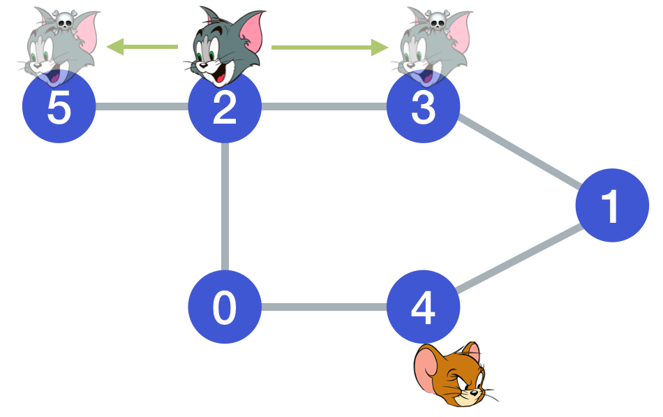
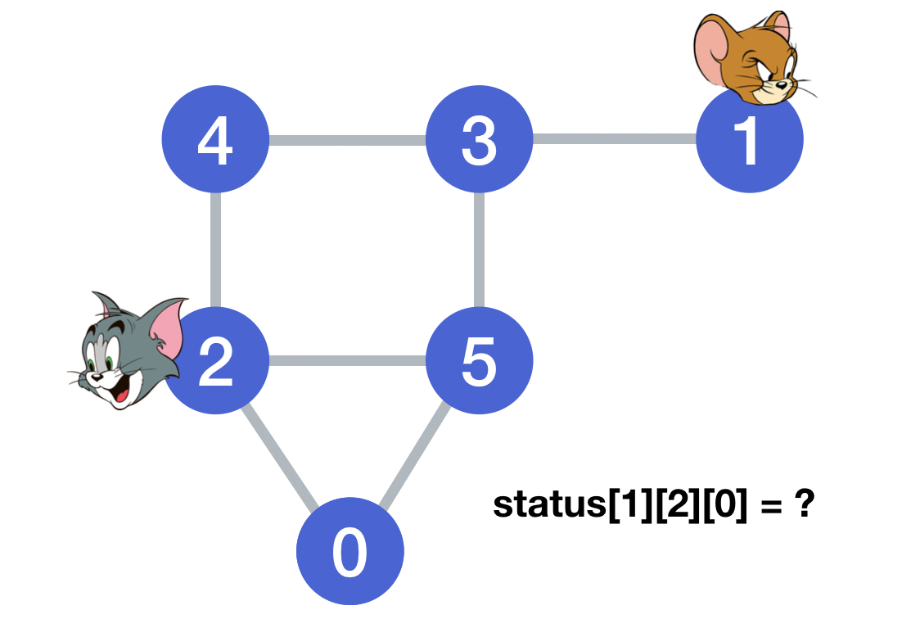
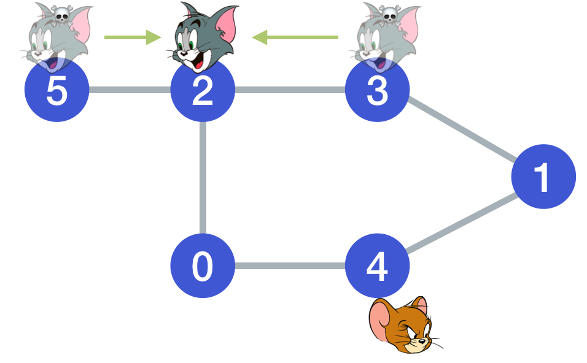

**【Cat and Mouse】**A game on an **undirected** graph is played by two players, Mouse and Cat, who alternate turns.

The graph is given as follows: `graph[a]` is a list of all nodes `b` such that `ab` is an edge of the graph.

Mouse starts at node 1 and goes first, Cat starts at node 2 and goes second, and there is a Hole at node 0.

During each player's turn, they **must** travel along one edge of the graph that meets where they are. For example, if the Mouse is at node `1`, it **must** travel to any node in `graph[1]`.

Additionally, it is not allowed for the Cat to travel to the Hole (node 0.)

Then, the game can end in 3 ways:

- If ever the Cat occupies the same node as the Mouse, the Cat wins.
- If ever the Mouse reaches the Hole, the Mouse wins.
- If ever a position is repeated (ie. the players are in the same position as a previous turn, and it is the same player's turn to move), the game is a draw.

Given a `graph`, and assuming both players play optimally, return `1` if the game is won by Mouse, `2` if the game is won by Cat, and `0` if the game is a draw.

**Example 1:**

```
Input: [[2,5],[3],[0,4,5],[1,4,5],[2,3],[0,2,3]]
Output: 0
Explanation:
4---3---1
|   |
2---5
 \ /
  0
```


##中文版：

两个玩家分别扮演猫（Cat）和老鼠（Mouse）在无向图上进行游戏，他们轮流行动。

该图按下述规则给出：graph[a] 是所有结点 b 的列表，使得 ab 是图的一条边。

老鼠从结点 1 开始并率先出发，猫从结点 2 开始且随后出发，在结点 0 处有一个洞。

在每个玩家的回合中，他们必须沿着与他们所在位置相吻合的图的一条边移动。例如，如果老鼠位于结点 1，那么它只能移动到 graph[1] 中的（任何）结点去。

此外，猫无法移动到洞（结点 0）里。

然后，游戏在出现以下三种情形之一时结束：

- 如果猫和老鼠占据相同的结点，猫获胜。
- 如果老鼠躲入洞里，老鼠获胜。
- 如果某一位置重复出现（即，玩家们的位置和移动顺序都与上一个回合相同），游戏平局。

给定 graph，并假设两个玩家都以最佳状态参与游戏，如果老鼠获胜，则返回 1；如果猫获胜，则返回 2；如果平局，则返回 0。

```
输入: [[2,5],[3],[0,4,5],[1,4,5],[2,3],[0,2,3]]
输出: 0
解释:
4---3---1
|   |
2---5
 \ /
  0
```

注意：

- 3 <= graph.length <= 50
- 保证 graph[1] 非空。
- 保证 graph[2] 包含非 0 元素。

##解法一： 记忆化搜索 (DP)

解法一的总体思路的通过下一点状态推测当前点的状态。

设状态 dp(t, x, y) 表示 t 时刻，鼠位于 x 且猫位于 y 时的结果（0，1 或 2)，t = 0, 2, 4, ... 时鼠行动，t = 1, 3, 5, ... 时猫行动。最后我们需要求出 dp(0, 1, 2) 作为答案。



1. 若当前为鼠走, 依次判断鼠每个下个点 dp(t+1, graph\[x], y) 的状态：：

   1. 若存在一个点结果为 1，那么一定是鼠赢，返回 dp(t, x, y) = 1

      

   2. 若所有点结果都为 2，那么一定是猫赢，返回 dp(t, x, y) = 2

      

   3. 否值是平局，返回 dp(t, x, y) = 0

      

1. 若当前为猫走, 依次判断猫每个下个点 dp(t+1, x, graph\[y]) 的状态：

   1. 若存在一个点结果为 2，那么一定是猫赢，返回 dp(t, x, y) = 2

      

   2. 若所有点结果都为 1，那么一定是鼠赢，返回 dp(t, x, y) = 1

      

   3. 否值是平局，返回 dp(t, x, y) = 0

我们已经知道的状态有:

1. dp(t, 0, y) = 1: 鼠赢
2. dp(t, x, x) = 2: 猫赢
3. 若游戏进行了 2n 个单位时间还没有结束，则可以宣布平局（ 证明：鼠最多需要 n 步就可以到达洞，所以鼠和猫加起来最多进行 2n 个单位时间就可以决定结果，否则一定有重复，重复就代表平局，因为鼠和猫的选择都是理想的，不存在重复 ）。

代码如下：

```swift
class Solution {
    var dp : [[[Int]]] = [[[Int]]]()  // Java: int[][][]

    func catMouseGame(_ graph: [[Int]]) -> Int {
        let len = graph.count
        dp = Array(repeating: Array(repeating: Array(repeating: -1, count: len), count: len), count: 2 * len)  // Java: int[2*n][n][n]
        return seach(graph: graph, t: 0, x: 1, y: 2)
    }
    
    func seach(graph: [[Int]], t: Int, x: Int, y: Int) -> Int{
        if t == graph.count * 2 { return 0 }
        if x == y { dp[t][x][y] = 2; return dp[t][x][y] }
        if x == 0 { dp[t][x][y] = 1; return dp[t][x][y] }
        if dp[t][x][y] != -1 { return dp[t][x][y] }
        let who = t % 2
        var flag: Bool
        if who == 0 {  // mouse's turn
            flag = true  // by default, is cat win
            for next in graph[x] {
                let nextVal = seach(graph: graph, t: t + 1, x: next, y: y)
                if nextVal == 1 {
                    dp[t][x][y] = 1; return dp[t][x][y]
                } else if nextVal != 2 {
                    flag = false
                }
            }
            if flag {
                dp[t][x][y] = 2; return dp[t][x][y]
            } else {
                dp[t][x][y] = 0; return dp[t][x][y]
            }
        } else {  // cat's turn
            flag = true  // by default, is mouse win
            for next in graph[y] where next != 0 {
                let nextVal = seach(graph: graph, t: t + 1, x: x, y: next)
                if nextVal == 2 {
                    dp[t][x][y] = 2; return dp[t][x][y]
                } else if nextVal != 1 {
                    flag = false
                }
            }
            if flag {
                dp[t][x][y] = 1; return dp[t][x][y]
            } else {
                dp[t][x][y] = 0; return dp[t][x][y]
            }
        }
    }
}
```

时间复杂度：O(n^3), 因为状态数为 O(n^3)，

空间复杂度：O(n^3)

## 解法二： 广度优先搜索 (BFS)

解法二的总体思想是通过已知状态推出未知的状态

假设status\[i]\[j][k]是一个三维矩阵，表示状态转移，其中：
- i 表示鼠的节点 ( i <= graph.count );
- j 表示猫的节点 ( j <= graph.count );
- k 表示该谁行动 ( 0: 鼠行动, 1: 猫行动 );
- status\[i]\[j][k] 如果值为 0，表示默认值，平局；如果值为 1 表示鼠胜；如果值为 2 表示猫胜



由规则可知，初始状态下可以确定的非平局状态有：

- status[0]\[j][k] = 1；此刻鼠在洞里，鼠胜
- status\[i]\[i][k] = 2, i != 0；此刻猫鼠同位，猫胜
- status\[i]\[0][k] 猫在洞里，不存在的状态。

由已知状态倒推之前的可能性：

1. 对于节点 status\[i]\[j][0] 来说，此时轮到鼠行动，上一步轮到猫行动：

   1. 如果 status\[i]\[j][0] = 1，即此步鼠胜。则对于能一步到达该状态的每一个可能的上一步状态 status\[i]\[graph\[j]][1] 来说，如果该“上一步状态”的所有下一步状态（包括 status\[i]\[j][0]）都是鼠胜，则该“上一步状态”一定是鼠胜。

      

   2. 如果 status\[i]\[j][0] = 2，即此步猫胜。则对于能一步到达该状态的所有可能的上一步状态 status\[i]\[graph\[j]][1] 都为 2，即上一步猫已经完全锁定胜局。
   
      
   
   3. 如果 status\[i]\[j][0] = 0，即此步未知（平局），则无法对上一步状态进行判断。
2. 对于节点 status\[i]\[j][1] 来说，此时轮到猫行动，上一步轮到鼠行动：
  
  1. 如果 status\[i]\[j][1] = 1，即此步鼠胜。则对于能一步到达该状态的所有可能的上一步状态 status\[graph\[i]]\[j][0] 来说，值都为1，即上一步鼠已经完全锁定胜局。
  
  2. 如果 status\[i]\[j][1] = 2，即此步猫胜。则对于能一步到达该状态的每一个可能的上一步状态status\[graph\[i]]\[j][0]来说，如果该“上一步状态”的所有下一步状态（包括status\[i]\[j][1]）都是猫胜，则该“上一步状态”一定是猫胜。
  
  3. 如果 status\[i]\[j][1] = 0，即此步未知（平局），则无法对上一步状态进行判断。
    

可以设置一队列(广度优先)，将所有非平局状态全部塞入，然后遍历每个队列元素，如果根据该元素能够判断其上一步状态的胜负，则将其上一步状态推入队列，否则出队列。如此循环往复，直到队列为空为止。

代码如下：

```swift
class Solution {    
    func catMouseGame(_ graph: [[Int]]) -> Int {
        let len = graph.count
        var status: [[[Int]]] = Array(repeating: Array(repeating: [0, 0], count: len), count: len)
        var queue = Queue<State>()

        // 初始化
        for j in 1 ..< len {
            status[0][j][0] = 1
            status[0][j][1] = 1
            queue.enqueue(State(i: 0, j: j, k: 0, val: 1))
            queue.enqueue(State(i: 0, j: j, k: 1, val: 1))
        }

        for i in 1 ..< len {
            status[i][i][0] = 2
            status[i][i][1] = 2
            queue.enqueue(State(i: i, j: i, k: 0, val: 2))
            queue.enqueue(State(i: i, j: i, k: 1, val: 2))
        }

        // 遍历 queue

        while !queue.isEmpty {
            let s = queue.dequeue()!
            let (i, j, k, val) = (s.i, s.j, s.k, s.val)
            if k == 0 { // 1. 此步轮到鼠行动
                if val == 1 { // 1.1 此步鼠胜
                    for pre in graph[j] {
                        var mouseWin = true
                        for preNext in graph[pre] {
                            if status[i][preNext][0] != 1 && preNext != 0 {
                                mouseWin = false
                                break
                            }
                        }
                        if mouseWin && status[i][pre][1] == 0 && pre != 0 {
                            status[i][pre][1] = 1
                            queue.enqueue(State(i: i, j: pre, k: 1, val: 1))
                        }
                    }
                } else { // 1.2 此步猫胜
                    for pre in graph[j] {
                        if status[i][pre][1] == 0 && pre != 0 {
                            status[i][pre][1] = 2
                            queue.enqueue(State(i: i, j: pre, k: 1, val: 2))
                        }
                    }
                }
            } else { // 2. 此步轮到猫行动
                if val == 1 { // 2.1 此步鼠胜
                    for pre in graph[i] {
                        if status[pre][j][0] == 0 && j != 0 {
                            status[pre][j][0] = 1
                            queue.enqueue(State(i: pre, j: j, k: 0, val: 1))
                        }
                    }
                } else { // 2.2 此步猫胜
                    for pre in graph[i] {
                        var catWin = true
                        for preNext in graph[pre] {
                            if status[preNext][j][1] != 2 && j != 0 {
                                catWin = false
                                break
                            }
                        }
                        if catWin && status[pre][j][0] == 0 && j != 0 {
                            status[pre][j][0] = 2
                            queue.enqueue(State(i: pre, j: j, k: 0, val: 2))
                        }
                    }
                }
            }
        }
        return status[1][2][0]
    }
}

struct State {
    var i, j, k, val: Int
}

public struct Queue<T> {
    fileprivate var array = [T?]()
    fileprivate var head = 0

    public var isEmpty: Bool {
        return count == 0
    }

    public var count: Int {
        return array.count - head
    }

    public mutating func enqueue(_ element: T) {
        array.append(element)
    }

    public mutating func dequeue() -> T? {
        guard head < array.count, let element = array[head] else { return nil }

        array[head] = nil
        head += 1

        let percentage = Double(head) / Double(array.count)
        if array.count > 50 && percentage > 0.25 {
            array.removeFirst(head)
            head = 0
        }

        return element
    }

    public var front: T? {
        if isEmpty {
            return nil
        } else {
            return array[head]
        }
    }
}
```

时间复杂度：O(n^3), 这里 n 代表 graph 中节点的数量。 因为这里有 O(n^2) 种状态，每种状态最多有 n 种转移的可能

空间复杂度：O(n^3), 队列可能最多存 O(n^2) 种状态，每种状态最多有 n 种转移的可能

##解法三： 深度优先搜索 (DFS)

思想和解法一完全一样，不同的是，我们这里用一栈(深度优先)，将所有非平局状态全部塞入，然后遍历每个队列元素，如果根据该元素能够判断其上一步状态的胜负，则将其上一步状态推入栈，否则出栈。如此循环往复，直到队列为空为止。

代码如下：

```swift
class Solution {
    func catMouseGame(_ graph: [[Int]]) -> Int {
        let len = graph.count
        var status: [[[Int]]] = Array(repeating: Array(repeating: [0, 0], count: len), count: len)
        var stack = Stack<State>()

        // 初始化
        for j in 1 ..< len {
            status[0][j][0] = 1
            status[0][j][1] = 1
            stack.push(State(i: 0, j: j, k: 0, val: 1))
            stack.push(State(i: 0, j: j, k: 1, val: 1))
        }

        for i in 1 ..< len {
            status[i][i][0] = 2
            status[i][i][1] = 2
            stack.push(State(i: i, j: i, k: 0, val: 2))
            stack.push(State(i: i, j: i, k: 1, val: 2))
        }

        // 遍历 queue

        while !stack.isEmpty {
            let s = stack.pop()!
            let (i, j, k, val) = (s.i, s.j, s.k, s.val)
            if k == 0 { // 1. 此步轮到鼠行动
                if val == 1 { // 1.1 此步鼠胜
                    for pre in graph[j] {
                        var mouseWin = true
                        for preNext in graph[pre] {
                            if status[i][preNext][0] != 1 && preNext != 0 {
                                mouseWin = false
                                break
                            }
                        }
                        if mouseWin && status[i][pre][1] == 0 && pre != 0 {
                            status[i][pre][1] = 1
                            stack.push(State(i: i, j: pre, k: 1, val: 1))
                        }
                    }
                } else { // 1.2 此步猫胜
                    for pre in graph[j] {
                        if status[i][pre][1] == 0 && pre != 0 {
                            status[i][pre][1] = 2
                            stack.push(State(i: i, j: pre, k: 1, val: 2))
                        }
                    }
                }
            } else { // 2. 此步轮到猫行动
                if val == 1 { // 2.1 此步鼠胜
                    for pre in graph[i] {
                        if status[pre][j][0] == 0 && j != 0 {
                            status[pre][j][0] = 1
                            stack.push(State(i: pre, j: j, k: 0, val: 1))
                        }
                    }
                } else { // 2.2 此步猫胜
                    for pre in graph[i] {
                        var catWin = true
                        for preNext in graph[pre] {
                            if status[preNext][j][1] != 2 && j != 0 {
                                catWin = false
                                break
                            }
                        }
                        if catWin && status[pre][j][0] == 0 && j != 0 {
                            status[pre][j][0] = 2
                            stack.push(State(i: pre, j: j, k: 0, val: 2))
                        }
                    }
                }
            }
        }
        return status[1][2][0]
    }
}

struct State {
    var i, j, k, val: Int
}

public struct Stack<T> {
    fileprivate var array = [T]()

    public var isEmpty: Bool {
        return array.isEmpty
    }

    public var count: Int {
        return array.count
    }

    public mutating func push(_ element: T) {
        array.append(element)
    }

    public mutating func pop() -> T? {
        return array.popLast()
    }

    public var top: T? {
        return array.last
    }
}
```

时间复杂度：O(n^3), 这里 n 代表 graph 中节点的数量。 因为这里有 O(n^2) 种状态，每种状态最多有 n 种转移的可能

空间复杂度：O(n^3), 栈可能最多存 O(n^2) 种状态，每种状态最多有 n 种转移的可能

## 总结

三种解法总结如下：

|    解法    | 解法一：记忆化搜索 | 解法二：广度优先搜索 | 解法三：深度优先搜索 |
| :--------: | :----------------: | :------------------: | :------------------: |
|    思想    |     空间换时间     |      已知推未知      |      已知推未知      |
|  实现方法  |         DP         |       BFS + DP       |       DFS + DP       |
| 时间复杂度 |       O(n^3)       |        O(n^3)        |        O(n^3)        |
| 空间复杂度 |       O(n^3)       |        O(n^3)        |        O(n^3)        |

