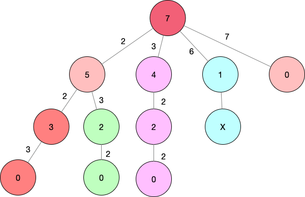

## Combination Sum

### 问题描述

给定一个整数数组和一个目标数字，找出所有独特的组合，使得每一个组合的和为目标数字。

例如：

```
对于数组[2,3,6,7]，目标数字7，可能的组合项为：
[
	[7],
	[2,3,3]
]
```

我们首先给出问题点：

1. 每个组合的和为目标数值

2. 组合是不重复的

然后根据这两个点来解决

### 解决思路

#### 方法一 ——— 暴力法(brute force enumeration)

这个想法很直观，枚举每一个可能的组合，然后检验枚举的结果。这个方法是最直观的，算法的时间复杂度是$O(2^n)$ 。这个时间复杂度的证明是很简单的，运用加法原理，可以如下直接计算出来
$$
C^1_n + C^2_n + \cdots + C^n_n = 2^n - 1
$$
上面的公式中的每一项就是著名的***二项式系数***

这个方法我们就不具体的展开了

#### 方法二——— 回溯法(backtrace)

这个方法属于一个优化的暴力解法，对于不满足条件的情况会停止下面的搜索。这样子就不用每一种都进行搜索了。

对于本例这个问题而言，我们可以随便选择一个数字A，然后求出来目标值T减去我们所选择的值D，即
$$
D = T - A
$$
然后问题就变成了，在给定的数组中找到独特的组合，使得每一个组合的和为D。我们发现，这个问题就是我们要解决的问题。对于这种子问题还是原问题本身的问题，很自然的就想到了递归的解决方案。那么如何直观的表示递归呢？树是一个很好的表示递归的工具，因为树既有层级（深度），也有循环（广度），所以是很适合表示递归的方法。



<center>图1</center>

可以看到，root是给定的目标数值，我们可以循环递归的查找，并且记录每一步所采用的数值，如果找到了一个符合要求的路径，那么就将该路径保存下来，作为一个组合选项。

我们知道，对于递归函数，终止条件以及每一步的操作逻辑是很重要的一点，那我们接下来就找出这个函数的终止条件。

我们可以从图1中看出来，终止条件有两个：

1. 结果为0
2. 结果小于0

其中，结果为0时接受的条件，结果小于0是拒绝的条件，结果大于0就继续进行。

之间的每一步操作就是，将这一步的结果放到一个容器中，然后递归，递归结束之后，弹出本步压入的数据。

上面的步骤解决的只是，找到了可选的路径，但是并没有保证没有重复性。我们以7—>5—>3—>0路径和7—>5—>2—>0路径作为对比，可以看到这两个路径所产生的候选组合是一样的。都是[2,2,3]的组合，只不过是两种不同的排列。如果熟悉排列与组合的区别的话，那么这个问题就很好解决了。这也是为什么强调数学在编程中很重要的原因。

排列是组合按照一定的次序所输出的一个序列，所以，我们这里为了排重，就可以取某一个特定的排列，那么就能做到排除重复。简单的一个排列规则就是按照从小到大的原则。

那么我们在终止条件上加上一条，如果当前的index比上一个index小的话，那么就进行下一次循环。

##### 扩展

我们对这个具体问题进行抽象一下，可以得出回溯法的pseudo code

定义：

* P：问题
* c: 候选项
* root(P)：产生根节点的候选项
* reject(P,c)：对于问题P，候选项c被拒绝

* accept(P,c)：对于问题P，候选项c被接受

* first(P,c): 对于问题P，产生第一个候选项的扩展

* next(P,s)：对于问题P，产生下一个基于候选项s的扩展
* output(P,c)：输出问题的一个解决方案

那么对于回溯问题P，可解决的方案是：

bt(root(P))

其中，bt的定义是：

```pseudocode
bt(c)
	if reject(P,c) then return; //backtracking
	if accept(P,c) then output(c);
	s = first(P,c)
	while s != null do
		bt(s)
    	s = next(P,s)
```

#### 方法三——— 动态规划(DP)

待定