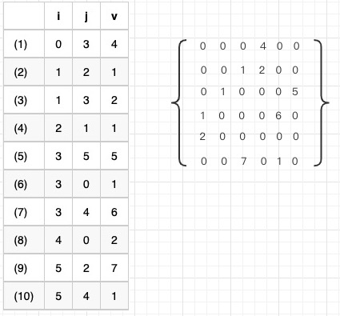
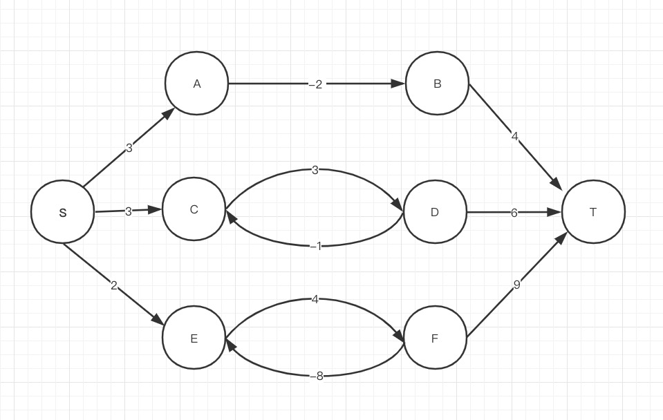

# 单源最短路径   
## 介绍   
给定一个带权有向图G(V,E)=Vertex(顶点集合)+Edge(边集合)，其中每条边的权是一个实数。另外，还给定一个顶点称为源。现在要计算从源到其他所有各顶点的最短路径长度。这里的长度就是指路上各边权之和。这个问题通常称为单源最短路径问题。

## 有向图  
是指一个有序三元组为关联函数.  

## 三元组  
三元组表:主要是用来存储稀疏矩阵的一种压缩方式,假设以顺序存储结构来表示三元组表，则得到稀疏矩阵的一种压缩存储方式，即三元组顺序表，如下图





## 环路 



一条最短路径是不可能包含环路的。环路包含两种情况:    
一种是负环路，它的最短路径为无限小，因为S、E、F、T的环路中，可以无限循环E、T，那么权重值可以无限降低。   
最短路径也不可能包含正环路的，比如S、C、D、T的路径，不可能重复C、T，因为这样会增加路径的距离，完全可以减去正环路。   
所以，最小路径中是不包含环路的


## 松驰操作  

对边集合 E 中任意边，以 w(u,v) 表示顶点 u 出发到顶点 v 的边的权值，以 d[v] 表示当前从起点 s 到顶点 v 的路径权值，初始把d[v]设置为无限大，并设置任意节点的前驱节点为空。

```java   
   public void init_single_source(List<Vertex> list, Vertex s){
    for (Vertex vertex : list) {
        vertex.d = Integer.MAX_VALUE;//最短权值
        vertex.pre = null;//前驱节点
    }
    s.d = 0;
}
   
```

若存在边 w(u,v)，使得：

					d[v] > d[u]+w(u,v)

则更新 d[v] 值：


```java   
 public void relax(Vertex u, Vertex v, int w){
    if (v.d > u.d + w) {
        v.d = u.d + w;
        v.pre = u;
    }
}
   
```

就是比较当前节点和前驱节点。如果前驱节点 d 加上边的权重值少于本节点的 d 值，则更新本节点 d 值。


## 求单源最短路径算法
Bellman-Ford算法将对每一条边进行松弛操作，共进行 v-1 次；本算法将会返回一个布尔值，布尔值的作用是判断该图中是否存在负权回路，若该布尔值为true则存在负权回路，那么问题无解，否则问题有解。


