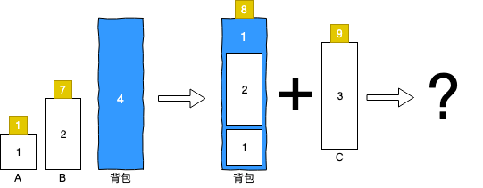

# 动态规划--0/1背包问题

## 介绍

给定**N个物品**，每个物品有**重量W**和**价值V**，你有一个能**装重量M的背包**，问怎么装使得**携带价值最大**，并且每个物品只有一个。

**上面这个题干有以下这些故事：**

* 山洞的宝藏
* 超市大赢家
* RPG游戏回城卖垃圾

直观上，我们直观上会以贪心策略来求解这道题，所谓**携带价值最大**，实际上就是找性价比最高的一些东西塞包里面，这里性价比就是**价值/重量**，如果去抢商场，当然是去洗劫珠宝店，不然去抢超市，捎上两斤白菜么？

但是，贪心策略给出的结论不一定是最优解，比如给出下面这个清单，尝试使用贪心策略来装货试试。

| 编号 | 价值 | 重量 | 性价比 |
| :--: | :--: | :--: | :--: |
|  A   |  9   |  3   |   3    |
|  B   |  7   |  2   |  3.5   |
|  C   |  1   |  1   |   1   |

现在给定一个负重为3的背包，从性价比的倒序排列，先把性价比最高的B先塞包里，然后再拿个C填剩下的空缺。但是这个明显不是最优策略，就拿一个A的价值是最高的。

| 组合 | 重量 | 价值 |
| :--: | :--: | :--: |
| B+C  | 3    | 8    |
| A    | 3    | 9    |

对于最优解，怎么做？

## 最优解

还是前面这个例子，我们先做一个穷举求解，对于很多人而言，没有什么是不能暴力的，如果不能，加机器 =,=

|  idx  | ABC  |   重量    |   价值   |
| :--: | :--: | :-------: | :------: |
| 0 | 000  | 0+0+0 = 0 | 0+0+0 = 0  |
| 1 | 001  |  0+0+1 = 1  | 0+0+1 = 1  |
| 2 | 010  |  0+2+0 = 2  | 0+7+0 = 7  |
| 3 | 011  |  0+2+1 = 3  | 0+7+1 = 8  |
| 4 | 100  |  3+0+0 = 3  | 9+0+0 = 9  |
| 5 | 101  |  3+0+1 = 4  | 9+0+1 = 10 |
| 6 | 110  |  3+2+0 = 5  | 9+7+0 = 16 |
| 7 | 111  |  3+2+1 = 6  | 9+7+1 = 17 |

3个物品跑了8次，40个物品得计算1 0995 1162 7776次。一桌子的东西出个方案给算了一年，废物！

**我们来优化一下。**

大家应该看出来很多计算压根就是多余的，比如第5个101就已经不用计算了，第4个就已经把包装满了。

下面这个张图是对前面表格计算的优化，在是否添加下一个物品的时候添加一条判断策略：**添加的物品是否已经超重**。

## 动态规划

动态规划有个基本思考方法，是将大问题拆解，对解空间的“所有”方案进行了比对，并分阶段去决策处理，通过对过程进行"剪枝"，实现优化。

0/1背包问题好像符合动态规划的基本特征：有分支处理，有重复处理，搜索最优解；这里需要找到0/1背包问题的阶段、状态和状态转移，这里悬而不论。

作为动态规划最重要的问题，是要回答最优解的子问题是否也是最优解，也称为**最优化原理**。

抛开上述问题，我们想象一下装包流程：

如果只有一件物品，那当然只要包能装得下，这个物品自然就是最优解。

再添加一件物品，如何获得最优解？这个就要考虑现在背包剩余空间够不够，如果不够，往外腾出足够的空间放进去，和不放这件物品相比哪个更好？

归纳一下，放一件物品的最优解：

* 背包剩余空间足够（放进去当然比不放要贵重），够则放；
* 剩余空间不够，腾出刚好足够的空间把这个物品放进去和当前的最优解相比，大则放；

推导**状态转移方程**：

对于添加的第i个物品，背包空间有w个单位。有c[i,w]为最优解。如下数学函数中：

* 当物品数量或者背包容量为0时，最优价值为0；

* 当物品重量大于背包总空间则以添加前的结果为最优；
* i的价值加上将背包腾出足够的空间的价值之和，与添加前的价值，取大者为最优；

## 二维记录表

有了前面对过程的拆解，后面模拟解题。下面给出一个稍微复杂一点的题设： v=[2,4,3,7]， w=[2,3,5,5]，背包负重为10。

最优解是13

