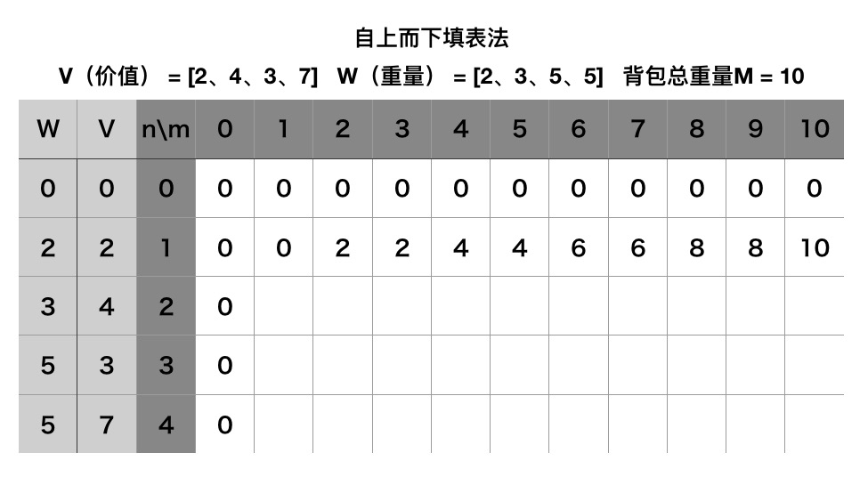
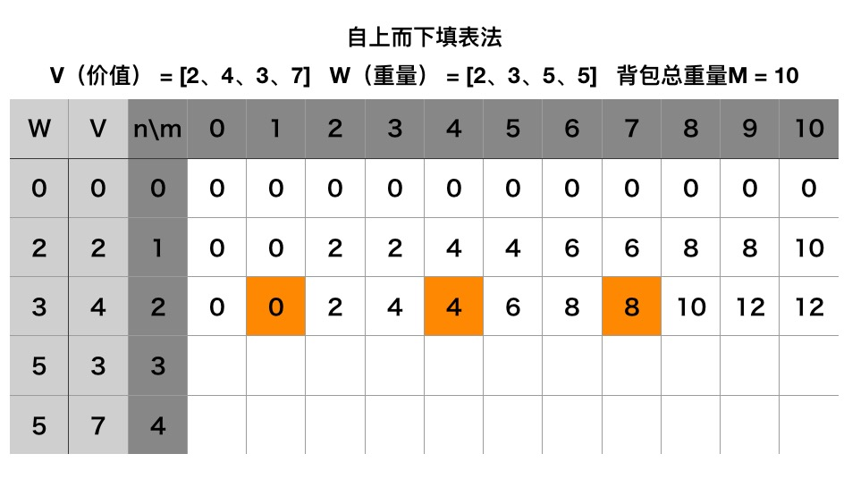

# 动态规划--完全背包问题


## 介绍

给定**N个物品**，每个物品**重量W**和**价值V**

你有一个能 **装重量M的背包**

和01背包问题不一样的地方是：每种物品都可以选择**任意多**个。

怎么装使得 **背包携带的价值最大**


## 贪心算法
同样，看到 **任意多件**

我们可以和01背包一样，来求出每一个物品的性价比，也就是**价值/重量**

但是 ：同一种物品虽然可以选择任意多件，但仍旧只能以**一件**为单位，也就是说物品是无法拆分的。

这也就可能出现，我们无法用性价比最高的物品来装满整个背包。

当然可以用性价比第二高的来填满，或者依次用第三、第四性价比的物品来填充。

但：我们来**举个栗子**

比如只有两个物品：

物品A：价值 V = **5**，重量 W = **5**

物品B：价值 V = **8**：重量 W = **6**

背包容量为 M = **10**

物品B的性价比显然要比物品A高，那么用贪心算法必然会选择放入**一个**物品B，此时，剩余的空间已无法装下A或者B。

所以得到的最高价值为 ： **8**。

而实际上，选择放入**两个**物品A即可得到更高的价值 ： **10**。

所以贪心算法并不适用


## 动态规划基本思路

首先，我们来看一下背包问题是否满足【动态规划】的适用条件。

1、重叠子问题

和01背包问题一样，完全背包问题一样包含很多重叠子问题，具体会在下方填表法中说明。

2、无后效性

对于子问题的任意解，都不会影响后续子问题的解，也就是说，前i种物品如何选择，只要最终的剩余背包空间（M）不变，就不会影响后面物品的选择。所以完全背包问题是满足无后效性的

3、最优子结构

其次，这个问题非常类似于01背包问题，所不同的是每种物品有【无限件】

也就是从每种物品的角度考虑，与它相关的策略已并非【往外腾出足够的空间放进去】或【和不放这件物品】这两种相比，哪个更好
而是对于物品i，有放0件、放1件、放2件……等很多种选择。

这是01背包问题的状态转移方程：

```swift
dp(i,M) = max(dp(i-1, M - W[i]) + V[i],dp(i-1,M))
```

但对于完全背包问题，当我们用了第n个物品以后，因为n还可以再次被用

因此01背包的其中一个最优子结构

```swift
dp(i-1 , M - W[i]) + V[i]
```

应该变为

```swift
dp(i , M - W[i]) + V[i]
```

代表用来第n个物品以后，还可以用第n个物品。

因此，完全背包问题也可以使用动态规划来解决。


## 二维记录表






对于第i种物品，我们可以选择的目标其实是从上一层中的某几个位置挑选出价值最高的一个。

用dp(i,M)表示前i种物品放入一个容量为M的背包获得的最大价值。

那么我们需要引入新变量k -> 对于第i种物品，我们有k种选择：0 <= k * V[i] <= M，即可以选择0、1、2…k个第i种物品

所以递推表达式为：

```swift

dp(i,M) = max{dp(i-1,M), dp(i-1 , (M - W[i] * k)) + V[i] * k}

dp(2,10) = max{dp(1,10), dp(1, (10 - 3 * 1)) + 4 * 1}
dp(2,10) = max{dp(1,10), dp(1,(10 - 3 * 2)) + 4 * 2}
dp(2,10) = max{dp(1,10), dp(1,(10 - 3 * 3)) + 4 * 3}


0 <= k * V[i] <= t;

dp(0,t) = 0;
dp(i,0) = 0;
```


最大价值是14.

## 递归求解

我们可以看一下代码
```swift
//数组前面+0位，处理下标和终止条件
//W代表商品的重量
var W = [0,2,3,5,5];
//V代表商品的价值
var V = [0,2,4,3,7];
//M代表背包的总容量
var M = 10;

func dp(n : Int, m : Int) -> Int{
var result = 0
// 终止条件
if (n == 0 || m == 0){
// 不装
}else if(W[n] > m){
result = dp(n: n - 1, m: m)
}else{
// 装
// 取k个物品i，取其中使得总价值最大的k
var k = 0
while k * W[n] <= m {
let tmp2 = dp(n: n - 1, m: m - W[n] * k) + V[n] * k
if (tmp2 > result){
result = tmp2;
}
k = k + 1
}
}
return result;
}

let result = dp(n: V.count - 1 , m: M)
print(result);
```

这跟01背包问题一样有O(VN)个状态需要求解

但求解每个状态的时间已经不是常数了，求解状态dp(i,M)的时间是O(M/c[i])，总的复杂度可以认为是O(M*Σ(M/c[i]))，是非常大的。


## 优化
完全背包问题有一个很简单有效的优化。

若两件物品i、j满足c[i]=w[j]

则将物品j去掉，不用考虑。这个优化的正确性显然：任何情况下都可将价值小费用高得j换成物美价廉的i，得到至少不会更差的方案。

对于随机生成的数据，这个方法往往会大大减少物品的件数，从而加快速度。然而这个并不能改善最坏情况的复杂度，因为有可能特别设计的数据可以一件物品也去不掉。


另外，针对背包问题而言，还有一种比较不错方法是：

首先将费用大于背包重量的物品去掉

然后使用类似计数排序的做法，计算出【费用相同】的物品中【价值最高】的是哪个

这样也可以提高减少物品的件数，提高速度


## 最后

三种背包问题虽然对于物品数量的限制不一样。

但都可以转化为01背包问题来进行思考。

在完全背包问题中，虽然每种物品都可以选择无限个，但由于背包容量有限，实际上每种物品可以选择的数量也是有限的，那么将每种物品都看做是 M/V[i]种【只有一件】的不同物品，不就成了01背包问题吗？
