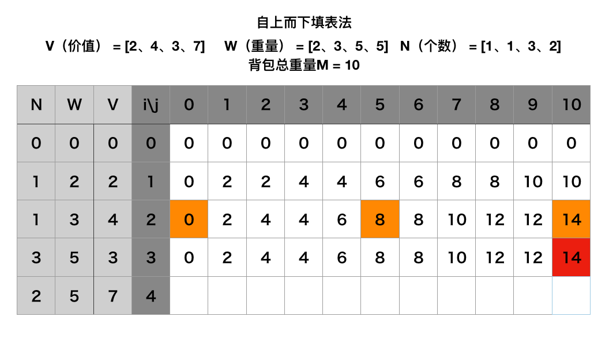
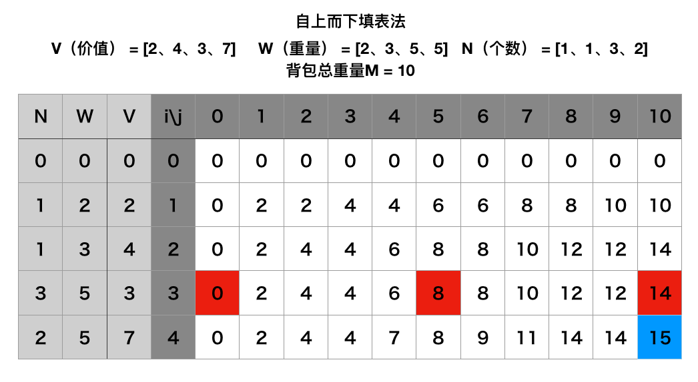
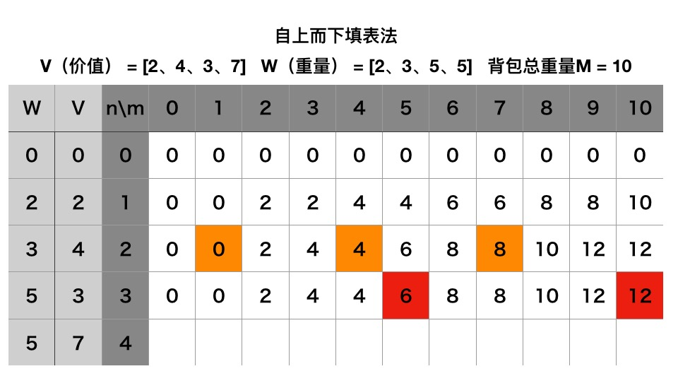
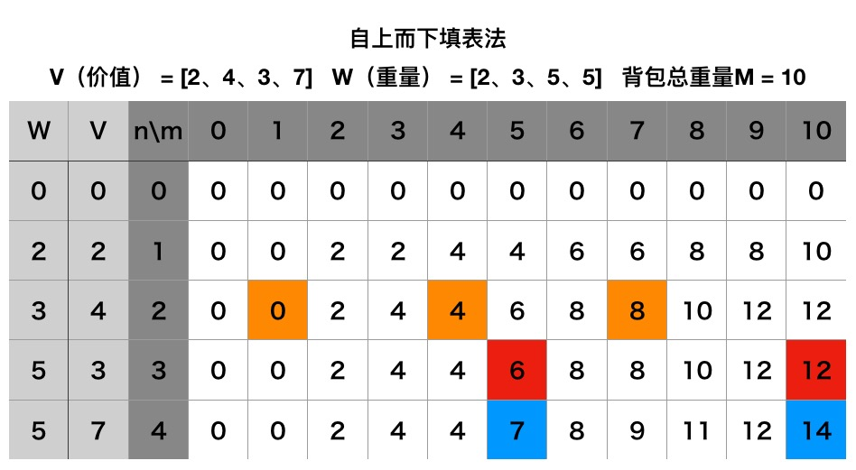

# 动态规划--多重背包问题


## 介绍

给定**N种物品**，每个物品**重量W**和**价值V**

你有一个能 **装重量M的背包**

和01背包问题不一样的地方是：每种物品最多可以选择K[N]个。

怎么装使得 **背包携带的价值最大**


## 贪心算法
同样，看到 **任意多件**

我们可以和01背包一样，来求出每一个物品的性价比，也就是**价值/重量**

但是 ：同一种物品虽然可以选择任意多件，但仍旧只能以**一件**为单位，也就是说物品是无法拆分的。这也就可能出现，我们无法用性价比最高的物品来装满整个背包。

当然可以用性价比第二高的来填满，或者依次用第三、第四性价比的物品来填充。

但：我们来**举个栗子**

比如只有两个物品：

物品A：价值 V = **5**，重量 W = **5**

物品B：价值 V = **8**：重量 W = **6**

背包容量为 M = **10**

物品B的性价比显然要比物品A高，那么用贪心算法必然会选择放入**一个**物品B，此时，剩余的空间已无法装下A或者B。
所以得到的最高价值为 ： **8**。

而实际上，选择放入**两个**物品A即可得到更高的价值 ： **10**。

所以贪心算法并不适用


## 动态规划基本思路

首先，我们来看一下背包问题是否满足【动态规划】的适用条件。

1、重叠子问题

和01背包问题一样，多重背包问题一样包含很多重叠子问题，具体会在下方填表法中说明。

2、无后效性

对于子问题的任意解，都不会影响后续子问题的解，也就是说，前n种物品如何选择，只要最终的剩余背包空间（M）不变，就不会影响后面物品的选择。所以多重背包问题是满足无后效性的

3、最优子结构

先看一下01背包问题的状态转移方程：

```swift
dp(N,M) = max(dp(N-1,M)，dp(N-1, M - W[N]) + V[N])
```

多重背包问题和01背包问题所不同的是：每种物品的个数【有限】


因为第N种物品，有放0件、放1件、放2件……放K[N]件等很多种选择。

所以可以将多重背包问题转化为01背包问题，即：将K[N]件第N种物品，每个当做01背包中的一个物品来思考。

因此01背包的其中一个最优子结构

```swift
dp(N-1 , M - W[N]) + V[N]
```

应该变为

```swift
dp(N-1 , M - W[N] * k) + V[N] * k    (0 < k <= K[N])
```

看完上面三点，多重背包问题也可以使用动态规划来解决。


## 二维记录表





对于第N种物品，我们可以选择的目标其实是从上一层中的某几个位置挑选出价值最高的一个。

用dp(N,M)表示前N种物品放入一个容量为M的背包获得的最大价值。

那么我们需要引入新变量k -> 对于第N种物品，我们有k种选择：0 <= k * W[N] <= M && 0 <= k * K[N]，即可以选择0、1、2…k个

比如第二张表，我们可以有以下选择：

```swift
dp(3,10) = max{dp(2,10), dp(2, (10 - 5 * 0)) + 3 * 0}
dp(3,10) = max{dp(2,10), dp(2, (10 - 5 * 1)) + 3 * 1}
dp(3,10) = max{dp(2,10), dp(2, (10 - 5 * 2)) + 3 * 2}
```

所以递推表达式为

```swift
dp(N,M) = max{dp(N-1,M), dp(N-1 , (M - W[N] * k)) + V[N] * k}

0 <= k * V[N] <= M && 0 <= k * K[N];
dp(0,M) = 0;
dp(N,0) = 0;
```




最大价值是14.

## 递归求解

我们可以看一下代码
```swift
private int dp(int i, int j) {
    int result = 0;

    if (i == 0 || j == 0) {
        return result;
    }
    if (j < weights[i - 1]) {
        result = dp(i - 1, j);
    } else {
        for (int k = 0; k <= numbers[i - 1] && k * weights[i - 1] <= j; k++) {
            int temp = dp(i - 1, j - weights[i - 1] * k) + values[i - 1] * k;
            if (temp > result) {
                result = temp;
            }
        }
    }

    return result;
}
```

这跟01背包问题一样有O(VN)个状态需要求解
但求解每个状态的时间已经不是常数了，求解状态dp(N,M)的时间是O(M/c[N])，总的复杂度可以认为是O(M*Σ(M/c[N]))，是非常大的。


## 最后

三种背包问题虽然对于物品数量的限制不一样。

但都可以转化为01背包问题来进行思考。
