# 动态规划（基本概念）

## 定义

动态规划(dynamic programming)是[运筹学]的一个分支，是求解**决策过程**(decision process)最优化的数学方法。20世纪50年代初[美国]数学家R.E.Bellman等人在研究**多阶段决策过程(multistep decision process)**的优化问题时，提出了著名的**最优化原理(principle of optimality)**，把多阶段过程转化为一系列单阶段问题，利用各阶段之间的关系，逐个求解，创立了解决这类过程优化问题的新方法——动态规划

## 分类

动态规划一般可分为线性动规，区域动规，树形动规，背包动规四类。
举例：

线性动规：拦截导弹，合唱队形，挖地雷，建学校，剑客决斗等；

区域动规：石子合并， 加分二叉树，统计单词个数，炮兵布阵等；

树形动规：贪吃的九头龙，二分查找树，聚会的欢乐，数字三角形等；

背包问题：01背包问题，完全背包问题，分组背包问题，二维背包，装箱问题，挤牛奶等；

应用实例：

最短路径问题 ，项目管理，网络流优化等；

## 术语

**例1（最短路线问题）**

从A至E有一批货物需要调运。图上所标数字为各节点之间的运输距离，为使总运费最少，必须找出一条由A至E总里程最短的路线。 

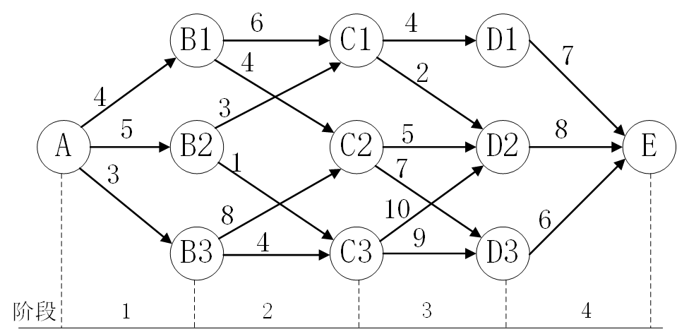

为了找到由A至E的最短线路，可以将该问题分成A—B—C—D—E，4个阶段，在每个阶段都需要作出决策，即在A点需决策下一步到B1还是到B2或B3；同样，若到达第二阶段某个状态，比如B1 ，需决定走向C1还是C2 ；依次类推，可以看出：各个阶段的决策不同，由A至E的路线就不同，当从某个阶段的某个状态出发作出一个决策，则这个决策不仅影响到下一个阶段的距离，而且直接影响后面各阶段的行进线路。所以这类问题要求在各个阶段选择一个恰当的决策，使这些决策序列所决定的一条路线对应的总路程最短。

**例2（带回收的资源分配问题）**

某厂新购某种机床125台。据估计，这种设备5年后将被其它设备所代替。此机车如在高负荷状态下工作，年损坏率为1/2，年利润为10万元；如在低负荷状态下工作，年损坏率为1/5，年利润为6万元。问应如何安排这些机床的生产负荷，才能使5年内获得的利润最大？

本问题具有时间上的次序性，在五年计划的每一年都要作出关于这些机床生产负荷的决策，并且一旦作出决策，不仅影响到本年利润的多少，而且影响到下一年初完好机床数，从而影响以后各年的利润。所以在每年初作决策时，必须将当年的利润和以后各年利润结合起来，统筹考虑。 与上面例1、例2类似的多阶段决策问题还有资源分配、生产存贮、可靠性、背包、设备更新问题等等。

### 1.阶段

动态规划问题通常都具有时间或空间上的次序性，因此求解这类问题时，首先要将问题按一定的次序划分成若干相互联系的阶段，以便能按一定次序去求解。如例1，可以按空间次序划分为A—B—C—D—E，4个阶段，而例2，按照时间次序可分成5个阶段。 

### 2.状态

在多阶段决策过程中，每阶段都需要作出决策，而决策是根据系统所处情况决定的。状态是描述系统情况所必需的信息。如例1中每阶段的出发点位置就是状态，例2中每年初拥有的完好机床数是作出机床负荷安排的根据，所以年初完好机床数是状态。一般地，状态可以用一个变量来描述，称为状态变量。记第k 阶段的状态变量为，X<sub>k</sub> ，k=1,2, …,n.

### 3.决策

多阶段决策过程的发展是用各阶段的状态演变来描述的，阶段决策就是决策者从本阶段某状态出发对下一阶段状态所作出的选择。描述决策的变量称为决策变量，当第k 阶段的状态确定之后，可能作出的决策要受到这一状态的影响。这就是说决策变量U<sub>k</sub>还是状态变量X<sub>k</sub>的函数，因此，又可将第k阶段X<sub>k</sub>状态下的决策变量记为U<sub>k</sub>(X<sub>k</sub>)。

在实际问题中，决策变量的取值往往限制在某一范围之内，此范围称为允许决策变量集合，记作D<sub>k</sub>(U<sub>k</sub>)。如例2中取高负荷运行的机床数为决策变量，则0≤U<sub>k</sub>≤X<sub>k</sub>（X<sub>k</sub>是k阶段初完好机床数）为允许决策变量集合。

### 4.状态转移方程

在多阶段决策过程中，如果给定了k 阶段的状态变量X<sub>k</sub>和决策变量U<sub>k</sub>，则第k+1阶段的状态变量也会随之而确定。也就是说X<sub>k+1</sub>是X<sub>k</sub>和U<sub>k</sub>的函数，这种关系可记为X<sub>k+1</sub> =T(X<sub>k</sub>,U<sub>k</sub> ) 称之为状态转移方程。

### 5.策略

在一个多阶段决策过程中，如果各个阶段的决策变量U<sub>k</sub>(X<sub>k</sub>) （k=1，2，…，n）都已确定，则整个过程也就完全确定。称决策序列{U<sub>1</sub>(X<sub>1</sub>),U<sub>2</sub>(X<sub>2</sub>),...,U<sub>n</sub>(X<sub>n</sub>)}为该过程的一个策略，从阶段k到阶段n的决策序列称为子策略，表示成{U<sub>k</sub>(X<sub>k</sub>),U<sub>k+1</sub>(X<sub>k+1</sub>),...,U<sub>n</sub>X<sub>n</sub>}。如例1中，选取一路线A-B<sub>1</sub>-C<sub>2</sub>-D<sub>2</sub>-E 就是一个策略：

{U<sub>1</sub>(A)=B<sub>1</sub>,U<sub>2</sub>(B<sub>1</sub>)=C<sub>2</sub>,U<sub>3</sub>(C<sub>2</sub>)=D<sub>2</sub>,U<sub>4</sub>(D<sub>2</sub>)=E}

由于每一阶段都有若干个可能的状态和多种不同的决策，因而一个多阶段决策的实际问题存在许多策略可供选择，称其中能够满足预期目标的策略为**最优策略**。例1中存在12条不同路线，其中A-B<sub>2</sub>-C<sub>1</sub>-D<sub>2</sub>-E是最短线路。

# 思想与性质

动态规划最重要的是掌握他的思想，动态规划的核心思想是把原问题分解成子问题进行求解，也就是分治的思想，**与分治法不同的是**，适合于用动态规划求解的问题，经分解得到子问题往往不是互相独立的。若用分治法来解这类问题，则分解得到的子问题数目太多，有些子问题被重复计算了很多次。如果我们能够保存已解决的子问题的答案，而在需要时再找出已求得的答案，这样就可以避免大量的重复计算，节省时间。我们可以用一个表来记录所有已解的子问题的答案。不管该子问题以后是否被用到，只要它被计算过，就将其结果填入表中。这就是动态规划法的基本思路。具体的动态规划算法多种多样，但它们具有相同的填表格式。

# 适用条件

任何思想方法都有一定的局限性，超出了特定条件，它就失去了作用。同样，动态规划也并不是万能的。

**例3：**

又到了一年一度的考核季，公司要挑选出三个最优秀的员工。一般高级经理会跟手下的经理说，你去把你们那边最优秀的3个人报给我，经理又跟总监说你把你们那边最优秀的人报给我，经理又跟组长说，你把你们组最优秀的三个人报给我，最后找出公司三个最优秀的员工。

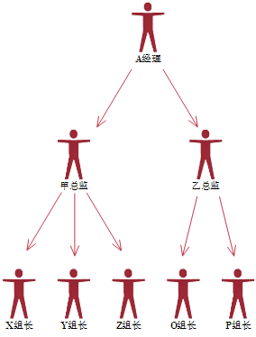

**条件一：重叠子问题，不同的问题，可能都要求1个相同问题的解。即子问题之间是不独立的，** 一个子问题在下一阶段决策中可能被多次使用到。（该性质并不是动态规划适用的必要条件，但是如果没有这条性质，动态规划算法同其他算法相比就不具备优势）

假如A经理想知道他下面最优秀的人是谁，他必须知道X,Y,Z,O,P组最优秀的人是谁， 甲总监想知道自己下面最优秀的人是谁，也要去知道X,Y,Z组里面最优秀的人是谁？这就有问题重叠了，两个人都需要了解X,Y,Z三个小组最优秀的人。

**条件二：最优子结构，最优解肯定是有最优的子解转移推导而来，子解必定也是子问题的最优解。**

甲总监下面最优秀的3个人肯定是从X,Y,Z提交上来的3份名单中选择最优秀的三个人。例如Q哥是X组长下面的第5名，那么他肯定不可能是甲总监下面最优秀的三个。

**条件三：无后效性，这个问题可能比较难理解，也就是求出来的子问题并不会因为后面求出来的改变。**

我们可以理解为，X组长挑选出三个人，即便到了高级经理选出大部门最优秀的三个人，对于X组来说，最优秀的还是这3个人，不会发生改变。

# 求解的基本步骤

## 1.划分状态，即划分子问题

例如上面的例子，我们可以认为每个组下面、每个部门、每个中心下面最优秀的3个人，都是全公司最优秀的3个人的子问题

## 2.状态表示，即如何让计算机理解子问题

上述例子，我们可以使用f[i][3]表示第i个人，他手下最优秀的3个人是谁。

## 3.状态转移，即父问题是如何由子问题推导出来的

上述例子，每个人大Leader下面最优秀的人等于他下面的小Leader中最优秀的人中最优秀的几个。

## 4.确定边界，确定初始状态是什么？最小的子问题？最终状态又是什么

例如上述问题，最小的子问题就是每个小组长下面最优秀的人，最终状态是整个企业，初始状态为每个领导下面都没有最优名单，但是小组长下面拥有每个人的评分。

**例4：**

有一座高度是10级台阶的楼梯，从下往上走，每跨一步只能向上1级或者2级台阶。要求用程序来求出一共有多少种走法。

比如，每次走1级台阶，一共走10步，这是其中一种走法。我们可以简写成 1,1,1,1,1,1,1,1,1,1。

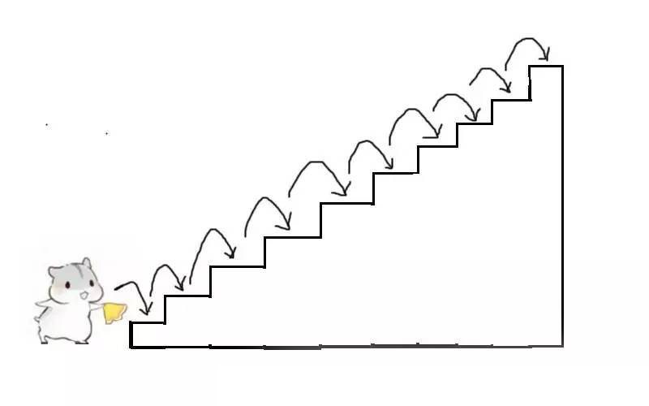

再比如，每次走2级台阶，一共走5步，这是另一种走法。我们可以简写成 2,2,2,2,2。

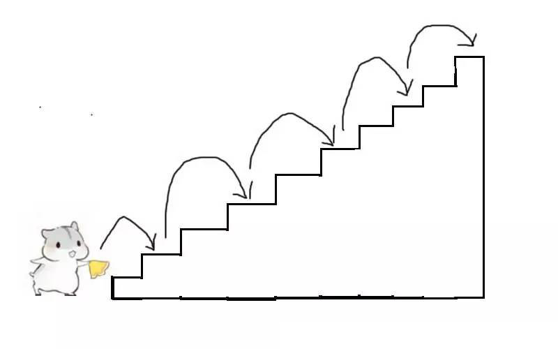

假设只差最后一步走到第10级台阶，这时候会出现几种情况？

两种情况，第一种是从9走到10级，第二种是从8级走到10级。

第一种情况：

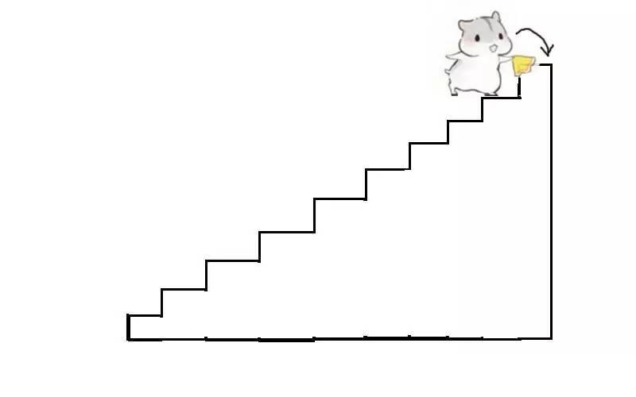

第二种情况：

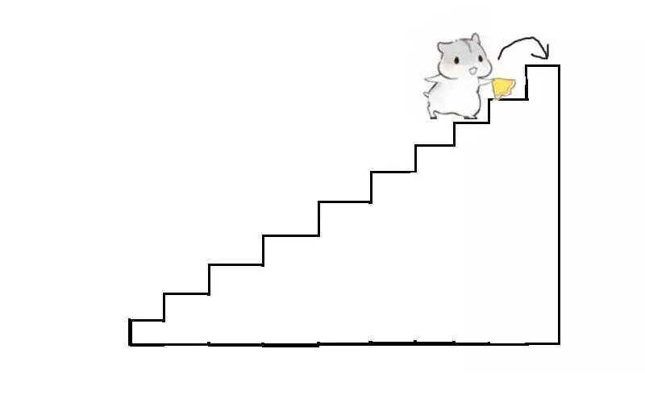

暂且不管从0走到8级台阶的过程，也不管从0走到9级台阶的过程。想要走到第10级，最后一步必然是从8级或者9级开始。

引申出一个新的问题：如果已知0到9级台阶的走法有X种，0到8级台阶的走法有Y种，那么0到10级台阶的走法有多少种？

从0到10级台阶的走法数量=0到9级的走法数量+0到8级的走法数量。

为了方便表达，把10级台阶的走法数量简写为F(10)，此时F(10) = F(9)+F(8)，那么，如何计算F(9)和F(8)呢？

利用上面思路

F(9)=F(8)+F(7)

F(8)=F(7)+F(6)

当只有1级台阶和2级台阶的时候，有几种走法呢，显然分别是1和2.由此，可归纳如下公式：

F(1)=1;

F(2)=2;

F(n)=F(n-1)+F(n-2)  (n >=3)

F(9)和F(8)是F(10)的最有子结构

当只有1级台阶或2级台阶时，可以直接得出结果，无需继续简化。称F(1)和F(2)是问题的边界。

F(n)=F(n-1)+F(n-2) 是阶段与阶段之前的状态转移方程。这是动态规划的核心，决定了问题的每一个阶段和下一阶段的关系。

求解过程：

**方法一：递归求解**

```c
int getClimbingWaysRecursive(int n) {
	if (n < 1) {
		return 0;
	}

	if (n == 1) {
		return 1;
	}

	if (n == 2) {
		return 2;
	}

	return getClimbingWaysRecursive(n - 1) + getClimbingWaysRecursive(n - 2);
}
```

要计算出F(N)，就要先得到F(N-1)和F(N-2)的值。要计算F(N-1)，就要得到F(N-2)和F(N-3)的值...以此类推，可以归纳成如下图：

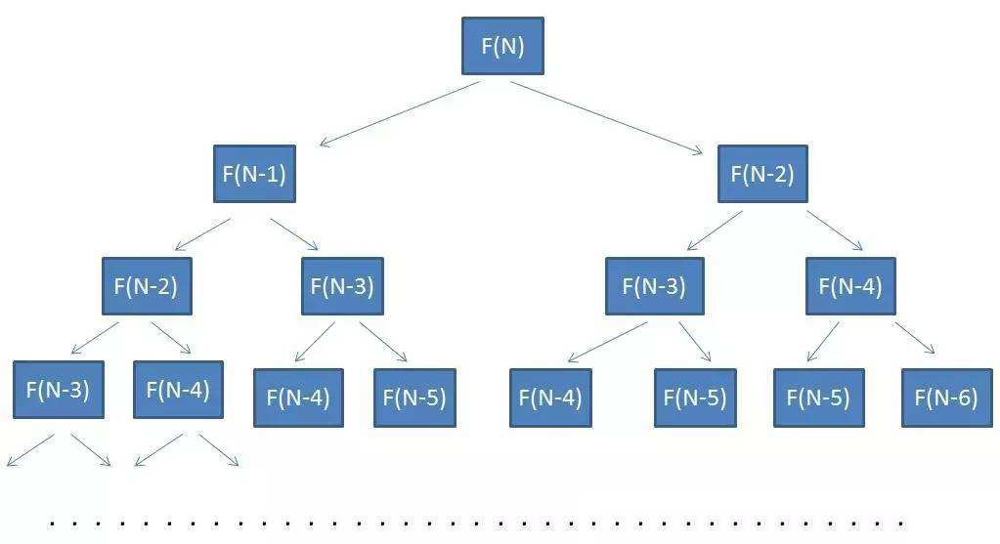

这就是一一颗二叉树，树的节点个数是递归方法所需要计算的次数。不难看出，这颗二叉树的高度是N,节点个数接近2的N次方。所以方法的时间复杂度近似于O(2<sup>^</sup>N)。

回顾刚才的递归图，有些相同的参数被重复计算了。越往下走，重复的越多。

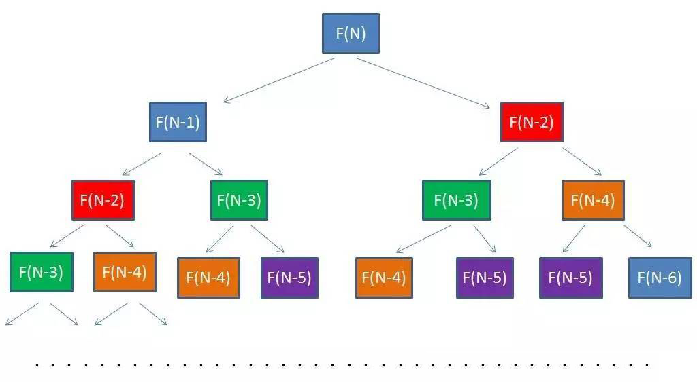

如图所示，相同的颜色代表了方法被传入相同的参数。

对于这种重复计算的情况，怎么避免呢？

用缓存！先创建一个哈希表，每次把不同参数的计算结果存入哈希。当遇到相同参数时，再从哈希表里取出，就不用重复计算了。这种缓存计算结果的方式叫做备忘录算法。

**方法二：备忘录算法**

```
int getClimbingWaysMemo(int n, std::unordered_map<int, int> &map) {
	if (n < 1) {
		return 0;
	}

	if (n == 1) {
		return 1;
	}

	if (n == 2) {
		return 2;
	}

	std::unordered_map<int, int>::iterator iter = map.find(n);
	if (iter != map.end()) {
		return iter->second;
	}else {
		int value = getClimbingWaysMemo(n - 1, map) + getClimbingWaysMemo(n - 2, map);
		map[n] = value;
		return value;
	}
}
```

在以上代码中，集合map是一个备忘录。当每次需要计算F(N)的时候，会首先从map中寻找匹配元素。如果map中存在，就直接返回结果，如果map中不存在，就计算出结果，存入备忘录中。

时间和空间复杂度

从F(1)到F(N)一共有N个不同的输入，在哈希表里存了N-2个结果，所以时间复杂度和空间复杂度都是O(N)

**目前还不算真正的动态规划实现。**

空间复杂度存在优化空间。

一定要对F(N)自顶向下做递归运算吗？可不可以自底向上，用迭代的方式推导出结果？

F(N)自底向上的求解过程。


表格的第一行代表了楼梯台阶的数目，第二行代表了若干级别台阶对应的走法数。F(1)=1,F(2)=2,这是已经明确的结果。

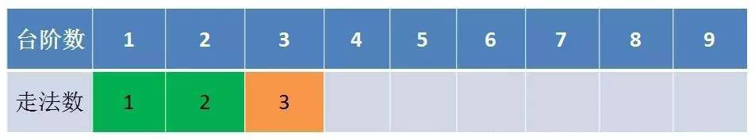

第一次迭代，台阶数等于3时，走法数量是3。这个结果怎么来的呢？是F(1)，F(2)这两个结果相加得到的。所以F(3)只依赖于F(1)和F(2)。

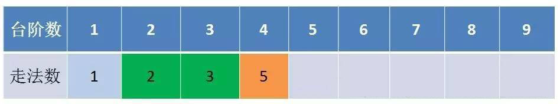

第二次迭代，台阶数等于4时，走法数量是5.这是F(2),F(3)这两个结果相加得到的。所以F(4)只依赖于F(2)和F(3)。

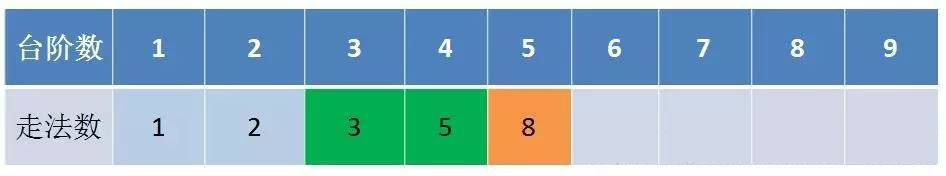

同理，在后续的迭代中，F(5)只依赖于F(4)，F(3);F(6)只依赖于F(5),F(4).

由此可见，每一次迭代过程种，只要保留之前的两个状态，就可以推导出新的状态，而不需要像备忘录算法那样保留全部的自状态。

这就是真正的动态规划实现。

**方法三：动态规划求解**

```
int getClimbingWaysDynamic(int n){
    if(n < 1){
        return 0;
    }
    
    if(n == 1){
        return 1;
    }

    if(n == 2){
        return 2;
    }

    int a = 1;
    int b = 2;
    int temp = 0;
    for(int i =3; i <= n; i++){
     temp = a + b;
     a = b;
     b = temp;
    }
    return temp;
}
```

程序从 i=3 开始迭代，一直到 i=n 结束。每一次迭代，都会计算出多一级台阶的走法数量。迭代过程中只需保留两个临时变量a和b，分别代表了上一次和上上次迭代的结果。 为了便于理解，引入了temp变量。temp代表了当前迭代的结果值。

**结论：上楼梯问题仅仅是动态规划领域中最简单的问题，因为它只有一个变化维度。还有许多问题比这个要复杂很多。**