# Dijkstra算法

**戴克斯特拉算法**（英语：Dijkstra's algorithm，又译**迪杰斯特拉算法**）由荷兰计算机科学家[艾茲赫尔·戴克斯特拉](https://www.wikiwand.com/zh/艾兹赫尔·戴克斯特拉)在1956年提出。戴克斯特拉算法使用了[廣度优先搜索](https://www.wikiwand.com/zh/广度优先搜索)解决赋权有向图的单源[最短路径问题](https://www.wikiwand.com/zh/最短路径问题)。该算法存在很多变体；戴克斯特拉的原始版本找到两个顶点之间的最短路径，但是更常见的变体固定了一个顶点作为源节点然后找到该顶点到图中所有其它节点的最短路径，产生一个[最短路径树](https://www.wikiwand.com/zh/最短路径树)。该算法常用于[路由](https://www.wikiwand.com/zh/路由)算法或者作为其他图算法的一个子模块。举例来说，如果图中的顶点表示城市，而边上的权重表示城市间开车行经的距离，该演算法可以用来找到两个城市之间的最短路径。

该算法的输入包含了一个有权重的有向图 *G*，以及G中的一个来源[顶点](https://zh.wikipedia.org/wiki/頂點) *S*。我们以 *V* 表示 *G* 中所有顶点的集合。每一个图中的[边](https://zh.wikipedia.org/wiki/邊)，都是两个顶点所形成的有序元素对。(*u*, *v*) 表示从顶点 *u* 到 *v* 有路径相连。我们以 *E* 表示*G*中所有边的集合，而边的权重则由权重函数 *w*: *E* → [0, ∞] 定义。因此，*w*(*u*, *v*) 就是从顶点 *u* 到顶点 *v* 的非负权重（weight）。边的权重可以想像成两个顶点之间的距离。任两点间路径的权重，就是该路径上所有边的权重总和。已知 *V* 中有顶点 *s* 及 *t*，Dijkstra 算法可以找到 *s* 到 *t* 的最低权重路径(例如，最短路径)。这个算法也可以在一个图中，找到从一个顶点 *s* 到任何其他顶点的最短路径。

## 举例

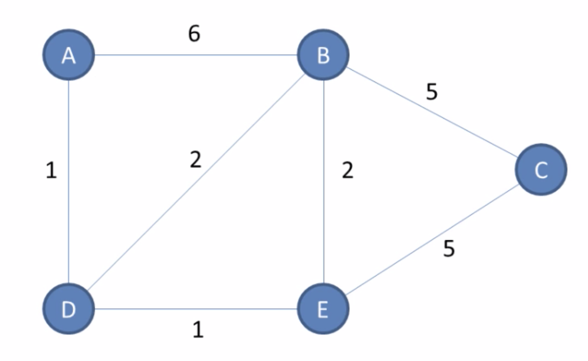

以上图为例，计算点A到点C的最短路径。

​	

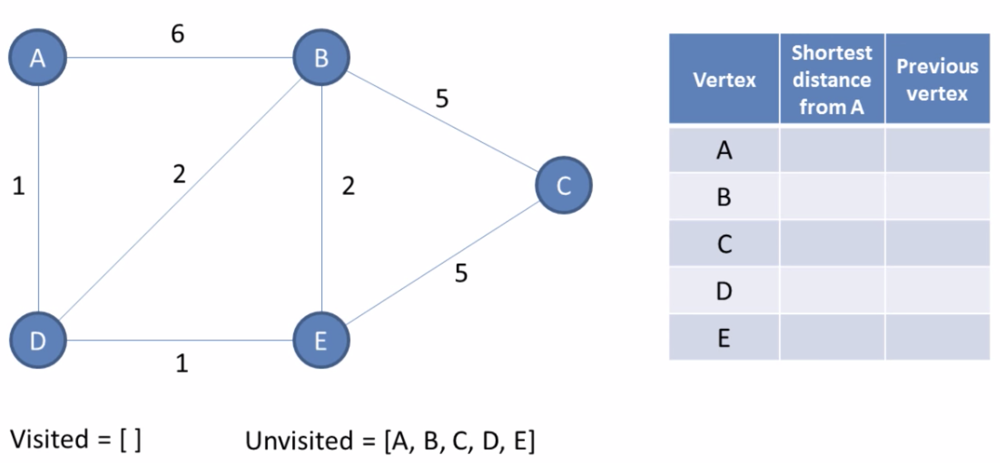

Vistied存放已求出的最短路径的点，Unvisited存放未求出最短路径的点，表格记录改点到点A的最短距离及经过的点。

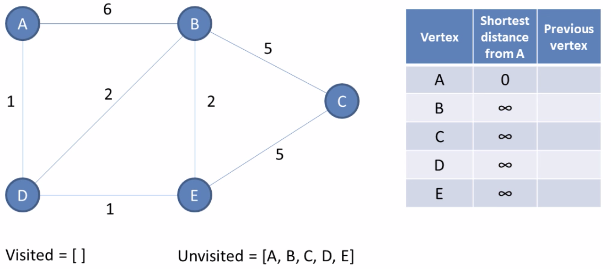

首先对数据进行初始化，点A到他自身的距离定义为0，点A到其他点的距离定义为正无穷。

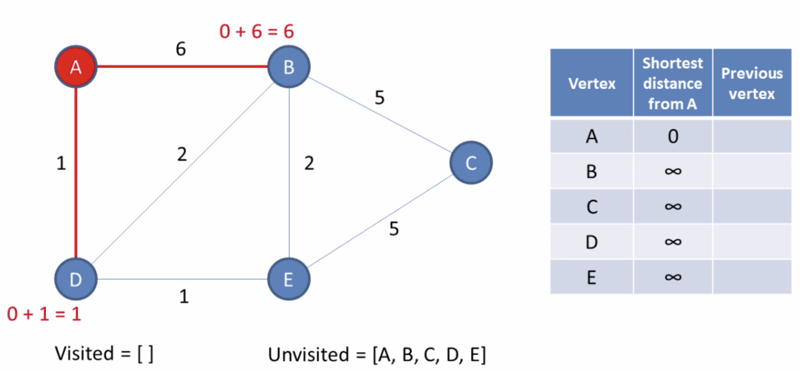

首先，我们检查一下点A的邻接点（和点A共享一条边的点），点B和点D，计算每个邻接点和起点的距离。

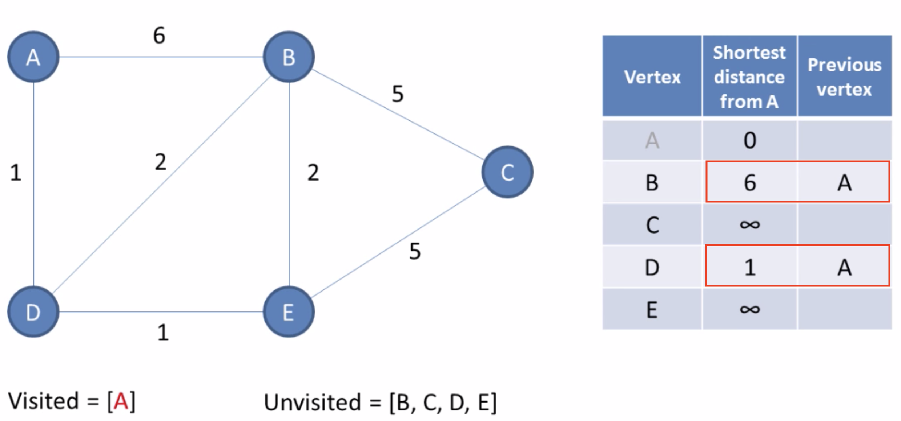

计算点A到相邻点的距离，并与表格中的数据进行比较，小于的话就更新表中的数据。

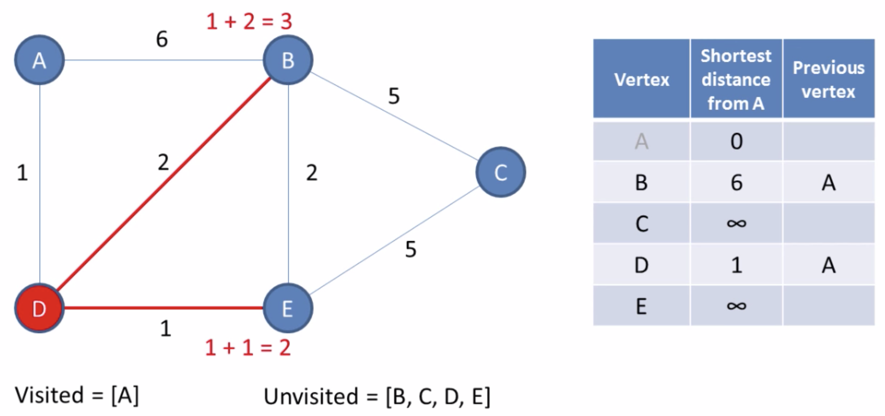

接下来分别计算点D的到邻接点点B和点E的距离。

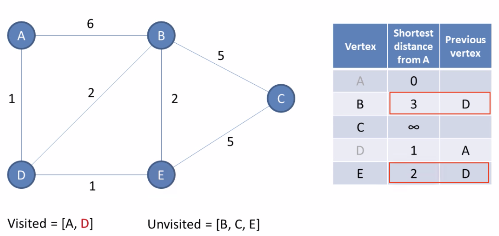

更新表格和数组中数据。

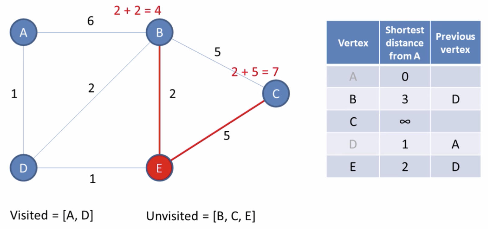

计算点E的到邻接点点B和点C的距离。

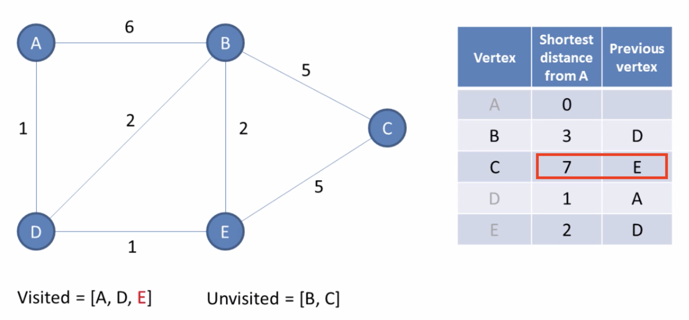

更新表格和数组中数据。

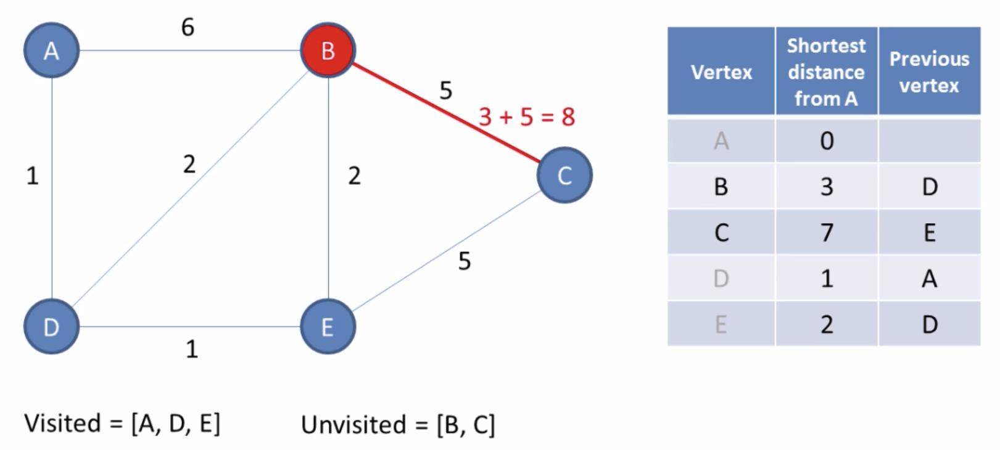

计算点B的到邻接点的距离，因为到点B的距离已经计算过了，这里只计算到点C的距离，这里因为8>7，所以不需要更新数据。

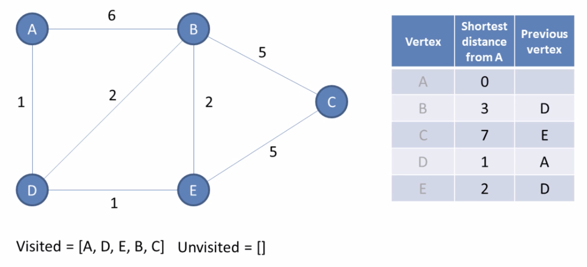

点C已经没有没计算过的邻接点了，所以我们只用把C加入已访问列表里。

通过表格可知点A到点C的最短路径为[A, D, E, C]。

## 时间复杂度

最初的戴克斯特拉算法不采用最小[优先级队列](https://www.wikiwand.com/zh/优先级队列)，时间复杂度是(其中为图的顶点个数)。通过[斐波那契堆](https://www.wikiwand.com/zh/斐波那契堆)实现的戴克斯特拉算法时间复杂度是 (其中是边数) （[Fredman & Tarjan 1984](https://www.wikiwand.com/zh/戴克斯特拉算法#CITEREFFredmanTarjan1984)）。对于不含负权的[有向图](https://www.wikiwand.com/zh/有向图)，这是目前已知的最快的单源[最短路径](https://www.wikiwand.com/zh/最短路径)算法。

