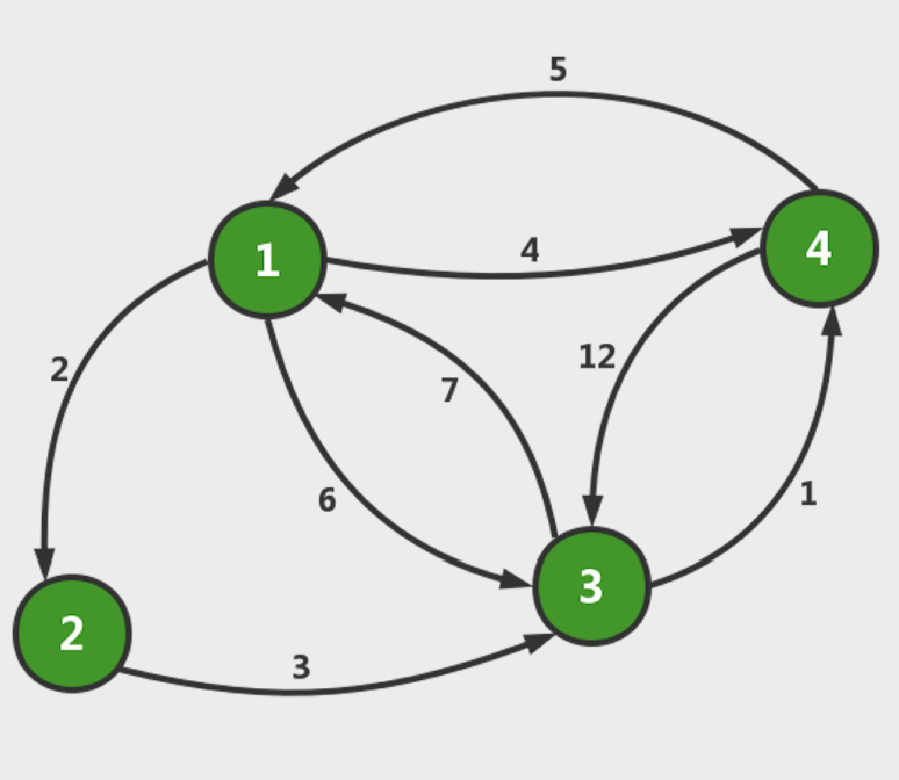

# 多源最短路径Floyd算法

## 介绍
**弗洛伊德算法**（英语：`Floyd-Warshall's algorithm`）又称为插点法，是一种利用动态规划的思想寻找给定的加权图中多源点之间最短路径的算法，与`Dijkstra`算法类似。该算法名称以创始人之一、1978年图灵奖获得者、斯坦福大学计算机科学系教授罗伯特·弗洛伊德命名。

## 举个例子
下图中有4个城市8条公路，公路上的数字表示这条公路的长短。请注意这些公路是单向的。我们现在需要求任意两个城市之间的最短路程，也就是求任意两个点之间的最短路径:

<center></center>

## 基本思想
从`i`到`j`的最短路径有两种有两种情况，一是从`i`直接到`j`，二是从`i`经过若干个中间节点到达`j`，对于任意`i`和`j`和任意中间节点k，`d(i)(k) + d(k)(j) < d(i)(j)`是否成立，如果成立，则更新`d(i)(j) = d(i)(k) + d(k)(j)`。


## 动态规划

**动态转移方程** 
`d[k][i][j]`是一种使用1号到k号点的状态，可以想办法把这个状态通过动态转移，规约到使用1号到(k-1)号的状态，即`d[k-1][i][j`]。对于`d[k][i][j]`（即使用1号到k号点中的所有点作为中间媒介时，i和j之间的最短路径），可以分为两种情况：

  - 不经过点k的最短路情况下，`d[k-1][i][j]。`
  
  - 经过点k的最短路情况下，`d[k-1][i][k] + d[k-1][k][j]`。
  
综合上述两种情况，便可以得到Floyd算法的动态转移方程：
  `d[k][i][j] = min(d[k-1][i][j], d[k-1][i][k]+d[k-1][k][j])（k,i,j∈[1,n]）`

**初始条件** `d[0][i][j] = w(i, j)`，在不使用任何点的情况下，两点之间最短路径的长度就是两点之间边的权值（若两点之间没有边，则权值为正无穷）

## 过程

>  - 当任意两点之间不允许经过第三个点时，这些城市之间最短路程就是初始路程,如下:
<center></center>

<br>
<br>
>  - 在只允许过 1号顶点的情况下，任意两点之间的路程更新如下:
<center></center>
通过上图我们发现，在只通过1号顶点中转的情况下，3号和2号顶点（e[3][2]）、4号顶点到2号顶点（e[4][2]）以及4号顶点到3号顶点（e[4][3]）的路程都变短了

<br>
<br>
> - 在只允许更新1号和2号顶点的情况下，任意两点之间的路径更新为：
<center></center>
通过上图我们可以看出来，在相比只允许1号顶点进行中转的情况，这里允许通过1号和2号顶点进行中转，使得e[1][3] 和e[4][3]的路程变得更短了。

<br>
<br>
> - 同理，我们在只允许通过1，2，3号顶点的情况下，求任意两点之间的最短路程。任意两点的最短路程更新为：
<center></center>


<br>
<br>
> - 最后是允许所有顶点作为中转，任意两点的最终路程为：
<center></center>

## 核心代码
```
for(int k = 0; k < COUNT; k++)
    for(int i = 0; i < COUNT; i++)
        for(int j = 0; j < COUNT; j++)
            if(d[i][j] >  d[i][k] + d[k][j])
                d[i][j] = d[i][k] + d[k][j];
```
## 时间复杂度

`O(N3)`


