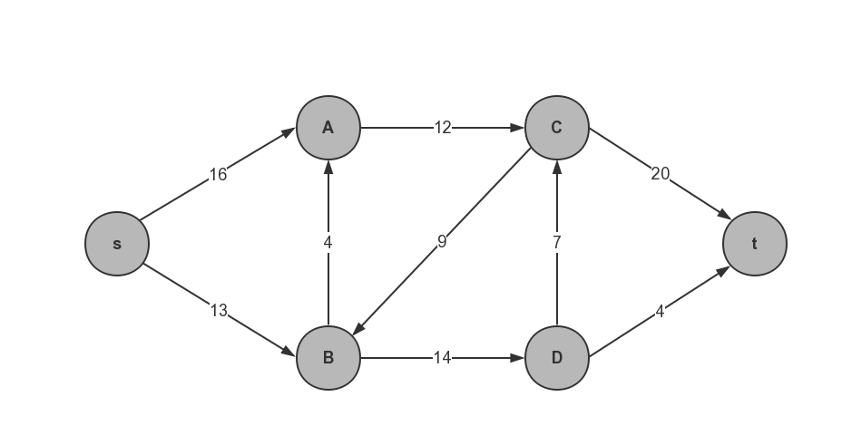
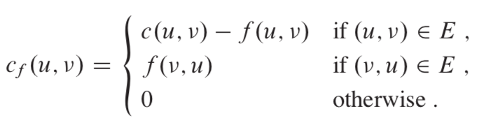
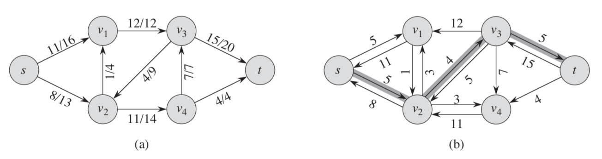
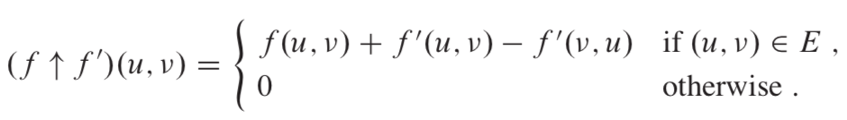
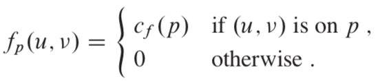
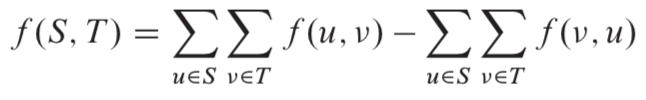
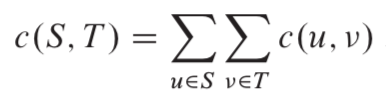
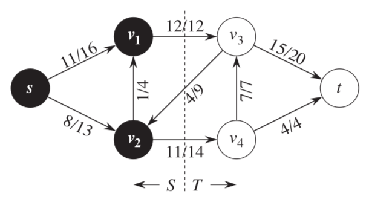
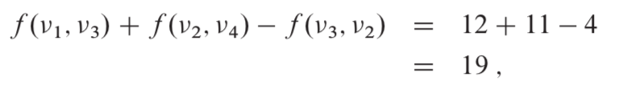
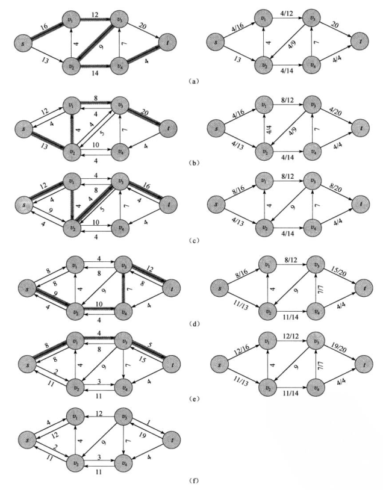

# 最大流

管道网络中每条边的最大通过能力（容量）是有限的，实际流量不超过容量。

最大流问题(maximum flow problem)，一种组合最优化问题，就是要讨论如何充分利用装置的能力，使得运输的流量最大，以取得最好的效果。求最大流的标号算法最早由福特和福克逊于1956年提出，20世纪50年代福特(Ford)、福克逊(Fulkerson)建立的“网络流理论”，是网络应用的重要组成成分。

 

## 一、流网络
### 1、流网络

流网络G=(V, E)是一个有向图，图中每条边(u, v) ∈E有一个非负的容量值c(u, v) ≥ 0。
并且如果边集合E包含一条边(u, v)，则图中不存在反方向的边(v, u)。
如果(u, v) ∉ E，定义c(u, v) = 0，且图中不允许自循环。
两个特殊结点：源结点s和汇点t。每个结点都在从源结点到汇点的某条路径上。即对于每个结点v∈V，流网络包含一条路径s -> v -> t。
因此，流网络是连通的，且由于源节点外每个结点都至少有一条进入的边，则|E| ≥ |V| -1。

### 2、流

设G=(V, E)是一个流网络，其容量函数为c。设s为网络的源结点，t为汇点。G中的流是一个实值函数f: V x V -> R，满足下面两条性质：

1）**容量限制**：对于所有的结点u, v ∈ V，要求 0 ≤ f(u, v) ≤ c(u, v)。
f(u, v)为从结点u到结点v的流。

2）**流量守恒**：对于所有的结点u ∈ V-{s, t}，要求

$ \sum_{v ∈ V} f(u, v) = \sum_{v ∈ V} f(v, u)$

当(u, v) ∉ E时，从结点u到结点v之间没有流，因此f(u, v) = 0

### 3、流的值 $$ |f| $$

一个流f的值$|f|$定义如下：

$ |f| = \sum_{v ∈ V} f(s, v) - \sum_{v ∈ V} f(v, s)$

流f的值是从源结点流程的总流量减去流入源结点的总流量。通常，一个流网络不会有任何进入源结点的边。也即后面的项为0.
这里将其包含进来时为了讨论后面的残存网络。

## 二、Ford-Fulkerson 方法

Ford-Fulkerson方法的主要思想

1、循环增加流的值。

 在开始的时候，对于所有的结点u, v ∈V，f(u, v) = 0，给出的初始流值为0。

 在每一次迭代中，将图G的流值进行增加，方法是在一个关联的“残存网络”Gf中寻找一条“增广路径”。

2、重复对流进行这一过程，知道残存网络中不再存在增广路径为止。

3、最大流最小切割定理将说明在算法终结时，该算法将获得一个最大流。


```
FORD-FULKERSON-METHOD(G,s,t)

initialize flow f to 0
while there exists an augmenting path p in the residual network Gf
  augment flow f along p
return f

```

### 1、残存网络（residual network）

假定有一个流网络G=(V, E)，其源结点为s，汇点为t。设f为图G的一个流，考虑结点对u, v ∈ V，定义**残存容量**cf(u, v)如下：

 

残存网络可能包含图G中不存在的边，残存网络中的反向边允许算法将已经发送出来的流量发送回去。一个残存网络示例图如下：



图a是一个流网络，b是a对应的残存网络，注意每条边上的值，残存网络中针对每条正向边计算出该条边在存在流的情况下的剩余容量，并画出一条反向边，反向边的容量即是发出流的大小，方便将发出的流运输回发送地，并将权重为0的边省略。

残存网络是如何增大原始流网络中的流的一种指示。如果f是G的一个流，对应的有一个残存网络，残存网络中我们可以定义一个流$f`$。此时我们可以定义一个函数$f ↑ f`$，我们将其称作流$f`$对f的增量（augmentation）




### 2、增广路径（augmenting paths）

给定流网络G和流f，增广路径p是残存网络中一条从源结点s到汇点t的简单路径。根据残存网络的定义，对于一条增广路径上的边（u，v），我们可以增加其流量的幅度最大为，即我们之前定义的残存容量（residual capacity）。我们将这里讨论的情形总结成一条引理：

**引理** 设G为一个流网络，设f为图G中的一个流，设p为残存网络中的一条增广路径。定义一个函数fp如下：



其中是$fp$残存网络中的一个流，其值$|fp| = cf(p) > 0$。

推论 设G为一个流网络，设f为G中的一个流，设p为残存网络中的一条增广路径。设$fp$如上述引理所定义，假定将f增加$fp$的量，则函数$f ↑ fp$是图G中的一个流，其值为$|f ↑ fp| = |f| +|fp| > |f|$。

### 3、流网络的切割（cuts of networks）

流网络G中的一个切割（S，T）将结点集合V划分为S和T=V-S两个集合，使得、。若f是一个流，则定义横跨切割（S，T）的净流量f（S，T）如下：



切割（S，T）的容量是：



一个网络的最小切割是整个网络中容量最小的切割。

举例说明切割的计算方法：



横跨该切割的净流量：



***引理*** 设f为流网络G的一个流，该流网络的源结点为s，汇点为t，设（S，T）为流网络G的任意切割，则横跨切割（S，T）的净流量为$ f(S,T) = |f|$

推论 流网络G中任意流f的值不能超过G的任意切割的容量。

定理（最大流最小切割定理） 设f为流网络G=（V，E）中的一个流，该流网络的源结点为s，汇点为t，则下面的条件是等价的：

1. f是G的一个最大流。

2. 残存网络不包含任何增广路径

3. |f|=c（S，T），其中（S，T）是流网络G的某个切割。

### 4、执行过程

 

### 5、算法分析

算法的运行时间取决于如何寻找增广路径。

如果选择不好，算法可能不会终止（当边的容量为无理数时）；

如果使用广度优先搜索来寻找增广路径，算法的运行时间将是多项式数量级。

