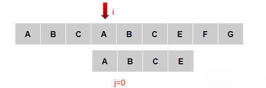
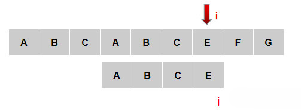

## KMP算法

> Knuth-Morris-Pratt 字符串查找算法，简称为 “KMP算法”，常用于在一个文本串S内查找一个模式串P 的出现位置，这个算法由Donald Knuth、Vaughan Pratt、James H. Morris三人于1977年联合发表，故取这3人的姓氏命名此算法   

### 一般字符串匹配

最基础的匹配思路：

当匹配到如图第四个字符A位置后，匹配失败，子串回到第一个位置，主串后移，继续匹配

直到匹配成功

这种方式是效率最低，匹配次数最多的情况，接下来看KMP的解决思路

### KMP思想

KMP在遇到下图位置时，不会很无脑的把子串的j移动到第0位，主串的i移动到第1位，然后进行T[i]==P[j]的比较

KMP思想：利用前面匹配的信息，保持i指针不变，通过修改j指针，让子串尽量地移动到有效的位置。

先来看一下规律：

如图：C和D不匹配了，我们要把j移动到哪？
可以移动到第1位。为什么？因为前面有一个A相同可以用

再看一种：

当主串C和子串B不匹配，移动指针到哪一个位置

这时我们发现规律了，j指针应该移动到的那个位置其实就是要求当前j之前的字符串也就是ABCAB它的首尾对称的长度最大长度的值。因为AB字符串前后对称，所以最大长度是2，j指针移动到下标是2的位置上

其实本质上是寻找模式串中最大长度的相同前缀和后缀，找到了模式串中每个字符之前的前缀和后缀公共部分的最大长度后，便可基于此匹配。而这个最大长度便正是next 数组要表达的含义。

例如下图j匹配到了末尾B的位置匹配失败了，此时指针移动到了K的位置，因为B以前的所有字符串中前缀和后缀公共部分的最大长度为2，

####KMP的核心思想是找到了模式串中每个字符之前的前缀和后缀公共部分的最大长度后，将他存入一个数组即next数组中，当匹配失败时，直接跳到next数组所对应的下标位置，然后继续匹配

### next数组
next数组中存入的值就是模式串中每个字符之前的前缀和后缀公共部分的最大长度
next[0]因为已经无法后退了所以设置为-1初始化值，next[1]它的前面只有下标0，所以next[0]=-1,next[1]=0
看下图：

现在，我们再看一下如何快速求得next数组。其实，求next数组的过程完全可以看成字符串匹配的过程，即以模式字符串为主字符串，以模式字符串的前缀为目标字符串，一旦字符串匹配成功，那么当前的next值就是匹配成功的字符串的长度

具体来说，就是从模式字符串的第一位(注意，不包括第0位)开始对自身进行匹配运算。 在任一位置，能匹配的最长长度就是当前位置的next值。如下图所示。

