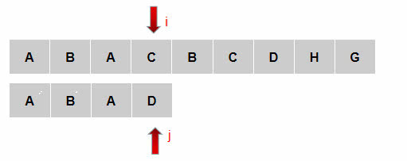
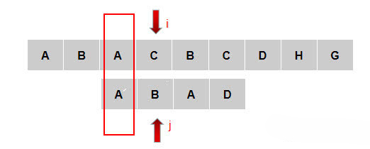
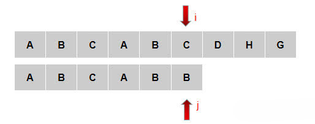
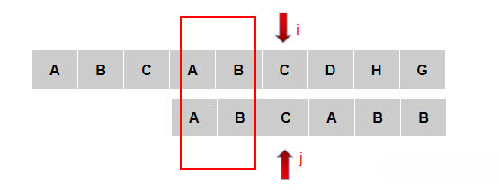
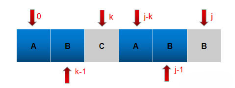
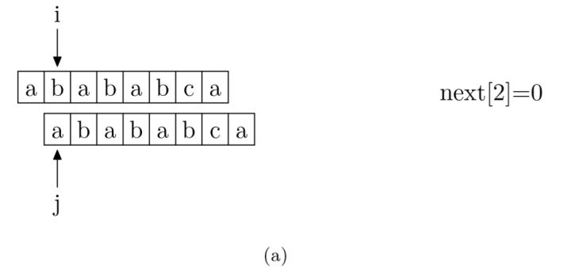
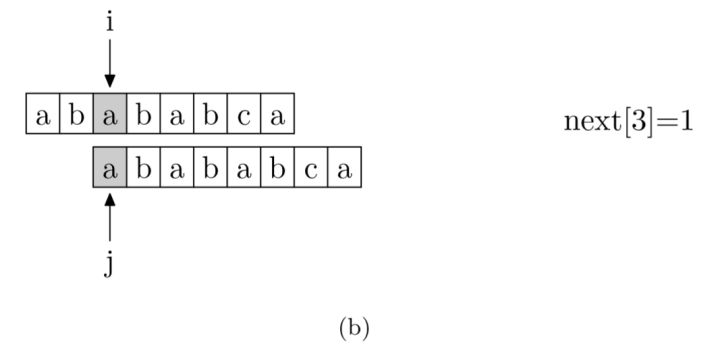
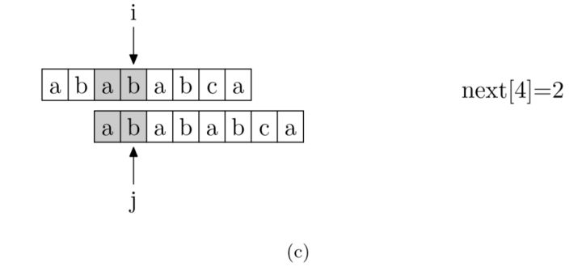
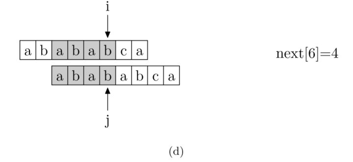
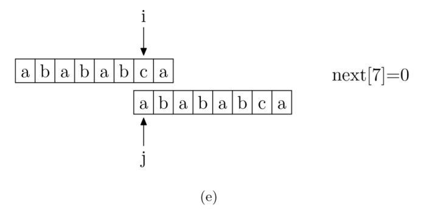

## KMP算法

>KMP算法是一种改进的字符串匹配算法，由D.E.Knuth，J.H.Morris和V.R.Pratt提出的，三人于1977年联合发表，故取这3人的姓氏命名此算法，因此人们称它为克努特—莫里斯—普拉特操作（简称KMP算法）。KMP算法的核心是利用匹配失败后的信息，尽量减少模式串与主串的匹配次数以达到快速匹配的目的。具体实现就是通过一个next()函数实现，函数本身包含了模式串的局部匹配信息。   

### 暴力匹配算法

假设现在我们面临这样一个问题：有一个文本串S，和一个模式串P，现在要查找P在S中的位置，怎么查找呢？
如果用暴力匹配的思路，并假设现在文本串S匹配到 i 位置，模式串P匹配到 j 位置，则有：
如果当前字符匹配成功（即S[i] == P[j]），则i++，j++，继续匹配下一个字符；
如果失配（即S[i] != P[j]），令i = i - (j - 1)，j = 0。相当于每次匹配失败时，i 回溯，j 被置为0。

举个例子，如果给定文本串S“BBC ABCDAB ABCDABCDABDE”，和模式串P“ABCDABD”，现在要拿模式串P去跟文本串S匹配，整个过程如下所示：

1. S[0]为B，P[0]为A，不匹配，“如果失配（即S[i] != P[j]），令i = i - (j - 1)，j = 0”，S[1]跟P[0]匹配，相当于模式串要往右移动一位（i=1，j=0）

2. S[1]跟P[0]还是不匹配，“如果失配（即S[i]! = P[j]），令i = i - (j - 1)，j = 0”，S[2]跟P[0]匹配（i=2，j=0），从而模式串不断的向右移动一位（不断的执行“令i = i - (j - 1)，j = 0”，i从2变到4，j一直为0）

3. 直到S[4]跟P[0]匹配成功（i=4，j=0），此时按照上面的暴力匹配算法的思路，“如果当前字符匹配成功（即S[i] == P[j]），则i++，j++”，可得S[i]为S[5]，P[j]为P[1]，即接下来S[5]跟P[1]匹配（i=5，j=1）

4. S[5]跟P[1]匹配成功，“如果当前字符匹配成功（即S[i] == P[j]），则i++，j++”，得到S[6]跟P[2]匹配（i=6，j=2），如此进行下去
  
  
  
5. 直到S[10]为空格字符，P[6]为字符D（i=10，j=6），因为不匹配，“如果失配（即S[i]! = P[j]），令i = i - (j - 1)，j = 0”，相当于S[5]跟P[0]匹配（i=5，j=0）
  
  
  
6. 至此，我们可以看到，如果按照暴力匹配算法的思路，尽管之前文本串和模式串已经分别匹配到了S[9]、P[5]，但因为S[10]跟P[6]不匹配，所以文本串回溯到S[5]，
    模式串回溯到P[0]，从而让S[5]跟P[0]匹配。
    
    
    
    
### KMP思想

KMP在遇到下图位置时，不会很无脑的把子串的j移动到第0位，主串的i移动到第1位，然后进行T[i]==P[j]的比较

KMP思想：利用前面匹配的信息，保持i指针不变，通过修改j指针，让子串尽量地移动到有效的位置。

先来看一下规律：

如图：C和D不匹配了，我们要把j移动到哪？
可以移动到第1位。为什么？因为前面有一个A相同可以用

再看一种：

当主串C和子串B不匹配，移动指针到哪一个位置

这时我们发现规律了，j指针应该移动到的那个位置其实就是要求当前j之前的字符串也就是ABCAB它的首尾对称的长度最大长度的值。因为AB字符串前后对称，所以最大长度是2，j指针移动到下标是2的位置上

其实本质上是寻找模式串中最大长度的相同前缀和后缀，找到了模式串中每个字符之前的前缀和后缀公共部分的最大长度后，便可基于此匹配。而这个最大长度便正是next 数组要表达的含义。

例如下图j匹配到了末尾B的位置匹配失败了，此时指针移动到了K的位置，因为B以前的所有字符串中前缀和后缀公共部分的最大长度为2

#### KMP的核心思想是找到了模式串中每个字符之前的前缀和后缀公共部分的最大长度后，将他存入一个数组即next数组中，当匹配失败时，直接跳到next数组的值所对应的下标位置，然后继续匹配 

### next数组
next数组中存入的值就是模式串中每个字符之前的前缀和后缀公共部分的最大长度
next[0]因为已经无法后退了所以设置为-1初始化值，next[1]它的前面只有下标0，所以next[0]=-1,next[1]=0
看下图：

现在，我们再看一下如何快速求得next数组。其实，求next数组的过程完全可以看成字符串匹配的过程，即以模式字符串为主字符串，以模式字符串的前缀为目标字符串，一旦字符串匹配成功，那么当前的next值就是匹配成功的字符串的长度

具体来说，就是从模式字符串的第一位(注意，不包括第0位)开始对自身进行匹配运算。 在任一位置，能匹配的最长长度就是当前位置的next值。如下图所示。

### KMP的时间复杂度分析
我们发现如果某个字符匹配成功，模式串首字符的位置保持不动，仅仅是i++、j++；如果匹配失配，i 不变（即 i 不回溯），模式串会跳过匹配过的next [j]个字符。整个算法最坏的情况是主串匹配到最后一位，模式串也匹配到最后一位才匹配成功，算法结束。
所以，如果文本串的长度为n，模式串的长度为m，那么匹配过程的时间复杂度为O(n)，算上计算next的O(m)时间，KMP的整体时间复杂度为O(m + n)。
