## KMP算法

>KMP算法是一种改进的字符串匹配算法，由D.E.Knuth，J.H.Morris和V.R.Pratt提出的，三人于1977年联合发表，故取这3人的姓氏命名此算法，因此人们称它为克努特—莫里斯—普拉特操作（简称KMP算法）。KMP算法的核心是利用匹配失败后的信息，尽量减少模式串与主串的匹配次数以达到快速匹配的目的。具体实现就是通过一个next()函数实现，函数本身包含了模式串的局部匹配信息。   

### 1、暴力匹配算法

假设现在我们面临这样一个问题：有一个文本串S，和一个模式串P，现在要查找P在S中的位置，怎么查找呢？
如果用暴力匹配的思路，并假设现在文本串S匹配到 i 位置，模式串P匹配到 j 位置，则有：
如果当前字符匹配成功（即S[i] == P[j]），则i++，j++，继续匹配下一个字符；
如果失配（即S[i] != P[j]），令i = i - (j - 1)，j = 0。相当于每次匹配失败时，i 回溯，j 被置为0。

举个例子，如果给定文本串S“BBC ABCDAB ABCDABCDABDE”，和模式串P“ABCDABD”，现在要拿模式串P去跟文本串S匹配，整个过程如下所示：

1. S[0]为B，P[0]为A，不匹配，“如果失配（即S[i] != P[j]），令i = i - (j - 1)，j = 0”，S[1]跟P[0]匹配，相当于模式串要往右移动一位（i=1，j=0）

2. S[1]跟P[0]还是不匹配，“如果失配（即S[i]! = P[j]），令i = i - (j - 1)，j = 0”，S[2]跟P[0]匹配（i=2，j=0），从而模式串不断的向右移动一位（不断的执行“令i = i - (j - 1)，j = 0”，i从2变到4，j一直为0）

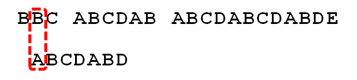

3. 直到S[4]跟P[0]匹配成功（i=4，j=0），此时按照上面的暴力匹配算法的思路，“如果当前字符匹配成功（即S[i] == P[j]），则i++，j++”，可得S[i]为S[5]，P[j]为P[1]，即接下来S[5]跟P[1]匹配（i=5，j=1）

4. S[5]跟P[1]匹配成功，“如果当前字符匹配成功（即S[i] == P[j]），则i++，j++”，得到S[6]跟P[2]匹配（i=6，j=2），如此进行下去
  
  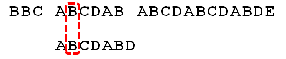
  
5. 直到S[10]为空格字符，P[6]为字符D（i=10，j=6），因为不匹配，“如果失配（即S[i]! = P[j]），令i = i - (j - 1)，j = 0”，相当于S[5]跟P[0]匹配（i=5，j=0）
  
  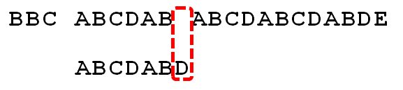
  
6. 至此，我们可以看到，如果按照暴力匹配算法的思路，尽管之前文本串和模式串已经分别匹配到了S[9]、P[5]，但因为S[10]跟P[6]不匹配，所以文本串回溯到S[5]，
    模式串回溯到P[0]，从而让S[5]跟P[0]匹配。
    
    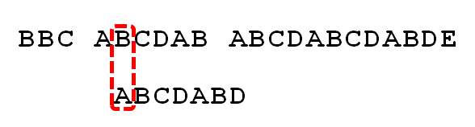
    
    我们看到步骤5因为S[10]跟P[6]不匹配，所以文本串从S[10]回溯到S[5]，从而让S[5]跟P[0]匹配，但是S[5]跟P[0]同样失配，那有没有一种算法，让i 不往回退，只需要移动j 即可呢？
    
    答案是肯定的。这种算法就是本文的主要内容KMP算法，它利用之前已经部分匹配这个有效信息，保持i 不回溯，通过修改j 的位置，让模式串尽量地移动到有效的位置。
    
### 2、KMP算法

#### 2.1寻找最长前缀后缀
字符串的前缀是除去首字符以外的所有子串的集合，字符串的后缀是除去末尾字符以外的所有子串的集合，如果给定的模式串是：“ABCDABD”，从左至右遍历整个模式串，其各个子串的前缀后缀分别如下表格所示：

    也就是说，原模式串子串对应的各个前缀后缀的公共元素的最大长度表为（下简称《最大长度表》）：
    
    

#### 2.2根据《最大长度表》求next 数组
next数组的含义是:当模式串中的某个字符跟文本串中的某个字符匹配失配时，模式串下一步应该跳到哪个位置。如模式串中在j 处的字符跟文本串在i 处的字符匹配失配时，下一步用next [j] 处的字符继续跟文本串i 处的字符匹配
求next数组：next数组考虑的是除当前字符外的最长相同前缀后缀,next数组是为模式串中的每一个字符计算出一个next值

由上文，我们已经知道，字符串“ABCDABD”各个前缀后缀的最大公共元素长度分别为：

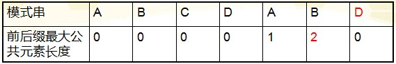    

next数组相当于“最大长度值”整体向右移动一位，然后初始值赋为-1。就是找最大对称长度的前缀后缀，然后整体右移一位，初值赋为-1（当然，你也可以直接计算某个字符对应的next值，就是看这个字符之前的字符串中有多大长度的相同前缀后缀）

对于给定的模式串：ABCDABD，它的最大长度表及next 数组分别如下：

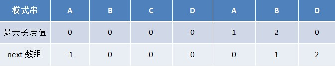    

我们前面已经提到，next数组的意义是当模式串中的某个字符跟文本串中的某个字符匹配失配时，模式串下一步应该跳到哪个位置
举个例子，如下图，根据模式串“ABCDABD”的next 数组可知失配位置的字符D（j=6）对应的next 值为2，代表字符D前有长度为2的相同前缀和后缀（这个相同的前缀后缀即为“AB”），正因为D有长度为2的相同前缀和后缀“AB”,所以在失配后，模式串的前缀“AB”与主串当前失配的位置之前的“AB”是相等的，不需要将j移动到起始位置，模式串会跳到字符C的位置继续跟文本串匹配
即：j = next[j] ,相当于j = next[6] ,也就是j = 2;

    

失配后，模式串会跳到字符C的位置继续跟文本串匹配，

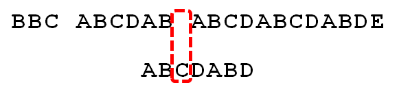    

#### KMP算法基于《next 数组》匹配

模式串“ABCDABD”的next数组如下图：

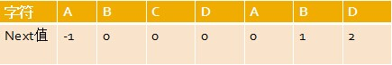    

还是给定文本串“BBC ABCDAB ABCDABCDABDE”，和模式串“ABCDABD”，现在要拿模式串去跟文本串匹配，如下图所示：

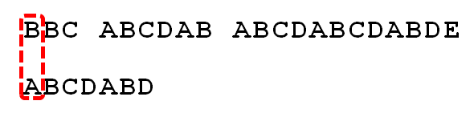    

在正式匹配之前，先来说一下KMP算法的匹配流程：
假设现在文本串S匹配到 i 位置，模式串P匹配到 j 位置
1、如果j = -1，或者当前字符匹配成功（即S[i] == P[j]），都令i++，j++，继续匹配下一个字符；
2、如果j != -1，且当前字符匹配失败（即S[i] != P[j]），则令 i 不变，j = next[j]。

开始匹配过程：
1. 最开始匹配时
P[0]跟S[0]匹配失败
所以执行“如果j != -1，且当前字符匹配失败（即S[i] != P[j]），则令 i 不变，j = next[j]”，所以j = -1，故转而执行“如果j = -1，或者当前字符匹配成功（即S[i] == P[j]），都令i++，j++”，得到i = 1，j = 0，即P[0]继续跟S[1]匹配。
P[0]跟S[1]又失配，j再次等于-1，i、j继续自增，从而P[0]跟S[2]匹配。
P[0]跟S[2]失配后，P[0]又跟S[3]匹配。
P[0]跟S[3]再失配，直到P[0]跟S[4]匹配成功，开始执行此条指令的后半段：“如果j = -1，或者当前字符匹配成功（即S[i] == P[j]），都令i++，j++”。

    

2. P[1]跟S[5]匹配成功，P[2]跟S[6]也匹配成功, ...，直到当匹配到P[6]处的字符D时失配（即S[10] != P[6]），由于P[6]处的D对应的next 值为2，所以下一步用P[2]处的字符C继续跟S[10]匹配

    

3. P[2]处的C再次失配，由于C对应的next值为0，所以下一步用P[0]处的字符继续跟S[10]匹配

    

4. A 跟空格不匹配，p[0]的next值为-1，即j = -1，如果“如果j = -1，或者当前字符匹配成功（即S[i] == P[j]），都令i++，j++”此时j = 0,此时让P[0]处的A与S[11]
    处的A继续匹配

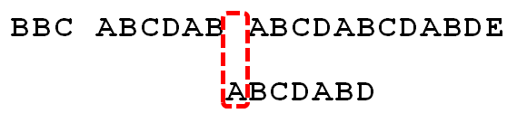    

5. P[0]处的A与S[11]处的A匹配成功，令i++，j++，直到P[6]处的D再次失配，因为P[6]对应的next值为2，故下一步用P[2]继续跟文本串匹配，

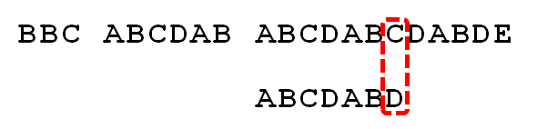    

6. 匹配成功，过程结束。

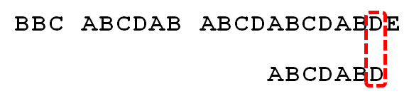    

KMP的核心思想是找到了模式串中每个字符之前的前缀和后缀公共部分的最大长度后，将他存入一个数组即next数组中，当匹配失败时，直接跳到next数组的值所对应的下标位置，然后继续匹配 

### KMP的时间复杂度分析
我们发现如果某个字符匹配成功，模式串首字符的位置保持不动，仅仅是i++、j++；如果匹配失配，i 不变（即 i 不回溯），模式串会跳过匹配过的next [j]个字符。整个算法最坏的情况是主串匹配到最后一位，模式串也匹配到最后一位才匹配成功，算法结束。
所以，如果文本串的长度为n，模式串的长度为m，那么匹配过程的时间复杂度为O(n)，算上计算next的O(m)时间，KMP的整体时间复杂度为O(m + n)。
 

  
   ---------------------------------
      
      
