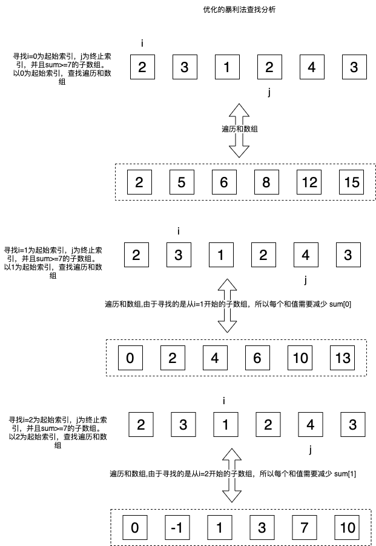
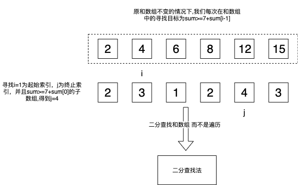
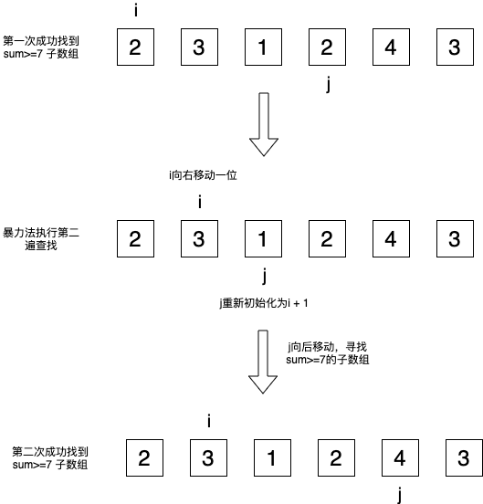

# 原题： 
	
	【长度最小的子数组】给定一个含有 n 个正整数的数组和一个正整数 s ，找出该数组中满足其和 ≥ s 的长度最小的连续子数组。
	如果不存在符合条件的连续子数组，返回 0。
	
	例子：
	输入: s = 7, nums = [2,3,1,2,4,3]
    输出: 2
    解释: 子数组 [4,3] 是该条件下的长度最小的连续子数组。
	

-------------------------
### 方案一：暴力法

#### 概述
按照题目要求直接求。计算所有可能的子数组的和并更新变量ans ，直到我们找到最短子数组且和满足 sum≥s

两遍循环和一遍迭代

两遍循环用于确定所有以i为起始索引，j为终止索引的子数组,内层循环退出条件为 子数组sum>=7,退出时j<=数组长度-1

一遍迭代用于计算子数组 nums i,j 的元素和

#### 代码：

```java   
    public static int minSubArrayLen1(int s, int[] nums) {
        int n = nums.length;
        int ans = Integer.MAX_VALUE;
        
        for (int i = 0; i < n; i++) {
            for (int j = i; j < n; j++) {
                int sum = 0;
                for (int k = i; k <= j; k++) {
                    sum += nums[k];
                }
                if (sum >= s) {
                    ans = Math.min(ans, (j - i + 1));
                    break;
                }
            }
        }
        return (ans != Integer.MAX_VALUE) ? ans : 0;
    }

```  
#### 复杂度 
时间复杂度：O(n<sup>3</sup>)

空间复杂度：O(1)

### 方案二：优化的暴力法

#### 概述
在方法 1 中，我们注意到求子数组的和需要的时间为 O(n) 。我们其实可以很容易地实现 O(1) 时间的求和，只需要从开始元素用一个累加器保存和。
我们将累积和保存在 sums 数组中，通过这种方法，我们可以轻松求出任意子区间的和。

两遍循环

预先计算指定位置i及之前的所有元素和值，并存放在sum[i] 中

两遍循环用于确认所有子数组的索引组合，并根据sums数组计算元素和值

#### 画图：
  

#### 代码：

```java   
    public static int minSubArrayLen2(int s, int[] nums) {
        int n = nums.length;
        if (n == 0) {
            return 0;
        }
        
        int ans = Integer.MAX_VALUE;
        
        int[] sums = new int[n];
        sums[0] = nums[0];
        
        for (int i = 1; i < n; i++) {
            sums[i] = sums[i - 1] + nums[i];
        }
        
        for (int i = 0; i < n; i++) {
            for (int j = i; j < n; j++) {
                int sum = sums[j] - (sums[i] - nums[i]);
                if (sum >= s) {
                    ans = Math.min(ans, (j - i + 1));
                    break;
                }
            }
        }
        return (ans != Integer.MAX_VALUE) ? ans : 0;
    }
```   


#### 复杂度 
时间复杂度：O(n<sup>2</sup>)

空间复杂度：O(n)

### 方案三：使用二分查找

#### 概述
一遍循环和一次二分查找

一遍循环用于取数组起始索引

一次二分查找用于寻找指定起始索引的子数组中 sum>=7的子数组

#### 画图：
  

#### 代码：

```java   
  public static int minSubArrayLen3(int s, int[] nums) {
        if (nums.length == 0) {
            return 0;
        }
        int result = Integer.MAX_VALUE;
        int[] sums = new int[nums.length + 1];
        for (int i = 1; i < sums.length; i++) {
            sums[i] = sums[i - 1] + nums[i - 1];
        }
        for (int i = 1; i < sums.length; i++) {
            int tmp = lowerBound(sums, 0, sums.length, s + sums[i - 1]);
            if (tmp != -1) {
                result = Math.min(result, tmp - i + 1);
            }
        }
        if (result == Integer.MAX_VALUE) {
            return 0;
        }
        return result;
    }
    
    private static int lowerBound(int[] nums, int L, int R, int target) {
        while (L < R) {
            int mid = L + (R - L) / 2;
            if (target <= nums[mid]) {
                R = mid;
            } else {
                L = mid + 1;
            }
        }
        if (L == nums.length) return -1;
        return L;
    }
```   


#### 复杂度 
时间复杂度：O(nlogn)

空间复杂度：O(n)


### 方案四：使用两个指针

#### 画图：
  
  
#### 分析：
第一行首次找到sum>=7的字数组，当执行第二次遍历查找时，需要将索引 i向右移动一位，
j重新初始化为i+1。然后迭代j，直到找到sum>=7的字数组为止。

我们发现，如果i向后移动一位，j向前移动n(n>=1)位，这个子数组的元素和必然小于7。
如果i向后移动n(n>=1)位，j位置不动，这个字数组的元素和可能大于等于7。

所以，我们就可以通过将j向前移动的操作消除掉，优化这个算法

#### 代码：

```java   
 public static int minSubArrayLen4(int s, int[] nums) {
        int n = nums.length;
        int ans = Integer.MAX_VALUE;
        
        int left = 0;
        int sum = 0;
        
        for (int i = 0; i < n; i++) {
            sum += nums[i];
            while (sum >= s) {
                ans = Math.min(ans, i + 1 - left);
                sum -= nums[left++];
            }
        }
        return (ans != Integer.MAX_VALUE) ? ans : 0;
    }
```   


#### 复杂度 
时间复杂度：O(n)

空间复杂度：O(1)

