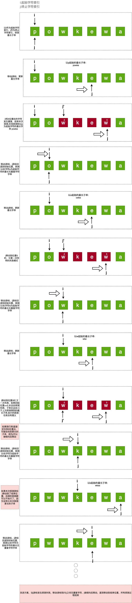
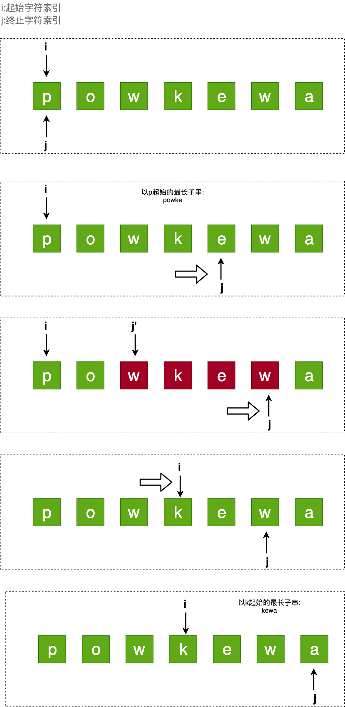

# 原题： 

	【Longest Substring Without Repeating Characters】给定一个字符串，找到最长的没有重复字符的子串. 

###### 示例：
###### 给定 "abcabcbb" ，没有重复字符的最长子串是 "abc" ，那么长度就是 3。
###### 给定 "bbbbb" ，最长的子串就是 "b" ，长度是 1。
###### 给定 "pwwkew" ，最长子串是 "wke" ，长度是 3。
-------------------------
### 方案一：暴力法
穷举所有子字符串，找到不含重复字符的最长子串。

即:执行n趟探测，每趟探测找到以i(0<=i<n)处字符为起始字符的最长无重复字符的子串

#### 画图：
  
  

代码：

```java   
    @Nullable
    public String longestSubString(@Nullable String s) {
        if (s == null || s.length() == 0) {
            return null;
        }
        
        int maxLength = 0;
        int resultIndex = 0;
        
        int n = s.length();
        
        for (int i = 0; i < n; i++) {
            for (int j = i; j < n; j++) {
                if (hasDuplicateChar(s, i, j)) {
                    break;
                }
                
                int newLength = j - i + 1;
                if (newLength <= maxLength) {
                    continue;
                }
                
                
                maxLength = newLength;
                resultIndex = i;
            }
        }
        
        return maxLength == 0 ? null : s.substring(resultIndex, resultIndex + maxLength);
    }
    
      private boolean hasDuplicateChar(String subStr, int start, int end) {
        Set<Character> set = new HashSet<>();
        
        for (int i = start; i <= end; i++) {
            Character ch = subStr.charAt(i);
            
            if (set.contains(ch)) {
                return true;
            }
            
            set.add(ch);
        }
        
        return false;
    }

```  
#### 复杂度 
时间复杂度：O(n<sup>3</sup>)

空间复杂度：O(min(n,m)),我们需要 O(k) 的空间来检查子字符串中是否有重复字符，其中 k 表示 Set 的大小。而 Set 的大小取决于字符串 n 的大小以及字符集/字母 m 的大小。
 
### 方案二：滑动窗口
#### 概述
在暴力法中，我们会反复检查一个子字符串是否含有有重复的字符，但这是没有必要的。如果从索引 i 到 j-1 之间的子字符串 s<sub>ij</sub> 已经被检查为没有重复字符。我们只需要检查 s\[j\] 对应的字符是否已经存在于子字符串 s<sub>ij</sub> 中。

要检查一个字符是否已经在子字符串中，我们可以检查整个子字符串，这将产生一个复杂度为 O(n<sup>2</sup>) 的算法，但我们可以做得更好。

通过使用 HashSet 作为滑动窗口，我们可以用 O(1) 的时间来完成对字符是否在当前的子字符串中的检查。

#### 画图：
  
#### 代码：

```java   
@Nullable
    public String longestSubStringSlidingWindow(@Nullable String s) {
        if (s == null || s.length() == 0) {
            return null;
        }
        
        int maxLength = 0;
        int resultIndex = 0;
        
        Set<Character> set = new LinkedHashSet<>();
        
        int length = s.length();
        int i = 0, j = 0;
        
        while (i < length && j < length) {
            
            if (set.contains(s.charAt(j))) {
                set.remove(s.charAt(i));
    
                i++;
                continue;
            }
            
            set.add(s.charAt(j));
            
            int newLength = j - i + 1;
            if (newLength > maxLength) {
                maxLength = newLength;
                resultIndex = i;
            }
            
            j++;
        }
        
        return maxLength == 0 ? null : s.substring(resultIndex, resultIndex + maxLength);
    }
```   


#### 复杂度 
这两种方法的时间复杂度和空间复杂度：
时间复杂度：O(n)

空间复杂度：O(min(m,n)),与之前的方法相同。滑动窗口法需要 O(k) 的空间，其中 k 表示 Set 的大小。而 Set 的大小取决于字符串 n 的大小以及字符集/字母 m 的大小。
