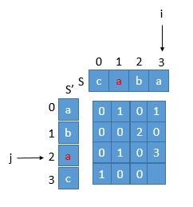
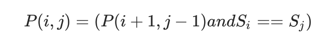
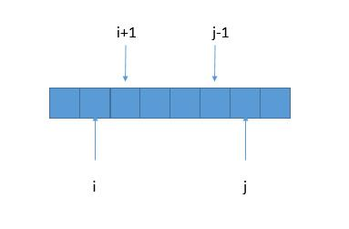
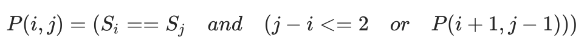

# 最长回文子串

### 题目描述

给定一个字符串 `s`，找到 `s` 中最长的回文子串。你可以假设 `s` 的最大长度为 1000。

**示例 1：**

```
输入: "babad"
输出: "bab"
注意: "aba" 也是一个有效答案。
```

**示例 2：**

```
输入: "cbbd"
输出: "bb"
```

### 解法一：暴力法

暴力法将选出所有子字符串可能的开始和结束位置，并检验它是不是回文。

```swift
func isPalindromic(_ string: String) -> Bool {
    let midIndex = string.index(string.startIndex, offsetBy: string.count / 2)
    let firstHalf = string[string.startIndex..<midIndex]
    let secondHalf = string[midIndex..<string.endIndex].reversed()
    return !zip(firstHalf, secondHalf).contains(where: { $0.lowercased() != $1.lowercased() })
}
func longestPalindrome(_ string: String) -> String {
    var result = ""
    var max = 0
    for i in 0 ..< string.count {
        for j in i + 1 ..< string.count {
            let start = string.index(string.startIndex, offsetBy: i)
            let end = string.index(string.startIndex, offsetBy: j)
            let temp = String(string[start...end])
            if isPalindromic(temp), temp.count > max {
                result = temp
                max = temp.count
            }
        }
    }
    return result
}
```

时间复杂度是<a href="https://www.codecogs.com/eqnedit.php?latex=O(n^3)" target="_blank"></a>

空间复杂度是<a href="https://www.codecogs.com/eqnedit.php?latex=O(1)" target="_blank"></a>

### 解法二：最长公共子串

根据回文串的定义，正着和反着读一样，那我们是不是把原来的字符串倒置了，然后找最长的公共子串就可以了。例如 `S = "caba"` ，`S' = "abac"`，最长公共子串是 `"aba"`，所以原字符串的最长回文串就是 `"aba"`。

关于求最长公共子串，有很多方法，这里用动态规划的方法：

整体思想就是，申请一个二维的数组初始化为 0，然后判断对应的字符是否相等，相等的话：

```
arr[i][j] = 1,  (i == 0 || j == 0)
arr[i][j] = arr[i-1][j-1] + 1,  (i > 0 && j > 0)
```

|      | c    | a    | b    | a    |
| ---- | ---- | ---- | ---- | ---- |
| a    | 0    | 1    | 0    | 1    |
| b    | 0    | 0    | 2    | 0    |
| a    | 0    | 1    | 0    | 3    |
| c    | 1    | 0    | 0    | 0    |

`arr[i][j] `保存的就是公共子串的长度。

```swift
func longestCommonSubstring(_ string: String) -> String {
    guard !string.isEmpty else { return "" }
    let origin = string
    let reverse = String(string.reversed())
    let length = string.count
    var arr = [[Int]](repeating: [Int](repeating: 0, count: string.count), count: string.count)
    var maxLen = 0
    var maxEndIndex = 0
    for i in 0 ..< length {
        for j in 0 ..< length  {
            let originCharacter = Array(origin)[i]
            let reverseCharacter = Array(reverse)[i]
            if  originCharacter == reverseCharacter {
                if i == 0 || j == 0 {
                    arr[i][j] = 1
                } else {
                    arr[i][j] = arr[i - 1][j - 1] + 1
                }
            }
            if arr[i][j] > maxLen {
                maxLen = arr[i][j]
                maxEndIndex = i
            }
        }
    }
    let start = string.index(string.startIndex, offsetBy: maxEndIndex - maxLen + 1)
    let end = string.index(string.startIndex, offsetBy: maxEndIndex)
    return String(string[start...end])
}
```

再看一个例子，`S="abc435cba"`，`S'="abc534cba"`，最长公共子串是 `"abc"` 和 `"cba"`，但很明显这两个字符串都不是回文串。

所以我们求出最长公共子串后，并不一定是回文串，我们还需要判断该字符串倒置前的下标和当前的字符串下标是不是匹配。

比如 `S="caba"`，`S'="abac"` ，`S’` 中 `aba` 的下标是 `0 1 2` ，倒置前是 `3 2 1`，和 `S` 中 `aba` 的下标符合，所以 `aba` 就是我们需要找的。当然我们不需要每个字符都判断，我们只需要判断末尾字符就可以。



首先 `i`，`j` 始终指向子串的末尾字符。所以 `j` 指向的红色的 `a` 倒置前的下标是 `beforeRev = length-1-j=4-1-2=1`，对应的是字符串首位的下标，我们还需要加上字符串的长度才是末尾字符的下标，也就是 `beforeRev+arr[i][j]-1=1+3-1=3`，因为 `arr[i][j]` 保存的就是当前子串的长度，也就是图中的数字 3。此时再和它与 i 比较，如果相等，则说明它是我们要找的回文串。

代码的话，在上边的基础上，保存 `maxLen` 前判断一下下标匹不匹配就可以了。

```swift
func longestPalindrome(_ string: String) -> String {
    guard !string.isEmpty else { return "" }
    let origin = string
    let reverse = String(string.reversed())
    let length = string.count
    var arr = [[Int]](repeating: [Int](repeating: 0, count: string.count), count: string.count)
    var maxLen = 0
    var maxEndIndex = 0
    for i in 0 ..< length {
        for j in 0 ..< length  {
            let originCharacter = Array(origin)[i]
            let reverseCharacter = Array(reverse)[j]
            if  originCharacter == reverseCharacter {
                if i == 0 || j == 0 {
                    arr[i][j] = 1
                } else {
                    arr[i][j] = arr[i - 1][j - 1] + 1
                }
            }
          /**********修改的地方*******************/
            if arr[i][j] > maxLen {
                let beforeRev = length - 1 - j
                if beforeRev + arr[i][j] - 1 == i {
                    maxLen = arr[i][j]
                    maxEndIndex = i
                }
            }
          /*************************************/
        }
    }
    let start = string.index(string.startIndex, offsetBy: maxEndIndex - maxLen + 1)
    let end = string.index(string.startIndex, offsetBy: maxEndIndex)
    return String(string[start...end])
}
```

时间复杂度：两层循环<a href="https://www.codecogs.com/eqnedit.php?latex=O(n^2)" target="_blank"></a>。

空间复杂度：一个二维数组<a href="https://www.codecogs.com/eqnedit.php?latex=O(n^2)" target="_blank"></a>。

### 解法三：动态规划

为了改进暴力法，我们首先观察如何避免在验证回文时进行不必要的重复计算。考虑`ababa`这个示例。如果我们已经知道 `bab`是回文，那么很明显`ababa`一定是回文，因为它的左首字母和右尾字母是相同的。

我们给出<a href="https://www.codecogs.com/eqnedit.php?latex=P(i,j)" target="_blank"></a>的定义如下：

因此，

所以如果我们想知道<a href="https://www.codecogs.com/eqnedit.php?latex=P(i,j)" target="_blank"></a>的情况，不需要调用判断回文串的函数了，只需要知道<a href="https://www.codecogs.com/eqnedit.php?latex=P(i&space;&plus;&space;1,j&space;-&space;1)" target="_blank"></a>的情况就可以了，这样时间复杂度就少了<a href="https://www.codecogs.com/eqnedit.php?latex=O(n)" target="_blank"></a>。因此我们可以用动态规划的方法，空间换时间，把已经求出的<a href="https://www.codecogs.com/eqnedit.php?latex=P(i,j)" target="_blank"></a>存储起来。



如果<a href="https://www.codecogs.com/eqnedit.php?latex=S[i&plus;1,j-1]" target="_blank"></a>是回文串，那么只要 <a href="https://www.codecogs.com/eqnedit.php?latex=S[&space;i&space;]==S[&space;j&space;]" target="_blank"></a>，就可以确定<a href="https://www.codecogs.com/eqnedit.php?latex=S[i,j]" target="_blank"></a>也是回文串了。

事实上，当<a href="https://www.codecogs.com/eqnedit.php?latex=S[&space;i&space;]==S[&space;j&space;]" target="_blank"></a>成立的时候，<a href="https://www.codecogs.com/eqnedit.php?latex=P(i,j)" target="_blank"></a>的值由<a href="https://www.codecogs.com/eqnedit.php?latex=P(i&space;&plus;&space;1,j&space;-&space;1)" target="_blank"></a>决定，这一点也不难思考：当左右边界字符串相等的时候，整个字符串是否是回文就完全由“原字符串去掉左右边界”的子串是否回文决定。但是这里还需要再多考虑一点点：“原字符串去掉左右边界”的子串的边界情况。

> 1、当原字符串的元素个数为3个的时候，如果左右边界相等，那么去掉它们以后，只剩下1个字符，它一定是回文串，故原字符串也一定是回文串；
>
> 2、当原字符串的元素个数为2个的时候，如果左右边界相等，那么去掉它们以后，只剩下0个字符，显然原字符串也一定是回文串。

把上面两点归纳一下，只要 <a href="https://www.codecogs.com/eqnedit.php?latex=S[i&plus;1,j-1]" target="_blank"></a>至少包含两个元素，就有必要继续做判断，否则直接根据左右边界是否相等就能得到原字符串的回文性。而<a href="https://www.codecogs.com/eqnedit.php?latex=S[i&plus;1,j-1]" target="_blank"></a> 至少包含两个元素”等价于 i + 1 < j - 1，整理得 i - j < -2，或者j - i > 2。

综上，如果一个字符串的左右边界相等，以下二者之一成立即可：
1、去掉左右边界以后的字符串不构成区间，即“ <a href="https://www.codecogs.com/eqnedit.php?latex=S[i&plus;1,j-1]" target="_blank"></a> 至少包含两个元素”的反面，即 i - j >= -2，或者 j - i <= 2；
2、去掉左右边界以后的字符串是回文串，具体说，它的回文性决定了原字符串的回文性。

由于j>i，所以状态转移方程为:


```swift
func longestPalindrome(_ string: String) -> String {
    let charaters = Array(string)
    let length = string.count
    var P = [[Bool]](repeating: [Bool](repeating: false, count: string.count), count: string.count)
    var maxLen = 0
    var maxPal = ""
    for len in 1 ... length {
        for start in 0 ..< length {
            let end = start + len - 1
            if end >= length { break }
            P[start][end] = (charaters[start] == charaters[end] && (len <= 2 || P[start + 1][end - 1]))
            if P[start][end] && len > maxLen {
                maxLen = len
                maxPal = String(charaters[start ... end])
            }
        }
    }
    return maxPal
}
```

时间复杂度：两层循环<a href="https://www.codecogs.com/eqnedit.php?latex=O(n^2)" target="_blank"></a>。

空间复杂度：用二维数组P保存每个子串的情况<a href="https://www.codecogs.com/eqnedit.php?latex=O(n^2)" target="_blank"></a>。

### 解法四：中心扩展算法

我们知道回文串一定是对称的，所以我们可以每次循环选择一个中心，进行左右扩展，判断左右字符是否相等即可。因此，回文可以从它的中心展开，并且只有2n - 1个这样的中心。

你可能会问，为什么会是2n - 1个，而不是n个中心？原因在于所含字母数为偶数的回文的中心可以处于两字母之间（例如“abba” 的中心在两‘b’之间）。

比如有字符串`abcba`，这时回文子串是`abcba`，中心是`c`；又有字符串`adccda`，这时回文子串是`adccda`，中心是`cc`。 由此可见中心点既有可能是一个字符，也有可能是两个字符，当中心为一个字符的时候有n个中心，当中心为两个字符的时候有n-1个中心，所以一共有2n-1个中心。 

```swift
func longestPalindrome(_ string: String) -> String {
    guard !string.isEmpty else { return "" }
    var start = 0
    var end = 0
    for i in 0 ..< string.count {
        let len1 = expandAroundCenter(string, left: i, right: i)
        let len2 = expandAroundCenter(string, left: i, right: i + 1)
        let len = max(len1, len2)
        if len > end - start {
            start = i - (len - 1) / 2
            end = i + len / 2
        }
    }
    let characters = Array(string)
    return String(characters[start ... end])
}
private func expandAroundCenter(_ string: String, left: Int, right: Int) -> Int {
    let characters = Array(string)
    let length = string.count
    var L = left
    var R = right
    while L >= 0 && R < length && characters[L] == characters[R] {
        L -= 1
        R += 1
    }
    return R - L - 1
}
```

为什么会有两次expandAroundCenter，一次是i和i本身，一次是i和i+1，这就是上面说到的一个中心与两个中心。 而后会去判断这两种情况下谁的回文子串最长，并标记出这个子串在原字符串中的定位，即start和end。

时间复杂度：<a href="https://www.codecogs.com/eqnedit.php?latex=O(n^2)" target="_blank"></a>。

空间复杂度：<a href="https://www.codecogs.com/eqnedit.php?latex=O(1)" target="_blank"></a>。