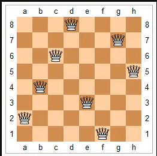
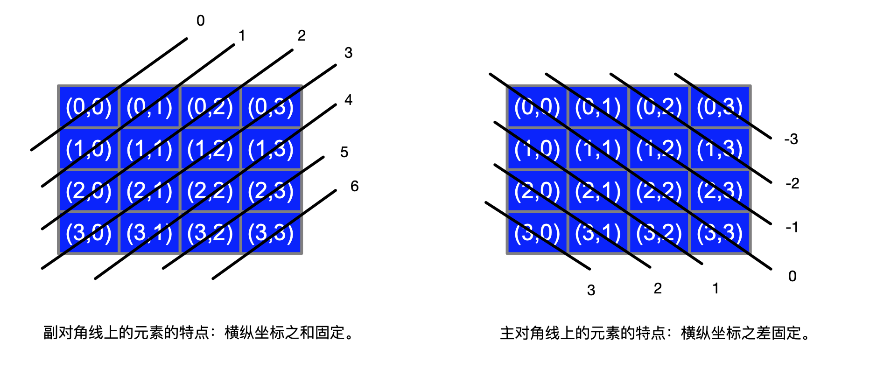

## N皇后问题

### 题目大意

n个皇后摆放在`N x N的棋盘格中，使得横、竖和两个对角线方向均不会同时出现两个皇后。

## 回溯

回溯算法的基本思想是：从一条路往前走，能进则进，不能进则退回来，换一条路再试。

# 解题思路

n皇后问题当n大于等于4才有讨论意义，而且不只有一个解决方案；
 用**递归**的方法找到每一种解决方案；
 在当前解决方案中，遍历每一行的每一列查找可以放置皇后的**位置**；
 在当前行中，遍历每一列的每一个位置，假设当前位置可以放，然后进行合法性判断，合法则放置；
 然后再递归判断下一行；
 递归结束后，将当前行当前列的位置回溯，置为未放状态，再接着判断当前行下一列，目的是为了找到所有的解决方案。

条件1、不能同行 X坐标不能相同

条件2、不能同列  Y坐标不能相同

条件3、不能放在统一斜线上， 对于所有的主对角线有 `行号 + 列号 = 常数`，对于所有的次对角线有 `行号 - 列号 = 常数`

