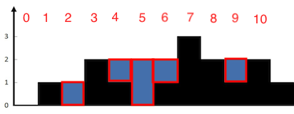
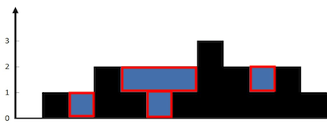

[42. 接雨水](https://leetcode-cn.com/problems/trapping-rain-water/)

给定 *n* 个非负整数表示每个宽度为 1 的柱子的高度图，计算按此排列的柱子，下雨之后能接多少雨水。

上面是由数组 [0,1,0,2,1,0,1,3,2,1,2,1] 表示的高度图，在这种情况下，可以接 6 个单位的雨水（蓝色部分表示雨水）。 

**示例:**

**输入**: [0,1,0,2,1,0,1,3,2,1,2,1]

**输出**: 6

 

 

 

 

 

 

 

 

**核心思路：找出每个index的水位**

 

 

#### 方法 1：暴力

对于数组中的每个元素，找出下雨后水能达到的最高位置，等于两边最大高度的较小值减去当前高度的值。

1、 从当前index向左扫描，找出最大值maxLeft；

2、 从当前index向右扫描，找出最大值maxRight；

3、 取maxLeft、maxRight的较小值；

4、 较小值减去当前index的高度；

 

**复杂性分析**

·    时间复杂度： *O*(*n*2)。数组中的每个元素都需要向左向右扫描。

·    空间复杂度 ：*O*(1) 的额外空间。

 

#### 方法 2：存储最大值

在暴力方法中，我们仅仅为了找到最大值每次都要向左和向右扫描一次。但是我们可以提前存储这个值。

1、 声明left数组，存储每个index对应的左向最大高度；

2、 声明right数组，存储每个index对应的右最大高度；

3、 取每个maxLeft、maxRight的较小值；

4、 较小值减去当前index的高度；

**复杂性分析**

·    时间复杂度：*O*(*n*)。

o  存储最大高度数组，需要两次遍历，每次 *O*(*n*) 。

o  最终使用存储的数据更新 ，*O*(*n*)。

·    空间复杂度：*O*(*n*) 额外空间。

o  和方法 1 相比使用了额外的 *O*(*n*) 空间用来放数组。

 

#### 方法 3：使用双指针

和方法 2 相比，我们不从左和从右分开计算，我们想办法一次完成遍历。
 1、如果左指针的高度小于右指针的高度，则有可能以左指针以左的最大高度为基准，确定左指针所在位置的水位；

2、如果左指针的高度大于右指针的高度，则有可能以右指针以右的最大高度为基准，确定右指针所在位置的水位；

 

**思考：**

 

