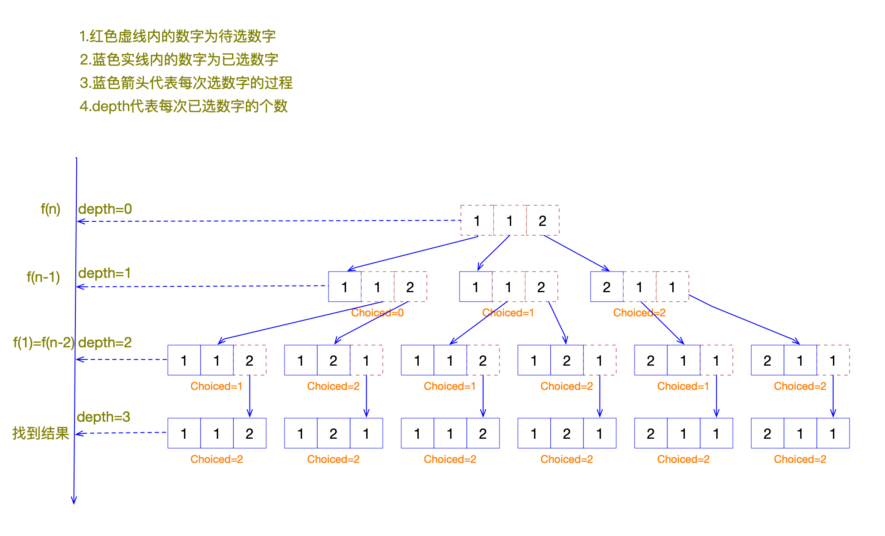
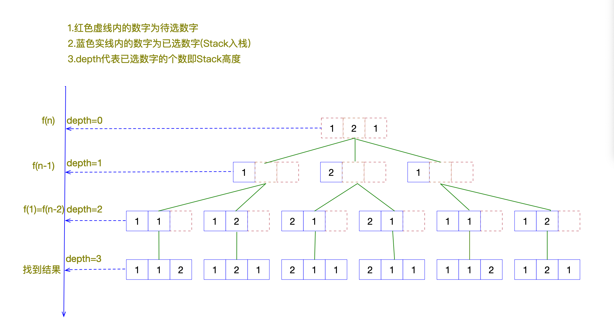
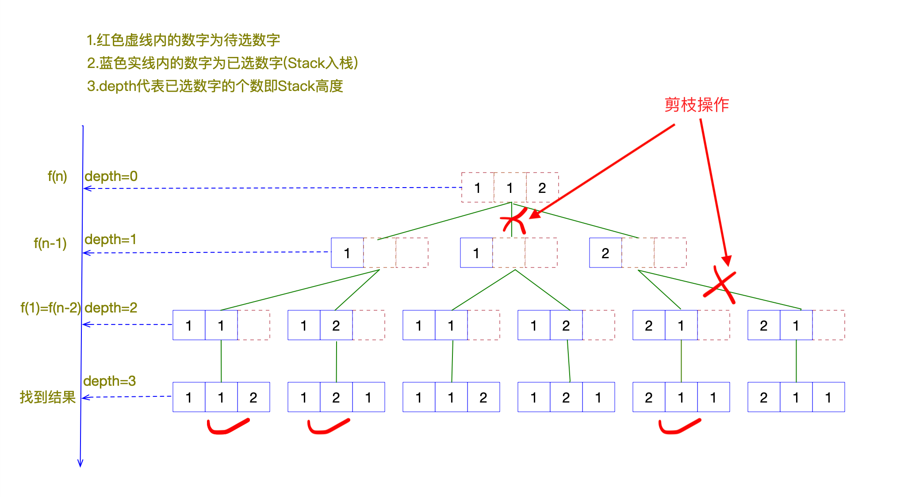
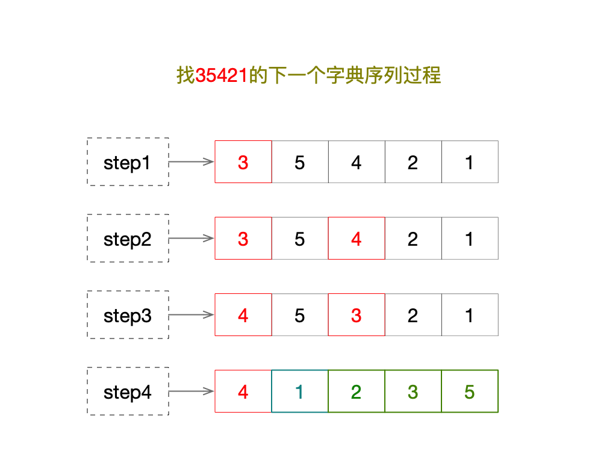

## Permutations II

### 题目描述
给定一组可能包含重复的数字，返回所有可能的唯一排列。例如：

```
Input: [1,1,2]
Output:
[
  [1,1,2],
  [1,2,1],
  [2,1,1]
]
```

### 递归思想
根据题目描述，可把一个找子序列的过程看做是一个填萝卜坑的过程，首先一个长度为n的数组，则记为0、1号、2号...n号，共n个萝卜坑，索引为0的数字1代表重量为1的萝卜。每次找到一个萝卜，就把这个萝卜往对应号码的坑里放。最后坑填满了说明找到一个子序列；然后重复找的过程。
据此我们可以归纳出以下过程：

1、从n个数字里选一个数字，这个过程记做f(n)；

2、第一次选一个数字为f(n)，第二次则为f(n-1)，但三次为f(n-2)....，最后一次为f(1)，此时没有数字可选，则得到一个子序列结果；

3、总的排列个数为R(n)=$$C_n^1$$ * $$C_n-1^1$$ * $$C_n-2^1$$...* $$C_2^1$$ * $$C_1^1$$

4、选数字的过程需要去重

记数组为array，长度为size，已选的次数为depth,当depth==size时，找到一个结果。最终可以得到伪代码如下：

```
f(array, size, depth) {
	if(size == depth) {
		保存子序列
	}
	for(int i=depth;i<size;i++) {
		if(待选数字与已选数字里的任何数字相等) {
			continue;
		}
		记录选择过程
		f(array, size, depth+1)
		重置选择过程
	}
}
```

如果这个过程不理解，我们再看下面的图：


最终Java版代码实现如下：

```
    /**
     * 递归算法
     *
     * @param array     当前待排序的集合
     * @param arraySize 数组长度
     * @param output    存放结果的集合
     * @param depth     已经选取的数字个数
     */
    public void recursive(ArrayList<Integer> array, int arraySize, List<List<Integer>> output, int depth) {
        if (depth == arraySize) {
            output.add(new ArrayList<>(array));
        }
        for (int i = depth; i < arraySize; i++) {
            Collections.swap(array, depth, i);
            recursive(array, arraySize, output, depth + 1);
            Collections.swap(array, depth, i);
        }
    }
```
### 回溯思想
以示例输入: `[1, 2, 3]` 为例，如果让我们手写，要做到不重不漏，我们书写的策略可能是这样：“一位一位确定”，这样说比较笼统，具体是这样的：

1、先写以 `1` 开始的两个排列：`[1, 2, 3]、[1, 3, 2]`；

2、再写以 `2` 开始的两个排列：`[2, 1, 3]、[2, 3, 1]`；

3、最后写以 `3` 开始的两个排列：`[3, 1, 2]、[3, 2, 1]`。

如果数组元素多一点的话，也不怕，我们写的时候遵循下面的原则即可：

* 1、按数组的顺序来（不要求排序，但我们选取元素的顺序是从左到右的），每次排定 1 个元素；
说明：只有按照顺序才能做到不重不漏。

* 2、新排定的元素一定不能在之前排定的元素中出现。
说明：如果违反了这一条，就不符合“全排列”的定义。
我们把上面这件事情给一个形式化的描述：问题的解空间是一棵递归树，求解的过程正是在这棵递归树上搜索答案，而搜索的路径是“深度优先遍历”，它的特点是“不撞南墙不回头”。


这里需要思考下如何去掉重复数据？此时怎么进行剪枝操作？



划重点：

* “回溯搜索”算法即“深度优先遍历 + 状态重置 + 剪枝”
* 状态重置有个小技巧（位掩码）

核心代码如下：

```
    /**
     * @param array     排好序的数组
     * @param visited   状态
     * @param depth     搜索深度
     * @param path      搜索路径
     * @param result    结果集
     */
    public void permutation(int[] array, int visited, int depth, Stack<Integer> path, List<List<Integer>> result) {
        int arraySize = array.length;
        if (depth == arraySize) {
            result.add(new ArrayList<>(path));
            return;
        }
        for (int i = 0; i < arraySize; i++) {
            if (notVisited(visited, i)) {
                if (i > 0 && array[i] == array[i - 1] && visited(visited, i - 1)) {
                    continue;
                }
                path.push(array[i]);
                visited ^= 1 << i;
                permutation(array, visited, depth + 1, path, result);
                // 回溯的时候，一定要记得状态重置
                path.pop();
                visited ^= 1 << i;
            }
        }
    }

```

### 字典序解法

字典序实现全排列有以下规则:

* 1、从右向左，找出第一个能破坏递增顺序的元素(即array[i]<array[i+1])，记位置为i;
* 2、从右向左，找出第一个大于A[i]的元素，及其位置为j;
* 3、交换A[i]与A[j]两个元素；
* 4、从i位置往后的所有元素进行逆序排列；



核心代码如下：

```
    private boolean getNextPerm(ArrayList<Integer> array, List<List<Integer>> output) {
        output.add(new ArrayList<>(array));
        int firstLessIndex = -1;
        int size = array.size();

        //找到第一个左边<右边的数X = nums[firstLessIndex]，firstLessIndex后全是倒序
        for (int i = size - 1; i > 0; i--) {
            if (array.get(i - 1) < array.get(i)) {
                firstLessIndex = i - 1;
                break;
            }
        }

        //如果没找到，则说明已经是最后一个序列了
        if (firstLessIndex == -1)
            return false;

        for (int j = size - 1; j > firstLessIndex; j--) {
            //从后往前，找到第一个大于X的数Y
            if (array.get(j) > array.get(firstLessIndex)) {
                //交换X和Y
                swap(array, j, firstLessIndex);
                //将firstLessIndex后边的数逆置
                reverse(array, firstLessIndex + 1, size - 1);
                return true;
            }
        }
        return false;
    }
```
