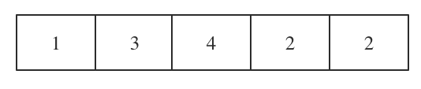
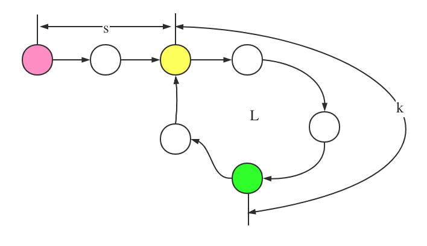

## 寻找重复数字

给定一个包含n+1个元素的整型数组，其中每一个元素都是一个1到n之间的正整数。该数组中存在唯一重复出现的数字，找出该数字。

比如：

```
Input: [1,3,4,2,2]
Output: 2
```

```
Input: [3,1,3,4,2]
Output: 3
```

算法要求：

* 不可改动数组
* 空间复杂度是`O(1)`
* 时间复杂度必须低于$ O(n^2) $

根据这几个条件，我们可以首先放弃的方法就是排序以及map来计数统计的方法来解决这个方案。

如果按照各个数字分别统计的方法来进行统计的话，时间复杂度的要求不会得到满足。

### 方案一：二分法

由题意，可供使用的数字有n个，但是位置有n+1个，因此至少会有一个数字重复。 题干保证了只有唯一一个重复的数字。假设只重复了一次的话，那么就是将n个不同的数字均匀地分布到n+1个位置，剩下的那个位置放置重复的那个数字。也就是说，对于这n个数字的中间数x而言，必定会有小于x的数字数量和大于等于x的数字数量差一或者二。同理如果重复的数字的数量大于二，那么也是有一边多，一边少。而且数量多的那一边就是重复数字多的那一边。那么我们就可以通过二分法不断地缩小范围来找到多出来的那个数字。比如对于数组`[1, 3, 4, 2, 2]`



小于3的数有3个，大于2的数有2个，`2 < 3`因此，重复的数字肯定是小于3的。小于2的数字有一个，大于1的数有2两个，因此重复的数字是2。

分情况。

假设寻找数字的范围是`[left, right]`

如果数字有奇数个，那么判断条件就是 $ x = count(>= mid) $ 和 $ y = count(<= mid) $，如果$ x == y $相等的话，那么重复的数就是mid，如果$ x < y $那么重复的数字就是$ (mid, right] $这个范围内的。如果$ right-mid == 1 $那么重复的数字就是$ right $

如果数字有偶数个，那么判断条件就是$ x = count(> \lfloor mid \rfloor) $，$ y = count( < \lceil mid \rceil) $，如果$ x < y $那么重复的就是大于$ mid $的，否则的话就是小于$ mid $的。

### 方案二：快慢指针

链表有一种表示方法就是通过数组来存储链表。因此我们可以把这个数组看作是一个链表。对于有重复数字的数组而言，就是该数组代表的链表里有一个环。那么就可以使用Floyd算法来解决。通过该方法找到的圆环的入口就是重复的数字。



设起点到圆环开始的距离是$ s $，如上图$ s $是2，圆环开始到第一次相聚的地方距离是$ k $，上图$ k $是3。圆环的长度是$ L $，上图是4。有两个指针，$ p、q $，$ p $每次走一步$ q $每次走两步，两者相聚的时候则p走了$ x $圈走的距离是$ s + xL + k $，q走了$ y $圈距离是$ s+ yL + k $因为q的速度是p的两倍，因此有$ 2(s + xL + k) = s + yL + k $
我们是想$ s $的长度，对上面的等式进行展开有：
$$
s = (y-2x)L - k
\\
s = (y-2x-1)L + (L - k)
$$
这个等式的意思是s的长度等于整数圈的环长减去$ k $的长度，也就是一个指针如果从相遇点开始走，另外一个指针从起始点开始走的话，最终会相遇在圆环的入口点。找到了入口点，就找到了重复的数字。