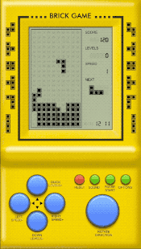
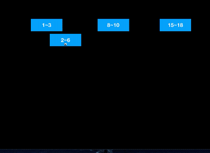
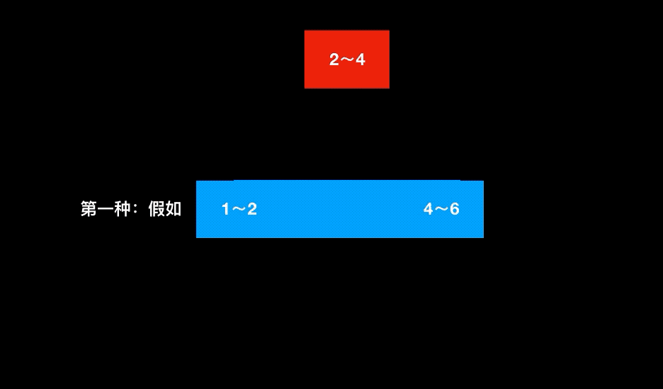
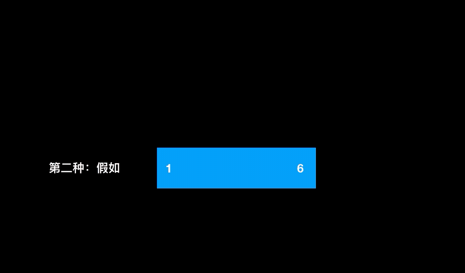

## 算法 -> 区间合并

```swift
 题目:
给出一个区间的集合，请合并所有重叠的区间。
示例 1:
输入: [[1,3],[2,6],[8,10],[15,18]]
输出: [[1,6],[8,10],[15,18]]
解释: 区间 [1,3] 和 [2,6] 重叠, 将它们合并为 [1,6].
示例 2:
输入: [[1,4],[4,5]]
输出: [[1,5]]
解释: 区间 [1,4] 和 [4,5] 可被视为重叠区间。
```

咱们先不看这个题，来看几个小问题。

首先来个🍐，玩过俄罗斯方块不？

 想一下俄罗斯方块，俄罗斯，俄罗斯～～俄罗斯美女（😝）

这个样子的：  




俄罗斯方块的游戏规则是当方块填满一行的时候，会自动消除当前填满的一行。这个行为，大家是不是可以看成，初始值从左到右都是false的数组，当方块下来的时候，把对应的值设置为true，当这个行都设置为true的时候消除掉这一行，并设置为初始值。（大家肯定会想，这个和这个题有什么关系那？答案：并没什么关系哈）

都玩过英雄联盟吧（默认都玩过哈），英雄联盟中有2个CP，炮娘 & 提莫，举个例子，当这两个CP吵架的时候，提莫给小炮致盲了，这个时候小炮打不到提莫了，当致盲的效果中，提莫还是很生气，再次致盲小炮，致盲效果的时间会在此基础上增加。小炮一直到致盲效果褪去才能打到提莫。这个过程看起来 和题目是不是也有点相似呢。

然后来个高级点的🌰，定过会议室不？不过这个是简单的，哈~

假如你想定一个会议室，当这个会议室被别人使用的时间和你想使用的时间重叠的时候，这个时候你肯定是定不了这个会议室的，然而你需要找一个空余时间和你想使用时间重合的会议室。反过来想，是不是在计算别人时间和自己时间是否重合是不是也和这个相似呢？

这个时候大家可能对上面这种♦️方块类的例子有了大概的了解，其实咱们的这个算法问题和这两个问题其实思想上差不多。那么开弄～

说了这么多无用的信息。为了方便大家再次理解与思考上面的题干，那就在看一下:



首先我们的思路是这样的

```swift
if current.Start <= last.End {
   Merge intervals  
} else {
  Instert new interval
}
```

首先说明一下下文中的关键字： 当前的 `interval` 下文开始写为 `$0` ,相对于 `interval`的下一个`interval` 为`$1`别忘了呦。。

开始正经的聊天了，不看题写作文了，不写代码。

思路为：当 `$0[0]` 和`$1[0]`得最大值 小于 `$0[1]` 和`$1[1]`的最小值时，这个时候证明两个区间是可以合并的

1. 第一种是对原来数据进行改造，对应的修改删除：这个时候 是可以 把`$0`删除掉，把`$1[0]`设置为`min($0[0]`,`$1[0]`) `  $1[0]`设置为`max($0[1]`,`$1[1]`)

   

2. 第二种就是申请一个新的数组，添加应有的区间

   

然后依次循环遍历即可

用以上的的思路来写一下代码如下：第一个解题代码是：

```swift
func merge(_ intervals: [[Int]]) -> [[Int]] {
    if intervals.count < 2 {
        return intervals
    }
    var result = intervals
    var i = 0
    while i < result.endIndex {
        var j = i + 1
        var needNext = true
        while j < result.endIndex {
            let array = result[i]
            let temp = result[j]
            if max(array[0], temp[0]) <= min(array[1], temp[1]) {
                result.remove(at:j)
                let a = [min(array[0],temp[0]), max(array[1], temp[1])]
                result[i] = a
                needNext = false
            } else {
                j = j + 1
            }
        }
        if needNext {
            i = i + 1
        }
    }
    return result
}
```

第二个解题代码是：

```swift
func merge(_ intervals: [[Int]]) -> [[Int]] {
    if intervals.count < 2 {
        return intervals
    }
    var list = intervals
    var arrayM: [[Int]] = []
    list.sort { (node1, node2) -> Bool in
        return node1[0] < node2[0]
    }
    var idx = 0
    let count = list.count
    while idx < count {
        let left = list[idx][0]
        var right = list[idx][1]
        while idx < list.count - 1, right >= list[idx + 1][0] {
            idx += 1
            right = max(right, list[idx][1])
        }
        arrayM.append([left, right])
        idx += 1
    }
    return arrayM
}
```

大家可能也发现了 二维数组的`[0]` ` [1]` 看起来不那么明显，So 咱们还是定义一个结构体吧，如下：

```swift
struct Node {
    var start: Int
    var end: Int
    init(start: Int, end: Int) {
        self.start = min(start, end)
        self.end = max(start, end)
    }
    static func < (node1: Node, node2: Node) -> Bool {
        return node1.start < node2.start
    }
    
    static func == (node1: Node, node2: Node) -> Bool {
        return node1.start < node2.start && node1.end == node2.end
    }
}
```

改造一下上面的代码🤩

```swift
func mergeIntervals(array: [Node]) -> [Node] {
    if array.count < 2 {
        return array
    }
    var list = array
    var arrayM: [Node] = []
    list.sort { return $0 < $1}
    var idx = 0
    while idx < list.count {
        let left = list[idx].start
        var right = list[idx].end
        while idx < list.endIndex, right >= list[idx + 1].start {
            idx += 1
            right = max(right, list[idx].end)
        }
        arrayM.append(Node(start: left, end: right))
        idx += 1
    }
    
    return arrayM
}
```

是不是清晰多了那？

---

这道题做完了么？想一想 应该差不多了吧～。

咦，突然看到了一个东西 ，我看到了什么～

```swift
给出一个无重叠的 ，按照区间起始端点排序的区间列表。

在列表中插入一个新的区间，你需要确保列表中的区间仍然有序且不重叠（如果有必要的话，可以合并区间）。

示例 1:
输入: intervals = [[1,3],[6,9]], newInterval = [2,5]
输出: [[1,5],[6,9]]

示例 2:
输入: intervals = [[1,2],[3,5],[6,7],[8,10],[12,16]], newInterval = [4,8]
输出: [[1,2],[3,10],[12,16]]
解释: 这是因为新的区间 [4,8] 与 [3,5],[6,7],[8,10] 重叠。
```


加入插入一个区间，然后再合并，形成一个新的区间。这种操作 是不是 也是这个范畴里面的那？想一下下。。嗯 好像是属于区间合并内的东东。干就得了～

思路 和 上面的合并是非常相似的，那么我们就开始讲两个解题思路

1. 查找新间隔的位置，将其插入列表中，并调用MergeIntervals，和上面的代码一摸一样，还用写代码么？

```swift
Null~
```

2. 第二个思路为，`star > $0.end`证明`$1` 在加入的新区间Node的左边，然而`end < $0.star`证明`$0`在新区间Node的右边，大家想想是不是那？

   既然大家都明白，代码如下：

```swift
func insert(intervals : [Node], newInterval: Node) -> [Node] {
    if intervals.isEmpty {
        return [newInterval]
    }
    var l: [Node] = []
    var r: [Node] = []
    
    var start = newInterval.start
    var end   = newInterval.end
    
    for interval in intervals {
        if interval.end < start {
            l.append(interval)
        } else if interval.start > end {
            r.append(interval)
        } else {
            start = min(interval.start, start)
            end   = max(interval.end, end)
        }
    }
    return l + [Node(start: start, end: end)] + r
}
```

---

然而这个时候又会有一个这样的操作（删除），当删除一个区间后，又会合并出一个新的区间，所以就有了下面的问题：

```swift
给你一个 有序的 不相交区间列表 intervals 和一个要删除的区间 toBeRemoved， intervals 中的每一个区间 intervals[i] = [a, b] 都表示满足 a <= x < b 的所有实数 x 的集合。

我们将 intervals 中任意区间与 toBeRemoved 有交集的部分都删除。

返回删除所有交集区间后， intervals 剩余部分的 有序 列表。

示例 1：

输入：intervals = [[0,2],[3,4],[5,7]], toBeRemoved = [1,6]
输出：[[0,1],[6,7]]
示例 2：

输入：intervals = [[0,5]], toBeRemoved = [2,3]
输出：[[0,2],[3,5]]
```

这个大家可以思考一下 [算法.key](算法.key) 或者看下面的图





看了gif中的演示，大家可能有了一个初步的想法，这个想法每个人都有每个人的想法，那么我先来大概说一下，看看对不对。

在删除区间主要是分为几种情况：

1. 删除区间和已有区间块压根没什么关系，
2. 删除区间和已有区间块重叠，重叠包含和一个区间重叠和多个区间
3. 删除区间覆盖已有区间，覆盖包换覆盖一个区间和多个区间

再分析一下，这几种情况可以总结为两点：

1. 当节点的start < 删除节点的statr 或者 节点的start > 删除节点的end 说明删除区间和当前区间没什么关系，也就是上面的情况一

2. 当节点的start < 删除节点的satrt 情况 和 节点的end > 删除节点的end 的情况为应该分割了

根据上面的思路代码如下：

```swift
func deleteNode(array: [Node],delete:Node) -> [Node] {
      if array.count == 0 || delete.end < array.first!.start {
          return array
      }
      var list: [Node] = []
      for node in array {
          if node.end <= delete.start || node.start >= delete.end {
              list.append(node)
          } else {
              if node.start < delete.start {
                  list.append(Node(start: node.start, end: delete.start))
              }
              if node.end > delete.end {
                  list.append(Node(start: delete.end, end: node.end))
              }
          }
      }
      return list
  }
```


---

#引申

当大家都看完后会发现一个很有意思的东西，那就是这类问题的一个通用的解题想法 。 Line Sweep 的简单的思想，在这里我就简单的引用leetcode中的话语：

```swift
在计算几何中，扫描线算法（Sweep Line Algorithm）或平面扫描算法（Plane Sweep Algorithm）是一种算法范例，它使用虚拟扫描线或扫描面来解决欧几里德空间中的各种问题。它是计算几何中的关键技术之一。

这种算法背后的想法是想象一条线（通常是一条垂直线）在平面上扫过或移动，在某些点停止。几何操作仅限于几何对象，无论何时停止，它们都与扫描线相交或紧邻扫描线，并且一旦线穿过所有对象，就可以获得完整的解。

链接：https://leetcode-cn.com/tag/line-sweep/
来源：力扣（LeetCode）
著作权归作者所有。商业转载请联系作者获得授权，非商业转载请注明出处。
```

 