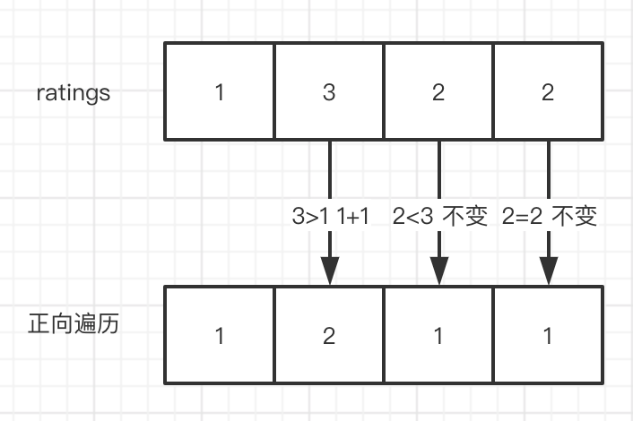
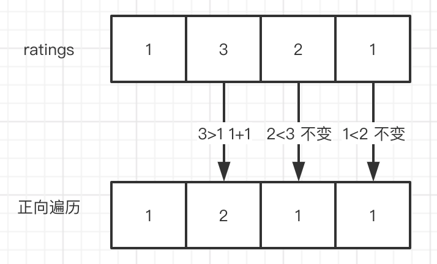
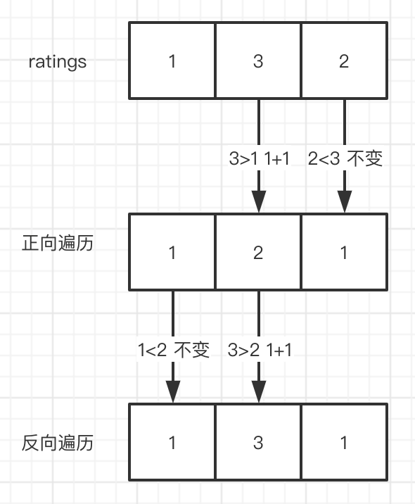
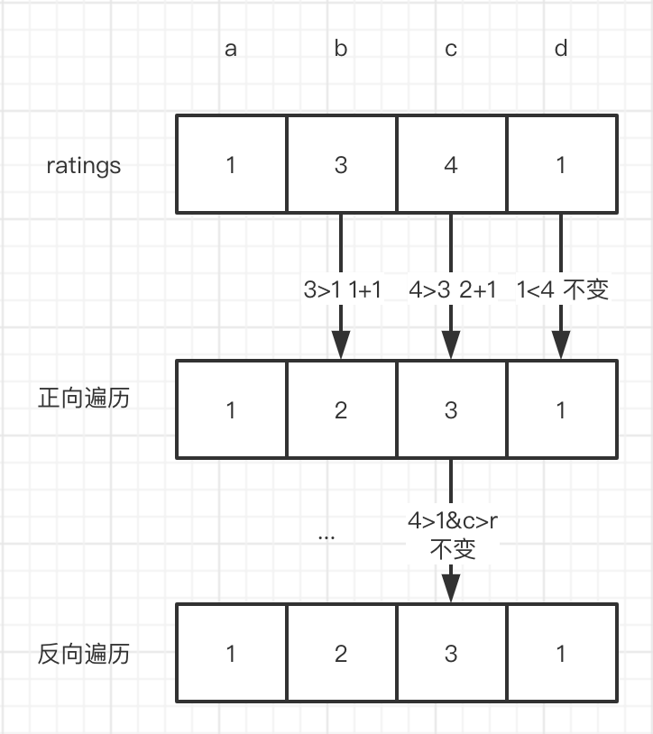
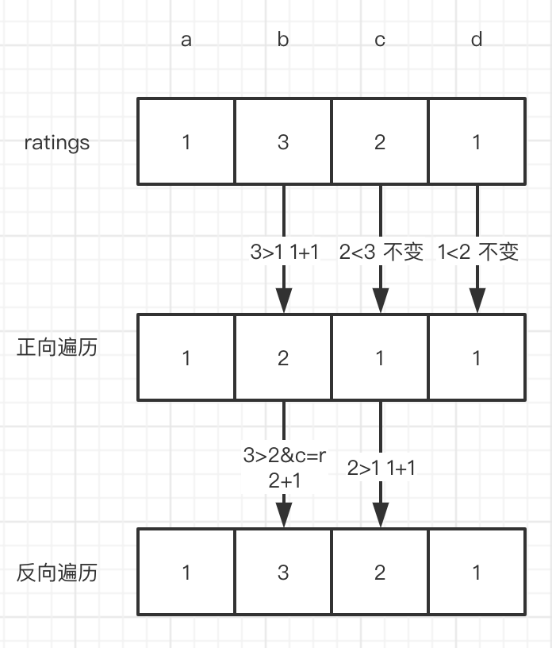
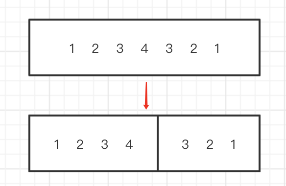
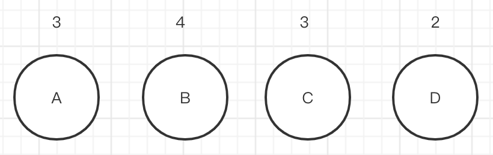

**# LeetCode58

## 原题

There are N children standing in a line. Each child is assigned a rating value.

You are giving candies to these children subjected to the following requirements:

Each child must have at least one candy. Children with a higher rating get more candies than their neighbors. What is the minimum candies you must give?

```
Input: [1,0,2]
Output: 5
Explanation: 2,1,2
```

```
Input: [1,2,2]
Output: 4
Explanation: 1,2,1
```

```
Input: [1,4,2,1]
Output: 7
Explanation: 1,3,2,1
```

## 举例切入

#### 例子1
ratings = {2,3,4}
Explanation: 1,2,3

#### 例子2
ratings = {4,3,1}
Explanation: 3,2,1

#### 例子3
ratings = {2,3,4,2}
Explanation: 1,2,3,1

#### 例子4
ratings = {2,4,3,2}
Explanation: 1,3,2,1

## 方案一：左右遍历（贪婪算法）

### 分析

因为题干要求每个孩子至少 **1** 个糖果，所以首先创建一个大小为 **N**，默认值为 **1** 的数组 **nums**，用于保存每个孩子应得到的糖果数。

先将 **ratings** 从左到右遍历一次，俩俩比较，如果右 rating > 左 rating，则说明右边孩子比左边孩子分数高，所以右边孩子应该比左边孩子多拿一个糖果。




这样遍历完有个问题，我们只在右 rating > 左 rating 的情况下，给予右边的孩子更多的糖多，但却没有在左 rating > 右 rating 的情况，给予左边孩子更多的糖果。比如下面的例子：



```
rating =  {1，3，2，1}
初始化复制后的 nums = {1，1，1，1}
从左往右扫描后 nums = {1，2，1，1}

rating 中 2 明明比 1 大，却拿一样的糖果，这不公平！
```

为了方便，这次我们从右往左遍历，在左 rating > 右 rating 的情况下，给予左边孩子更多糖果：

方法一样，继续俩俩比较，如果左 rating > 右 rating，则说明左边孩子比右边孩子分数高，所以应该比右边孩子多拿一个糖果。



很快我们发现了问题：经过第一次的遍历，对于左 rating > 右 rating 的情况，左边孩子的糖果有可能已经比右边孩子多了，这种情况已经满足要求，所以不做处理。



但是，（经过第一次的遍历，对于左 rating > 右 rating 的情况）左边孩子的糖果有可能比右边孩子少或者一样，这样就需要将左边孩子的糖果值设定为右边孩子的糖果 + 1，才能满足要求。比如：



这样左右遍历之后，孩子的任意俩边均满足分数高、糖果多的最小要求。

其它例子：

```
rating =  {2，3，3，3，2}
初始化复制后的 nums = {1，1，1，1，1}
从左往右扫描后 nums = {1，2，1，1，1}

// 左值比右值大，糖果却和右边一样，所以左糖果 = 右糖果 + 1
从右往左分解第一步 nums = {1，2，1，2，1} 
// 左值比右值一样，糖果不变
从右往左分解第二步 nums = {1，2，1，2，1} 
// 左值比右值一样，糖果不变
从右往左分解第三步 nums = {1，2，1，2，1}
```

### 代码

```java
public static int methodA(int[] ratings){
    int res = 0;
    int[] nums = new int[ratings.length];
    // 默认为1
    for(int i = 0; i < nums.length; i++){
        nums[i] = 1;
    }
    // 从左到右
    for(int i = 0; i < nums.length - 1; i++){
        if(ratings[i + 1] > ratings[i]){
            nums[i + 1] = nums[i] + 1;
        }
    }
    // 从右到左
    for(int i = nums.length - 1; i > 0; i--){
        if(ratings[i - 1] > ratings[i]){
            nums[i - 1] = nums[i] + 1 > nums[i - 1] ? nums[i] + 1 : nums[i - 1];
        }
    }
    for(int num : nums) res += num;
    return res;
}
```

时间复杂度 On，空间复杂度 On。

## 方案二：一次遍历

我们可以按照分数递增递减来划分，递增和递减数列按照不同的计算方式获取最终糖果数，只需一次循环遍历。

```
rating =  {1，2，3，4，3，2，1}
```

划分方式：



现在从左到右遍历，**上述例子** 就可以简单理解为递增数列之和 + 递减数列之和。

对于递增队列，如果 rating 为 1 的孩子糖果数为 1，则后一个孩子的糖果数为前一个孩子的糖果数 +1，所以我们设第一个孩子的糖果数为 pre，每进行一次循环，总糖果数为：

```Java
res += ++pre；

// 如第二个孩子 res = res + （pre + 1）
```

对于递减队列，我们可以看作是 n 阶的等差数列。

> 递减队列的最小糖果数总是1。（左右俩侧分数均比他大，则他只能拿最小糖果数1）

所以可以如下求和：

```java
res += n * (n + 1) / 2;
```

> 从上可以看出，要一次循环就拿到总糖果数，递增数列遍历过程中即可得到当前总糖果数，而递减数列则需要在最小位才能知道。
> 
> 所以对于上面的例子，求糖果数过程就变成了递增数列逐步累加求和+递减数列等差数列求和。
> 
> 尝试用上面例子模拟求和过程。

上述求和方式没有考虑到俩种情况，下面一一说明：

#### 情况一:

```
rating =  {1，3，3，4，3，2，1}
```

举几个简单的例子：

```
rating =  {1，2，2}
Explanation：1，2，1
```

```
rating =  {1，2，2，2}
Explanation：1，2，1，1
```

即数列中存在相邻节点相同 rating 的情况。

从例子中可以看出，如果是递增队列中出现相同 rating 的情况，可以将 pre 置为 1，然后重新开始计算糖果。

假如是递减队列中出现呢？
递减队列中出现，则可以拆分成新的递增队列 + 递减队列，举个例子：

```
rating =  {3，2，2，1}
拆分后：第一个2为递减队列，第二个2为递增队列，1为递减队列。
```

>实际看代码比较好理解，即第二个 2 的糖果（糖果数为1）作为递增形式直接累加，不通过等差数列公式计算。
>即 >= 算作一种情况，只不过 == 时需要将累加值 pre （也就是糖果数）重置为 1.

#### 情况二:

```
rating =  {3，4，3，2}

通过上述公式计算，结果为：1，2，2，1
但是实际应该是：1，3，2，1
```

即我们没有考虑到等差数列衔接处的特殊情况，或者这样说：

```
if (n >= pre) res += n + 1 - pre;
```



上述例子，n = 2（n 阶等差数列），pre = 2（递增累加值）。

pre 位，也就是 B 同学，一定是俩个数列的最大值。所以 B 持有的糖果，不能只比左边多，同时还要比右边多，也就是说 **B 同学持有的糖果数 = Max（pre，n + 1）**。

由于我们已经把 pre 的最大值，也就是 B 同学在递增情况下持有的糖果数加入到了结果了，所以当 n >= pre 时，res 应当先减去错误的糖果数，再加入正确的糖果数，即

```
if (n >= pre) res = res - pre + (n + 1);
```

### 代码

```java
public static int methodC(int[] ratings){
    int[] nums = new int[ratings.length];
    int res = 1, pre = 1, cnt = 0;
    for (int i = 1; i < ratings.length; ++i) {
        if (ratings[i] >= ratings[i - 1]) {
            if (cnt > 0) {
                res += cnt * (cnt + 1) / 2;
                if (cnt >= pre) res += cnt + 1 - pre; 
                cnt = 0;
                pre = 1;
            }
            pre = (ratings[i] == ratings[i - 1]) ? 1 : pre + 1;
            res += pre;
        } else {
            ++cnt;
        }
    }     
    if (cnt > 0) {
        res += cnt * (cnt + 1) / 2;
        if (cnt >= pre) res += cnt + 1 - pre;
    }
    return res;
}
```


