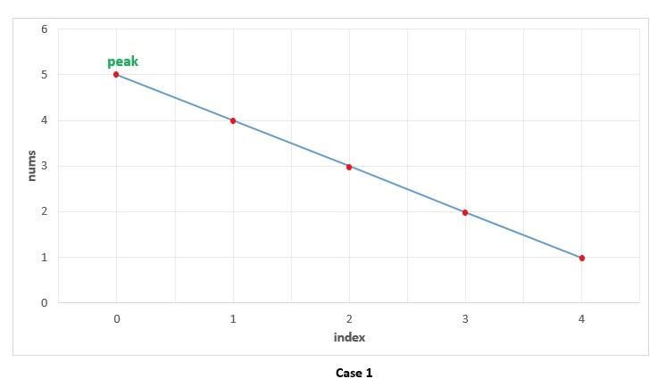
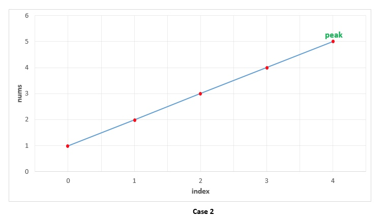
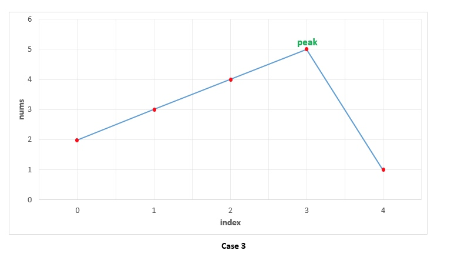

# 寻找峰值

## 题目要求

峰值元素是指其值大于左右相邻值的元素。

给定一个输入数组 nums，其中 nums[i] ≠ nums[i+1]，找到峰值元素并返回其索引。

数组可能包含多个峰值，在这种情况下，返回任何一个峰值所在位置即可。

你可以假设 nums[-1] = nums[n] = -∞。

示例 1:

```java
输入: nums = [1,2,3,1]
输出: 2
解释: 3 是峰值元素，你的函数应该返回其索引 2。
```

示例 2:

```java
输入: nums = [1,2,1,3,5,6,4]
输出: 1 或 5
解释: 你的函数可以返回索引 1，其峰值元素为 2；
     或者返回索引 5， 其峰值元素为 6。
```

示例 3:

```java
输入: nums = [1,2,3]
输出: 2
解释: 3 是峰值元素，你的函数应该返回其索引 2。
```

示例 4:

```java
输入: nums = [3,2,1]
输出: 0
解释: 3 是峰值元素，你的函数应该返回其索引 0。
```

要求：时间复杂度 O(logN)

## 解法

### 线性扫描

#### 思路

一句话，出现降序，即为峰值。

下面一一列举。

场景1:纯降序数组。（0点出现降序，所以为峰值）



场景2:纯升序数组。（末尾出现降序，所以为峰值）



场景3:升降复合数组。（n点出现降序，即为峰值）




#### 代码

```java
/**
 * 寻找峰值元素
 * <p>
 * 遍历 n
 */
public static int findPeakElement(int[] nums) {
    for (int i = 1; i < nums.length; ++i) {
        if (nums[i] < nums[i - 1]) return i - 1;
    }
    return nums.length - 1;
}
```

很明显，不能满足 O(logN) 的要求。

### 二分查找

#### 思路

寻找中点元素。
如果中点元素的值小于右边元素的值，则说明峰值在右边，抛弃左边和中点的数；
如果中点元素的值大于右边元素的值，则说明峰值在左边，抛弃右边的数。

见演示 Demo。

#### 代码

```java
    /**
     * 寻找峰值元素
     * <p>
     * 二分法 logN
     */
    public static int findPeakElementByDivide(int[] nums) {
        int start = 0;
        int mid = 0;
        int end = nums.length - 1;
        while (start < end) {
            mid = (start + end) / 2;
            if (nums[mid] < nums[mid + 1]) {// 峰值在右边
                start = mid + 1;
            } else {// 峰值在左边
                end = mid;
            }
        }
        // start == end 二分到了最后一位 注意 此时mid可能没变
        return start;
    }
```

时间复杂度满足题目要求。

> 耗时就不单独算了，偶然性太大，除非是最坏情况，但是最坏情况实际就是 `O(N)` 和 `O(log2N)` 的耗时对比了，没有太大的意义。

> 另外二分查找还有递归形式，没什么太大区别，而且空间复杂度更高（也是 logN）。

