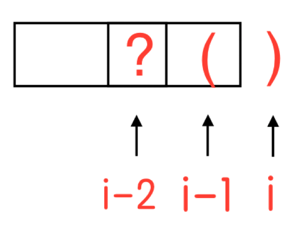
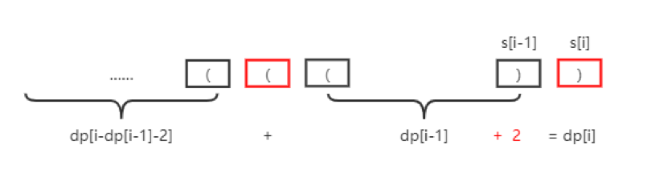

## 【Longest Valid Parentheses】 

Given a string containing just the characters '(' and ')', find the length of the longest valid (well-formed) parentheses substring. Each time you can either climb 1 or 2 steps. In how many distinct ways can you climb to the top? Note: Given n will be a positive integer. Example 1:
    Input: "(()"
    Output: 2
    Explanation: The longest valid parentheses substring is "()"
Example 2:
    Input: ")()())"
    Output: 4
    Explanation: The longest valid parentheses substring is "()()"

## 32.最长有效括号【困难】
给定一个只包含 '(' 和 ')' 的字符串，找出最长的包含有效括号的子串的长度。
示例 1:
输入: "(()"
输出: 
解释: 最长有效括号子串为 "()"

示例 2:
输入: ")()())"
输出: 4
解释: 最长有效括号子串为 "()()"

示例 3:
输入: "((())"
输出: 4
解释: 最长有效括号子串为 "(())"

## 概念解释

这道题，再不看Leecode的时候，非常容易弄错题目的含义，首先我们看一下题目中的三个关键因素。

有效括号 -- 
1、(在前，)在后
2、如果(和)之间是(...)且(...)是有效括号序列，那么...一定由0到多个不定长度的【有效括号序列】组成

配对 -- 栈

最长 -- 动态规划

## 解法1 - 暴力法

列举所有的字符串，然后判断每个字符串是不是符合。
为了检查有效性，我们使用栈的方法。

每当我们遇到一个 ( ，我们把它放在栈顶。对于遇到的每个 ) ，我们从栈中弹出一个 ( ，如果栈顶没有 (，或者遍历完整个子字符串后栈中仍然有元素，那么该子字符串是无效的。
这种方法中，我们对每个偶数长度的子字符串都进行判断，并保存目前为止找到的最长的有效子字符串的长度。

当然这里可以做个优化就是，因为合法字符串一定是偶数个，所以可以只列举偶数长度的字符串。列举从 0 开始的，长度是 2、4、6 ……的字符串，列举下标从 1 开始的，长度是 2、4、6 ……的字符串，然后循环下去。

举个🌰:
"((())"

(( --> 无效
(( --> 无效
() --> 有效，长度为 2
)) --> 无效
((()--> 无效
(())--> 有效，长度为 4
最长长度为 4

```objc

/// 判断括号是否有效
/// @param str 目标字符串
+ (BOOL)isVailed:(NSString *)str {
    Stack *stack = [[Stack alloc] init];
    for (NSInteger i = 0; i < [str length]; i++) {
        NSString *temp = [str substringWithRange:NSMakeRange(i, 1)];
        if ([temp isEqualToString:@"("]) {
            [stack push:@"("];
        } else if (![stack isEmpty] && [[stack peek] isEqualToString:@"("]) {
            [stack popObj];
        } else {
            return NO;
        }
    }
    return [stack isEmpty];
}

/// 暴力解法
/// @param str 目标字符串
+ (NSInteger)violenceMethod:(NSString *)str {
    NSInteger maxLength = 0;
    for (NSInteger i = 0; i < [str length]; i++) {
        for (NSInteger j = i + 2; j <= [str length]; j+=2) {
            NSString *subString = [str substringWithRange:NSMakeRange(i, j - i)];
            if ([LongestValidParentheses isVailed:subString]) {
                maxLength = MAX(maxLength, j - i);
            }
            
        }
    }
    return maxLength;
}

```
时间复杂度: 列举字符串是 O（n²），判断是否是合法序列是 O（n），所以总共是 O（n³）。

空间复杂度：O（n），每次判断的时候，栈的大小。

这个算法，leetCode 会报时间超时。
那有没有其他的解法呢？


## 解法2 - 动态规划

动态规划题目分析的4个步骤：

1、确定状态
    研究最优策略的最后一步
    化为子问题
2、转移方程
    根据子问题定义得到
3、初始条件和边界情况
4、计算顺序


### 确定状态

对于最优的策略，一定有最后一个元素 str[i]
所以，我们先看第 i 个位置，这个位置的元素 str[i]可能有如下两种情况：
第一种情况：**str[i] == '('**
这时，str[i] 无法和其之前的元素组成有效的括号对，所以，dp[i] = 0

第二种情况：**str[i] == ')'**
这时，需要看其前面对元素来判断是否有有效括号对。分为如下两种情况：

情况1:**str[i - 1] == '('**
即 str[i] 和 str[i - 1] 组成一对有效括号，有效括号长度新增长度**2**
i位置对最长有效括号长度为 其之前2个位置的最长括号长度，加上当前位置新增的2，我们无需知道i-2位置对字符是否可以组成有效括号对。
那么得到如下方程
**dp[i] = dp[i - 2] + 2**
如下图：



情况2:**str[i - 1] == ')'**
这种情况下，如果前面有和str[i]组成有效括号对的字符，即形如( (....) )，这样的话，就要求str[i - 1]位置必然是有效的括号对，否则str[i]无法和前面对字符组成有效括号对。

这时，我们只需要找到和str[i]配对对位置，并判断其是否是 ( 即可。和其配对的位置为：i - dp[i - 1] −1。

如果：**str[i - dp[i - 1] −1] == '('**

有效括号长度新增长度2，i位置对最长有效括号长度为 i-1位置的最长括号长度加上当前位置新增的2，那么有：
**dp[i] = dp[i−1] + 2**

值得注意的是，i - dp[i - 1] - 1 和 i 组成了有效括号对，这将是一段独立的有效括号序列，如果之前的子序列是形如 (...)(...) 这种序列，那么当前位置的最长有效括号长度还需要加上这一段。所以：

**dp[i]= dp[i−1] + dp[i − dp[i−1] − 2]+2**



### 子问题

根据上面的分析，我们得到了如下两个计算公式：

dp[i] = dp[i−2] + 2

dp[i] = dp[i−1] + dp[i−dp[i−1]−2]+2

那么，求dp[i]就变成了求dp[i - 1]、 dp[i - 2]d、dp[i - dp[i - 1] - 2]的子问题。

这样状态也明确了：

设dp 数组，其中第 i 个元素表示以下标为 i 的字符结尾的最长有效子字符串的长度。

### 状态转移方程

**以 ( 结尾的子字符串不考虑，因为不可能构成合法括号**

如果当前位置的括号是右括号： str[i] == ')'，那我们可以推断？
1、如果当前位置的前面一位是左括号：str[i - 1] == '('，也就是字符串形如 “……()”，我们可以推出：
dp[i] = dp[i − 2] + 2。
因为结束部分的 "()" 是一个有效子字符串，并且将之前有效子字符串的长度增加了 2.

2、如果当前位置的前面一位是右括号：s[i - 1] == ')'，也就是字符串形如 “.......))”，我们可以推出：
    继续向前扫描，如果发现左括号：if s[i - dp[i - 1] - 1] == '('，
    dp[i] = dp[i − 1] + dp[i − dp[i − 1] − 2] + 2。
因为如果倒数第二个 )是一个有效子字符串的一部分（记为subs），
我们此时需要判断 subs 前面一个符号是不是 ( ，
如果恰好是(，我们就用 subs 的长度(dp[i - 1)加上 2 去更新 dp[i]。
除此以外，我们也会把子字符串 subs 前面的有效字符串的长度加上，也就是 dp[i − dp[i − 1] − 2].

### 边界情况
i - 2 有可能小于零越界了，这种情况下就是只有 () ，前面记为 0 就好了.
i - dp[i - 1] - 1 和 i - dp[i - 1] - 2 都可能越界，越界了当成 0 来计算就可以了.

### 确定状态

无论第一个字符是什么，都有：dp[0] = 0
然后依次计算：dp[1], dp[2], ..., dp[n - 1]
结果是： max(dp[i])
 
```objc

/// 动态规划
/// @param str 字符串
+ (NSInteger)dynamicProgrammingMethod:(NSString *)str {
    NSInteger maxLength = 0;
    NSMutableArray *dpArray = [[NSMutableArray alloc] initWithCapacity:str.length];
    //dp数组先填充补0
    for (NSInteger i = 0; i < [str length]; i++) {
        [dpArray addObject:@(0)];
    }
    //一次遍历
    for (NSInteger i = 1; i < [str length]; i++) {
        NSString *temp = [str substringWithRange:NSMakeRange(i, 1)];
        //判断右括号
        if ([temp isEqualToString:@")"]) {
            NSString *lastTemp = [str substringWithRange:NSMakeRange(i - 1, 1)];
            //右括号前边是左括号
            if ([lastTemp isEqualToString:@"("]) {
                NSInteger length = i >= 2 ? [dpArray[i - 2] integerValue] : 0;
                length = length + 2;
                dpArray[i] = [NSNumber numberWithInteger:length];
                //右括号前边是右括号，并且除去前边的合法序列的前边是左括号
            } else if (i - [dpArray[i - 1] integerValue] - 1 >= 0) {
                NSString *lastlastTemp = [str substringWithRange:NSMakeRange(i - [dpArray[i - 1] integerValue] - 1, 1)];
                if ([lastlastTemp isEqualToString:@"("]) {
                    NSInteger length = (i - [dpArray[i - 1] integerValue] - 2) >= 0 ? [dpArray[i - [dpArray[i - 1] integerValue] - 2] integerValue] : 0;
                    length = length + [dpArray[i - 1] integerValue] + 2;
                    dpArray[i] = [NSNumber numberWithInteger:length];
                }
            }
        }
        maxLength = MAX(maxLength, [dpArray[i] integerValue]);
    }
    return maxLength;
}

```

时间复杂度： O(n) 。遍历整个字符串一次，就可以将 dp 数组求出来。
空间复杂度： O(n) 。需要一个大小为 length 的 dp 数组。


## 解法3 - 栈解法

从左到右扫描字符串，栈顶保存当前扫描的时候，合法序列前的一个位置位置下标是多少。

具体解释一下吧：

我们扫描到左括号，就将当前**位置**入栈。

扫描到右括号，就将栈顶出栈（代表栈顶的左括号匹配到了右括号），然后分两种情况。

1、栈不空，那么就用当前的位置减去栈顶的存的位置，然后就得到当前合法序列的长度，然后更新一下最长长度。
2、栈是空的，说明之前没有与之匹配的左括号，那么就将当前的位置入栈。

我们来具体看下面的图示：


```objc

/// 栈解法
/// @param str 目标字符串
+ (NSInteger)stackMethod:(NSString *)str{
    NSInteger maxLength = 0;
    Stack *stack = [[Stack alloc] init];
    [stack push:@(-1)];
    for (NSInteger i = 0; i < [str length]; i++) {
        NSString *temp = [str substringWithRange:NSMakeRange(i, 1)];
        if ([temp isEqualToString:@"("]) {
            [stack push:@(i)];
        } else {
            [stack popObj];
            if ([stack isEmpty]) {
                [stack push:@(i)];
            } else {
                maxLength = MAX(maxLength, i - [[stack peek] integerValue]);
            }
        }
    }
    return maxLength;
}

```


时间复杂度： O(n) 。n是给定字符串的长度。
空间复杂度： O(n) 。栈的大小，最大达到 n 。

## 解法4 - 左右扫描计数法

从左到右扫描，用两个变量 left 和 right 保存的当前的左括号和右括号的个数，都初始化为 0 。

*如果左括号个数等于右括号个数了，那么就更新合法序列的最长长度。*
*如果左括号个数大于右括号个数了，那么就接着向右边扫描。*
*如果左括号数目小于右括号个数了，那么后边无论是什么，此时都不可能是合法序列了，此时 left 和 right 归 0，然后接着扫描。*

从左到右扫描完毕后，同样的方法从右到左再来一次
因为类似这样的情况 ( ( ( ) ) ，如果从左到右扫描到最后，left = 3，right = 2，
期间不会出现 left == right。但是如果从右向左扫描，扫描到倒数第二个位置的时候，就会出现 left = 2，right = 2 ，就会得到一种合法序列。

**感兴趣大家可以讨论下解法的思路从何而来（有效括号的概念）**

```objc
/// 左右扫描解法
/// @param str 目标字符串
+ (NSInteger)leftAndRightScanningMethod:(NSString *)str{
    NSInteger left = 0;
    NSInteger right = 0;
    NSInteger maxLength = 0;
    //从左到右扫描
    for (NSInteger i = 0; i < [str length]; i++) {
        NSString *temp = [str substringWithRange:NSMakeRange(i, 1)];
        if ([temp isEqualToString:@"("]) {
            left++;
        } else {
            right++;
        }
        if (left == right) {
            maxLength = MAX(maxLength , 2 * left);
        } else if (right > left){
            left = 0;
            right = 0;
        }
    }
    left = 0;
    right = 0;
    //从右到左扫描
    for (NSInteger i = [str length] - 1; i >= 0; i--) {
        NSString *temp = [str substringWithRange:NSMakeRange(i, 1)];
        if ([temp isEqualToString:@"("]) {
            left++;
        } else {
            right++;
        }
        if (left == right) {
            maxLength = MAX(maxLength , 2 * left);
        } else if (left > right){
            left = 0;
            right = 0;
        }
    }
    return maxLength;
}
```

时间复杂度： O(n) 。遍历两遍字符串。
空间复杂度： O(1) 。仅有两个额外的Integer变量 left 和 right 。
