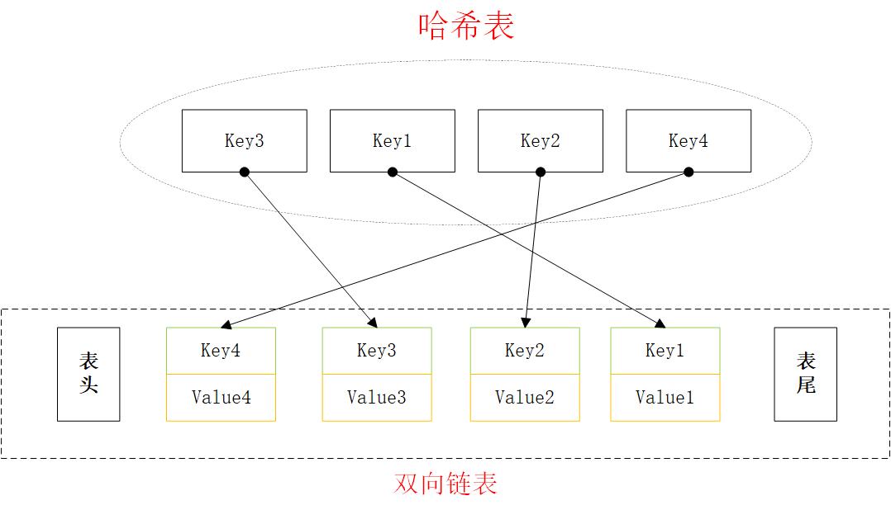

**【LRU Cache】** 设计和实现最近最少使用（LRU）缓存的数据结构,它应该支持以下操作:
get and put
get（key）:如果key在于缓存中，则获取的value（始终为正）,否则返回-1
put（key，value）如果key不存在，则插入该值
当缓存达到其容量时，它应在插入新项目之前使最近最少使用的项目无效。
后续行动：您能否以O（1）时间复杂度进行上面两项操作？

**例子：**
LRUCache cache = new LRUCache( 2 /* capacity */ ); 
cache.put(1, 1); 
cache.put(2, 2); 
cache.get(1);       // returns 1 
cache.put(3, 3);    // 逐出 key 2 
cache.get(2);       // returns -1 (not found) 
cache.put(4, 4);    // 逐出 key 1
cache.get(1);       // returns -1 (not found) 
cache.get(3);       // returns 3 
cache.get(4);       // returns 4 

**LRU：** Least Recently Used 

**中文释义**：近期最不会访问的数据淘汰掉 

**思路：** 要让 put 和 get 方法的时间复杂度为 O(1)，cache 这个数据结构必要的条件：查找快，插入快，删除快，有顺序之分。
cache 必须有顺序之分，以区分最近使用的和久未使用的数据；而且要在 cache 中查找键是否已存在；如果容量满了要删除最后一个数据；每次访问还要把数据插入到队头。
什么数据结构同时符合上述条件呢？哈希表查找快，但是数据无固定顺序；链表有顺序之分，插入删除快，但是查找慢。所以结合一下，形成一种新的数据结构：哈希链表。
LRU 缓存算法的核心数据结构就是哈希链表，双向链表和哈希表的结合体。

**结构设计：** 



代码：

```
class LRUCache
	{
		struct KeyValue
		{
			int key;
			int value;
		};

	public:
		LRUCache(int capacity);
		~LRUCache();
		int Get(int key);
		void Put(int key, int val);


	private:

		int m_Capacity;
		DoubleLink<KeyValue> m_Cache;
		std::unordered_map<int, DNode<KeyValue> *>m_KeyToNode;
	};
```

```
	int LRUCache::Get(int key) {
		std::unordered_map<int, DNode<KeyValue>* >::iterator iter = m_KeyToNode.find(key);
		if (iter == m_KeyToNode.end()) {//map中不存在key 直接返回-1
			return -1;
		}
		
		Put(key, iter->second->value.value);// 利用 put 方法把该数据提前
		return iter->second->value.value;
	}

	void LRUCache::Put(int key, int val) {
		KeyValue keyValue;
		keyValue.key = key;
		keyValue.value = val;
		std::unordered_map<int, DNode<KeyValue> *>::iterator iter = m_KeyToNode.find(key);
		if (iter != m_KeyToNode.end()) {//map中存在key
			m_Cache.delete_node(iter->second);//双向链表中删除 map中存的这个节点
			m_Cache.insert_first(keyValue);//双向链表把这个key的新值存储
			m_KeyToNode[key] = m_Cache.get_first();//map中更新这个key对应的新值
		}else {
			if (m_Capacity == m_Cache.size()) {//达到容量限制
				m_KeyToNode.erase(m_Cache.get_last()->value.key);//map中删除双相链表中表尾的值 对应的key
				m_Cache.delete_last();//同时双向链表删除表尾的值
			}
			m_Cache.insert_first(keyValue);//双向链表把新数据插入表头 
			m_KeyToNode[key] = m_Cache.get_first();//map对应值进行更新
		}
	}
```

**问题**： 

1.为什么要是双向链表，单链表行不行？

因为需要删除操作。删除一个节点不光要得到该节点本身的指针，也需要操作其前驱节点的指针，而双向链表才能支持直接查找前驱，保证操作的时间复杂度 O(1)。

2.既然哈希表中已经存了key，为什么链表中还要存键值对呢，只存值不就行了？

当缓存容量已满，不仅仅要删除最后一个 Node 节点，还要把 map 中映射到该节点的 key 同时删除，而这个 key 只能由 Node 得到。如果 Node 结构中只存储 val，那么我们就无法得知 key 是什么，就无法删除 map 中的键。

**扩展：** 

java中的 LinkHashMap就是类似实现，在java中实现LRU使用一般都是使用LinkHashMap数据结构，尤其在图片缓存中应用比较多。目前androi中的图片加载框架，ImageLoader、Picasa、Glide都有用到。

**局限性：** 

**命中率：** 当存在热点数据时，LRU的效率很好，但偶发性的、周期性的批量操作会导致LRU命中率急剧下降，缓存污染情况比较严重。

**解决方案：** LRU-K

LRU-K中的K代表最近使用的次数，因此LRU可以认为是LRU-1。LRU-K的主要目的是为了解决LRU算法“缓存污染”的问题，其核心思想是将“最近使用过1次”的判断标准扩展为“最近使用过K次”。

**Multi Queue（MQ）** 
MQ算法根据访问频率将数据划分为多个队列，不同的队列具有不同的访问优先级，其核心思想是：优先缓存访问次数多的数据。