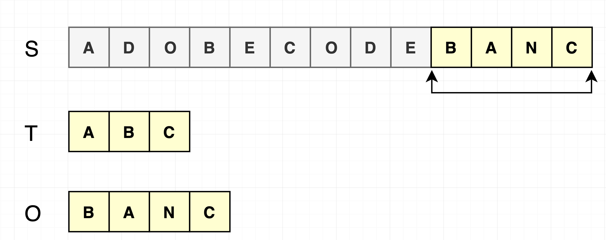
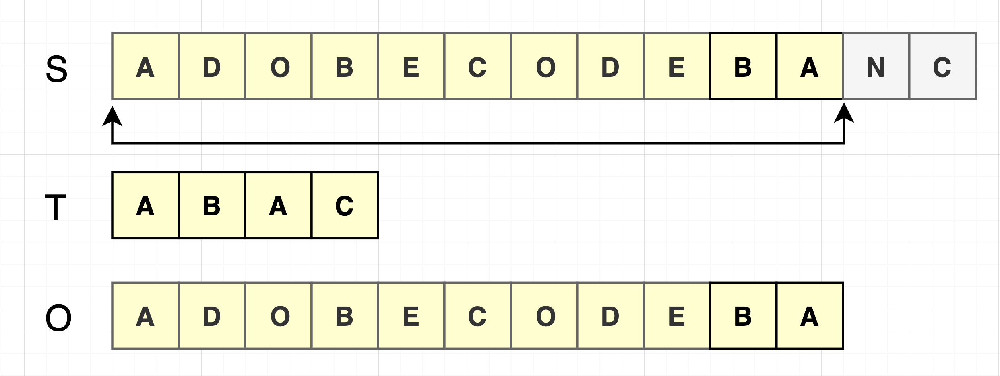
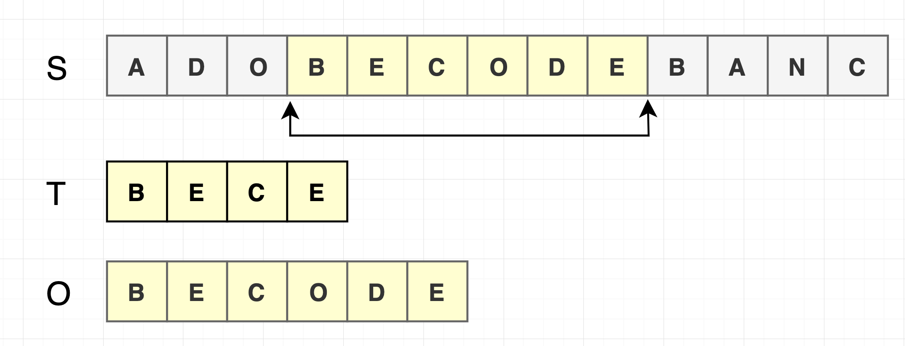
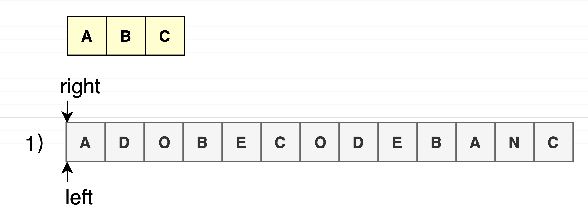
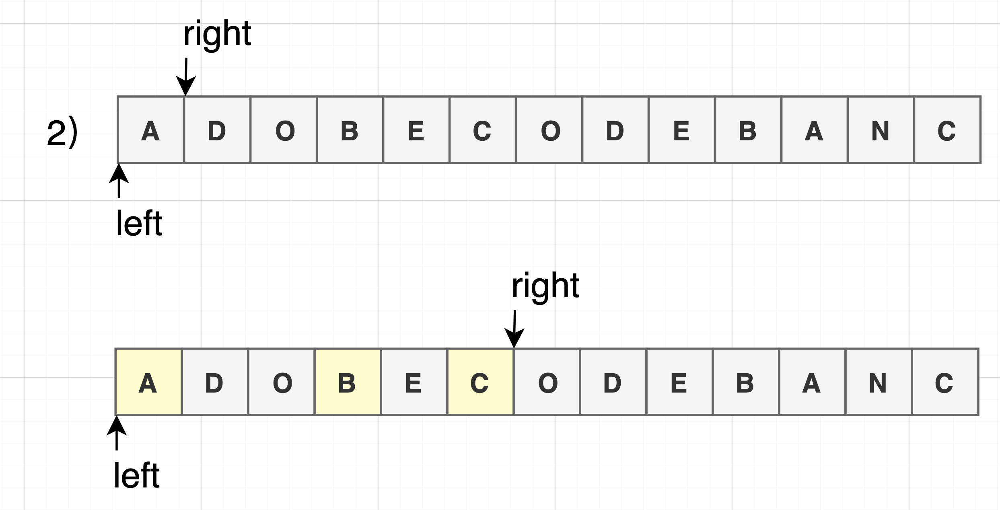
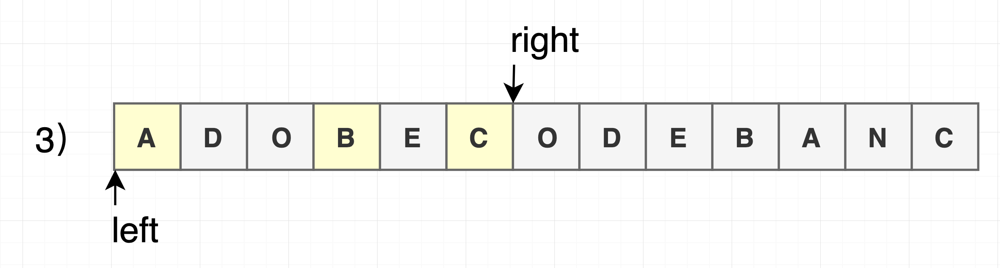
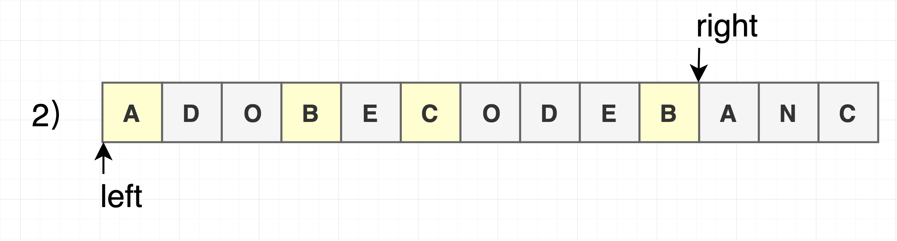
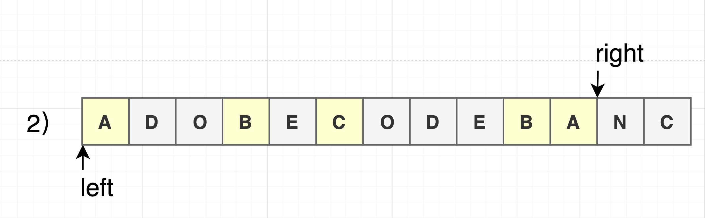
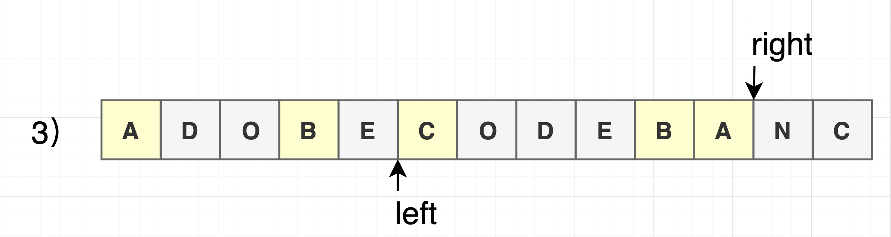
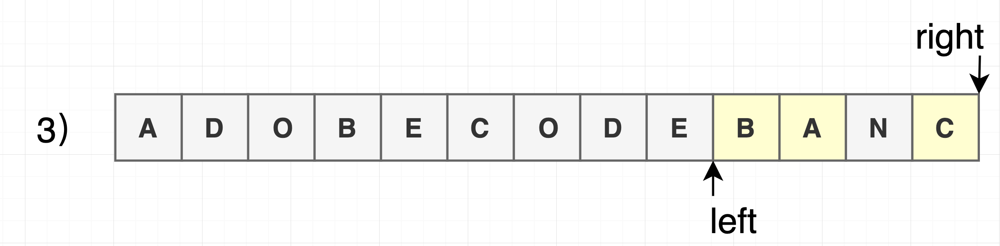

## Minimum Window Substring（最小窗口覆盖子串）

### 一、题目

#### 1. 英文版

【Minimum Window Substring】 
Given a string S and a string T, find the minimum window in S which will contain all the characters in T in complexity O(n).
Example:

Input: S = "ADOBECODEBANC", T = "ABC"
Output: "BANC"

Note: 
· If there is no such window in S that covers all characters in T, return the empty string "". 
· If there is such window, you are guaranteed that there will always be only one unique minimum window in S.

#### 2. 中文版

【最小窗口覆盖子串】
给你一个字符串S、一个字符串T，请在字符串S里面找出：包含T所有字母的最小子串，要求算法的时间复杂度为O(n)。

示例：
输入: S = "ADOBECODEBANC", T = "ABC"
输出: "BANC"

说明：
如果S中不存这样的子串，则返回空字符串""。
如果S中存在这样的子串，我们保证它是唯一的答案。



### 二、题目理解

> 1.在S（source）中找到包含T（target）中**全部字母**的一个子串；

> 2.子串T中**字符不去重**，即 T = "ABC"和 T = "ABAC"是不同的子串，后者需要找到包含两个A的子串，包含"ABAC"的最小窗口覆盖子串为"ADOBECODEBA"；



> 3.**顺序无所谓**，但这个子串一定是所有可能子串中最短的。



### 三、解法

#### 1.暴力解法

```C++
for (int i = 0; i < source.size(); i++)
    for (int j = i + 1; j < source.size(); j++)
        if source[i:j] 包含 t 的所有字母:
            更新答案
```

#### 2.滑动窗口

在滑动窗口类型的问题中都会有两个指针。一个用于延伸现有窗口的right指针，和一个用于收缩窗口的left指针。在任意时刻，只有一个指针运动，而另一个保持静止。

而该题目需要找到包含子串的最小窗口，我们可以通过移动right指针不断扩张窗口。当窗口包含全部所需的字符后，如果能收缩，我们就收缩窗口知道得到最小窗口，最终可以得到最小的可行窗口。
















> 1）初始化：left和right指针都指向S的第一个元素A；

> 2）移动right指针：向右扩张，直到得到一个可行窗口；

> 3）得到可行的窗口后，将left指针逐个右移，如果得到窗口依然可行，则更新最小窗口大小；

> 4）如果窗口不再可行，则跳转到第2）步；

> 5）重复以上步骤，直到遍历完S。

重点关注：
我们更高效地判断第2）步，即判断当前left和right指向的窗口是否可行，也就是是否包含T？


代码：（C++）
```C++
#include <iostream>
#include <unordered_map>

std::string FindMinimumWindowSubstring(std::string source,
                                       std::string target) {
    
    if (source.empty() || target.empty()) {
        return "";
    }

    size_t source_len = source.length();
    size_t target_len = target.length();

    if (source_len < target_len) {
        return "";
    }

    size_t start = 0;           //符合条件的最小窗口的字符串位置
    size_t min_len = UINT_MAX;  //符合条件的最小窗口字符长度
    
    //1）初始化
    size_t left = 0;            //left指针
    size_t right = 0;           //right指针

    std::unordered_map<char, size_t> window_char_map;    //记录当前子串对应char
    std::unordered_map<char, size_t> target_char_map;    //记录目标子串对应char

    for (char c : target) {
        target_char_map[c]++;
    }
    
    size_t target_char_map_len = target_char_map.size();    //target子串中包含字符的个数（去重后）

    size_t match = 0;   //记录已经匹配的字符个数（去重后）
    
    //4）重复：直到S串末尾
    while (right < source_len) {
        
        //2）找到可行窗口，即包含T中所有字符的窗口。
        char current_char = source[right];
        
        //如果target包含该字符
        if (target_char_map.count(current_char)) {
            
            //在当前子串标记匹配该字符
            window_char_map[current_char]++;
            
            if (window_char_map[current_char] == target_char_map[current_char]) {
                match++;    //累加已经匹配字符个数
            }
        }
        right++;    //right指针右移

        //3）如果当前窗口可行，则想办法右移left指针。
        while (match == target_char_map_len) {
            
            //如果符合条件的最小窗口len发生变化，则更新
            if (right - left < min_len) {
                
                //移动记录符合条件的start位置
                start = left;
                
                //更新符合条件的最小窗口len
                min_len = right - left;
            }
            
            char left_char = source[left];
            
            //如果left位置的字符在target中
            if (target_char_map.count(left_char)) {
                
                //从当前窗口中减掉left位置的字符
                if (window_char_map.count(left_char)) {
                    window_char_map[left_char]--;
                }
                
                //如果left位置的字符，在target中是必须的，则match - 1，这会导致下一个while循环终止，即left指针右移操作终止；
                //直到找到可行窗口后，再执行第3）步。
                if (window_char_map[left_char] < target_char_map[left_char]) {
                    if (match > 0) {
                        match--;
                    }
                }
            }
            
            left++; //left指针右移
        }
    }
    
    return min_len == UINT_MAX ? "" : source.substr(start, min_len);
}

int main(int argc, const char * argv[]) {
    
    std::string source = "ADOBECODEBANC";
    std::string target = "ABC";
    printf("\nsource: %s\ntarget: %s\nMinimum window substring is: %s\n", source.c_str(), target.c_str(), FindMinimumWindowSubstring(source, target).c_str());

    source = "ADOBECODEBANC";
    target = "ABAC";
    printf("\nsource: %s\ntarget: %s\nMinimum window substring is: %s\n", source.c_str(), target.c_str(), FindMinimumWindowSubstring(source, target).c_str());
    
    source = "ADOBECODEBANC";
    target = "BECE";
    printf("\nsource: %s\ntarget: %s\nMinimum window substring is: %s\n", source.c_str(), target.c_str(), FindMinimumWindowSubstring(source, target).c_str());
    
    source = "ADOBECODEBANC";
    target = "ABCAC";
    printf("\nsource: %s\ntarget: %s\nMinimum window substring is: %s\n", source.c_str(), target.c_str(), FindMinimumWindowSubstring(source, target).c_str());
    
    return 0;
}
```

#### 3.算法的时间复杂度

> O(M + N)，M和N分别是S和T的长度；
> 其中初始化T每个字符出现个数，时间复杂度为O(N)；
> 遍历S while循环为M次，里面嵌套的while循环总计最多为M次，时间复杂度为O(M)。

### 四、参考资料
> 1.[LeetCode最小覆盖子串](https://leetcode-cn.com/problems/minimum-window-substring)
> 2.[查找包含子串的最小子串](https://www.geeksforgeeks.org/find-the-smallest-window-in-a-string-containing-all-characters-of-another-string/)

