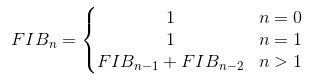
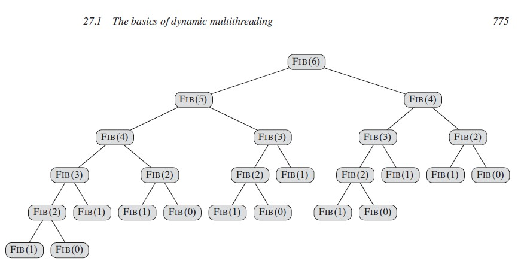
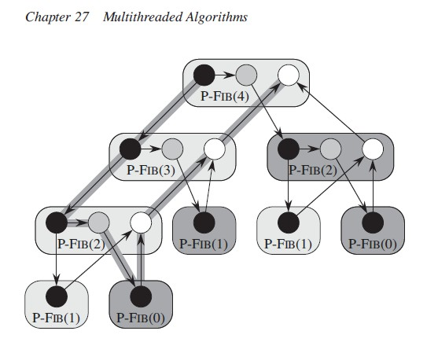
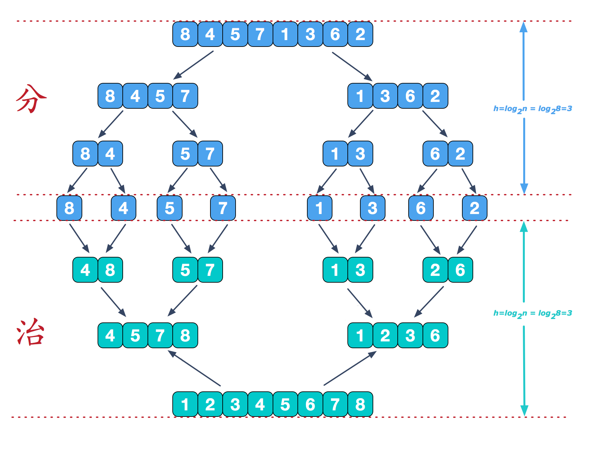

### 为什么使用动态多线程(并行算法)
通常算法优化都有限制，比如排序算法归并和快排时间复杂度都为O(nlogn),我们无法再从优化算法复杂度的角度去提升算法性能，如果此时借助并行算法，性能可以进一步提升，也是非常有意义的。通常能使用于并行算法的有递归问题、分治问题、字符串匹配等问题。
### 并行案例
#### 斐波那契数列(递归问题)
  1, 1, 2, 3, 5, 8, 13, 21, 34, 55, 89, 144，...
  
  
  
 ```java
 int P-FIB(n)
 1.    if n <= 1
 2.        return n;
 3.    else int x = spawn P-FIB(n - 1)
 4.         int y = P-FIB(n - 2)
 5.       sync
 6.      return x + y
```
关键字spawn的作用：嵌套并行调用。父进程派生子进程，与P-FIB(n - 2)并行执行。

关键字sync作用：同步语句。执行完sync之后，一个过程（父进程）才能安全地使用其派生子过程（子进程）的返回值。sync表明，过程在执行sync后面的语句前，必须等到它的所有派生子过程计算完成。
 
 下面是一个：有向无环图
 公式：G=（V，E)
 V，代表定点（指令）；
 Ε ，代表边（指令间的依赖关系）；如：(u , ν) ∈  Ε 表示指令 u必须在 ν之前执行。
 
 
 一个表示P-FIB(4)计算的有向无环图。每个圈代表一个链，黑圈代表基础情形或 
是到第3行P-FIB(n-1)派生语句前的部分程序(实例）；灰圈代表第4行调用P-FIB 
(n—2)到第5行sync前的部分程序，它执行完后一直要等待派生P-FIB(n-1)的返 
回；白圈代表sync指令之后的程序，也就是x和y求和直到返回结果那部分。属于 
同一过程的一组链用圆角矩形圈起来，浅色阴影代表派生的过程，深色阴影代表调 
用的过程。派生边和调用边指向下，连接边水平指向右，返回边指向上。
#### 归并排序(分治问题)
 
 对数组A[p...r]进行归并排序
 ```java
MERGE-SORT’(A, p, r)
1  if p < r
2     q = [(p+r)] /2
3     spawn MERGE-SORT’(A, p, q)
4     MERGE-SORT’(A, q+1, r)
5     Sync
6     MERGE(A, p, q, r)
```
## 多线程竞争
 当两个逻辑上并行的指令去访问同一个内存位置并且只要有其中之一是写入指令时，就会出现确定性竞争 。下面的过程中包含了一个竞争条件：
```java
RACE-EXAMPLE()
1               x = 0
2               parallel for i = 1 to 2
3                    x = x+1
4               print x
```
 当一个处理器在增加 x 时，虽然该操作是不可分割的，但是其是由一系列指令所组成的：
1. 从内存中读取 x ，放入处理器的寄存器。
2. 把寄存器中的值加 1.
3. 把寄存器中的值写回到内存中的 x 。
```java
private int x;
public synchronized void add() {
            x = x + 1;
}
```
synchronized保证原子性和可见性
### java线程池
```java
public ThreadPoolExecutor(int corePoolSize,  
                              int maximumPoolSize, 
                              long keepAliveTime, 
                              TimeUnit unit,
                              BlockingQueue<Runnable> workQueue, 
                              ThreadFactory threadFactory）
```
* **corePoolSize**：核心线程数量  
* **maximumPoolSize**：最大线程数量 
* **workQueue**：等待队列，当任务提交时，如果线程池中的线程数量大于等于corePoolSize的时候，把该任务封装成一个Worker对象放入等待队列  
* **keepAliveTime**：线程池维护线程所允许的空闲时间。当线程池中的线程数量大于corePoolSize的时候，如果这时没有新的任务提交，核心线程外的线程不会立即销毁，而是会等待，直到等待的时间超过了keepAliveTime
* **TimeUnit** ：时间级别
* **handler**：它是RejectedExecutionHandler类型的变量，表示线程池的饱和策略。如果阻塞队列满了并且没有空闲的线程，这时如果继续提交任务，就需要采取一种策略处理该任务

#### workQueue（队列）
* 有界队列 如ArrayBlockingQueue
* 无界队列 如LinkedBlockingQueue
* 同步切换队列 如SynchronousQueue
#### handler（拒绝策略）
* AbortPolicy：直接抛出异常，这是默认策略
* CallerRunsPolicy：用调用者所在的线程来执行任务；
* DiscardOldestPolicy：丢弃阻塞队列中靠最前的任务，并执行当前任务；
* DiscardPolicy：直接丢弃任务；

