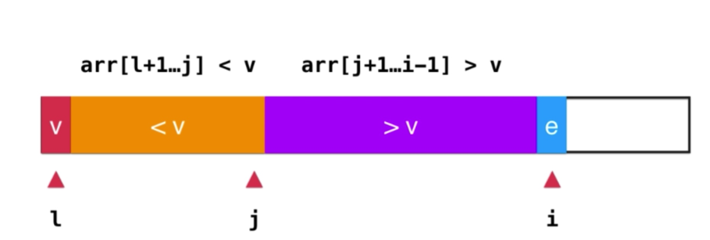
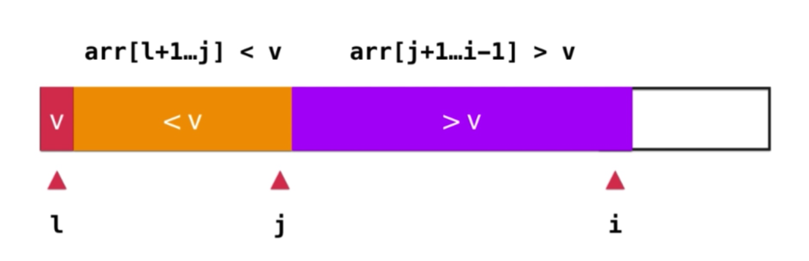
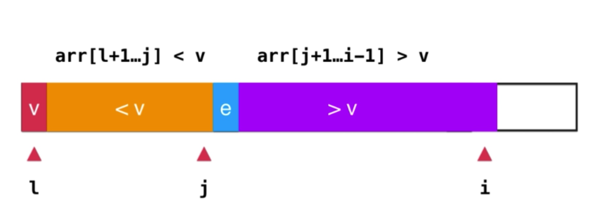
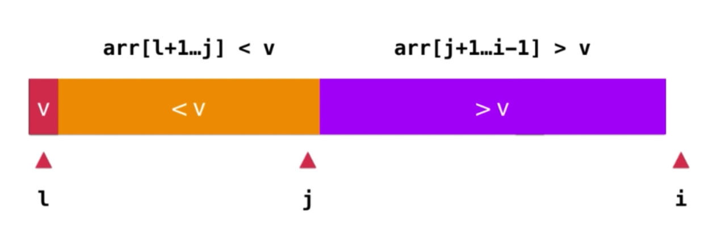
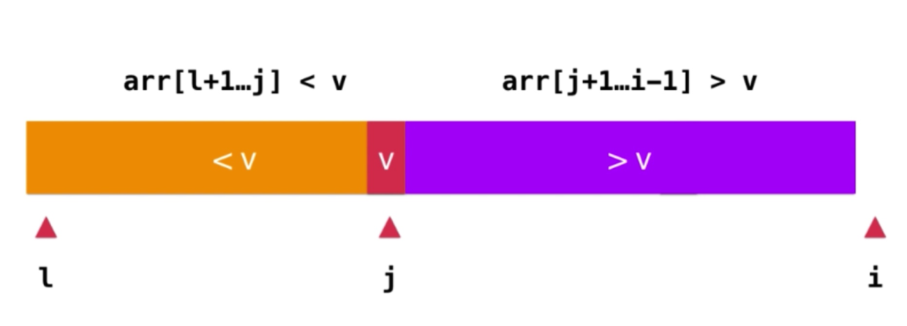
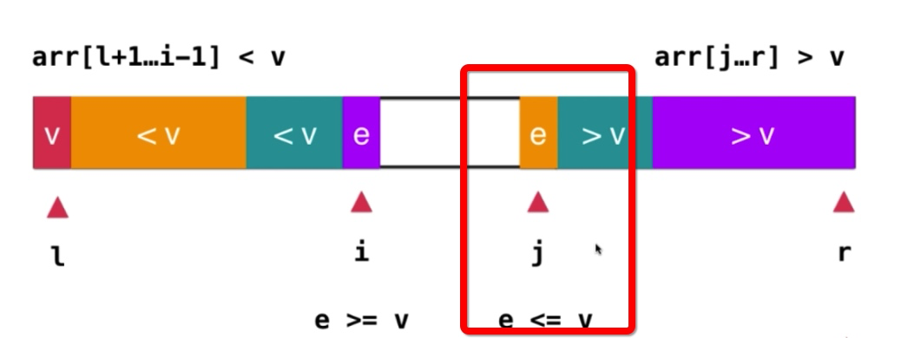
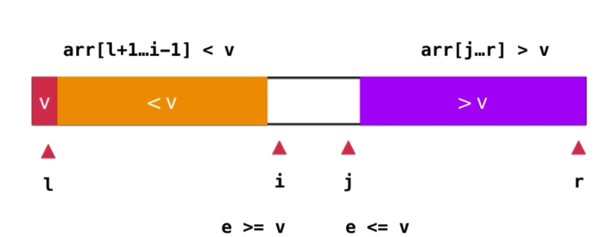
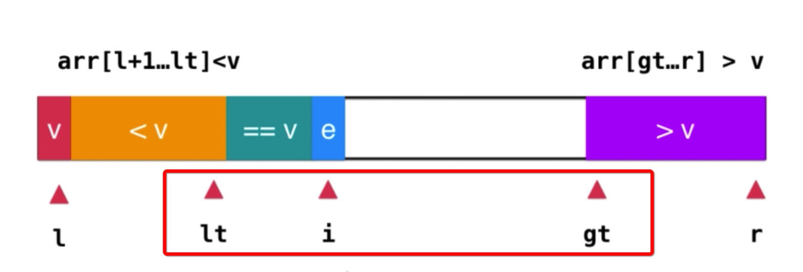
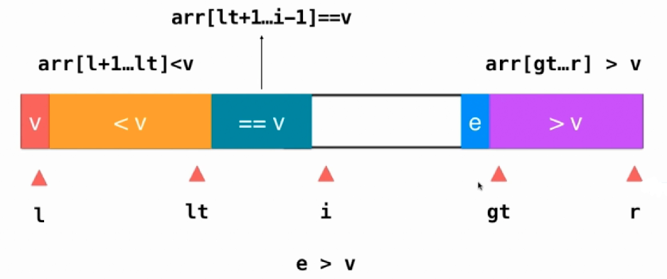
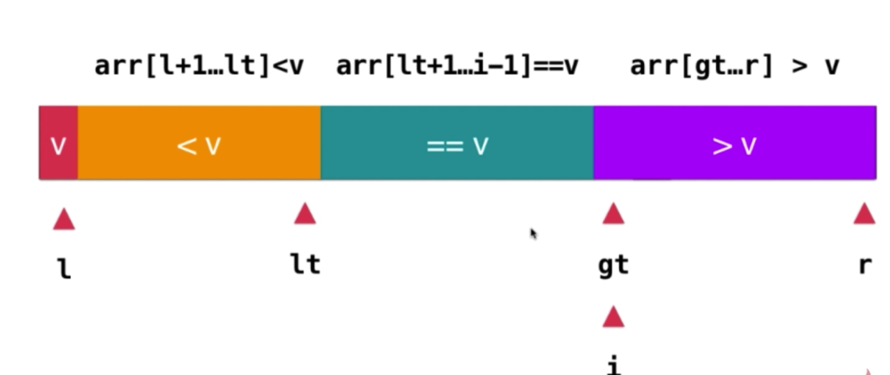

## Merge Sort

### 算法思想

快速排序算法采用经典的分治策略，是对冒泡排序算法（交换排序）的一种改进。

### 基本思路
先递归的把数组划分为两个子数组，一直递归到数组中只有一个元素，然后再调用函数把两个子数组排好序，因为该函数在递归划分数组时会被压入栈，所以这个函数真正的作用是对两个有序的子数组进行排序；

### 基本思路

#### 普通快排
1. 判断参数的有效性，也就是递归的出口；
2. 随机选取一个 value 作为被比较对象；
3. 依次将传入的数组中的元素与 value 做对比，使得 arr[l + 1 ... j - 1] < value、arr[j + 1 ... r] >= value，并返回 j 索引;
4. 递归排序 arr[l ... j - 1] 与 arr[j + 1 ... r] 直到结束；

   
arr[i] >= value
   
arr[i] < value
  
遍历结束 
   
   

<br></br>
#### 双路快排
1. 判断参数的有效性，也就是递归的出口；
2. 随机选取一个 value 作为被比较对象；
3. 依次将传入的数组中的元素与 value 做对比，使得 arr[l + 1 ... i - 1] <= value、arr[j + 1 ... r] >= value（此时即使 arr[i] == arr[j] == value， i、j 也会交换） ，返回 j 索引;
4. 递归排序 arr[l ... j - 1] 与 arr[j + 1 ... r] 直到结束；

   
   

<br></br>
#### 三路快排
1. 判断参数的有效性，也就是递归的出口；
2. 随机选取一个 value 作为被比较对象；
3. 依次将传入的数组中的元素与 value 做对比，使得 arr[l + 1 ... lt] < value、arr[lt + 1 ... gt - 1] == value、arr[gt ... r] > value;
4. 递归排序 arr[l ... lt - 1] 与 arr[gt ... r] 直到结束；

arr[i] == value
  
arr[i] < value 
   
arr[i] > value
  
遍历结束 
   

<br></br>
### 时间复杂度

最优情况下，每次 Partiation 都划分得很均匀，如果排序n个关键字，其递归树的深度就为 [log2n] + 1，即仅需递归 log2n 次；
需要时间为 T(n) 的话，第一次 Partiation 应该是需要对整个数组扫描一遍，做 n 次比较；然后，获得的枢轴将数组一分为二，那么各自还需要 T(n/2) 的时间（注意是最好情况，所以近似于平分两半）；于是不断地划分下去。。。
```
公式：T[n]  =  nT(1) + (log(n)) * n；

推导过程：
T(n) = 2T(n/2) + n
T(n) = 2(2T(n/4) + n/2) + n = 4T(n/4) + 2n
T(n) = 4(2T(n/8) + n/4) + 2n = 8T(n/8) + 3n
......
且 T(1) = 0

结果：T[n] = O(nlogn)
```

最差情况下，当待排序的序列为正序或逆序排列时，且每次划分只得到一个比上一次划分少一个记录的子序列，注意另一个为空。如果递归树画出来，它就是一棵斜树；此时需要执行 n ‐ 1 次递归调用，且第 i 次划分需要经过 n ‐ i 次关键字的比较才能找到第 i 个记录，也就是枢轴的位置。
```
公式：T[n]  = n - 1 + n - 2 +  ...... + 1 = n * (n - 1) / 2 = O(n^2)
```
