[**树的基础**]([https://www.jianshu.com/p/bf73c8d50dc2](https://www.jianshu.com/p/bf73c8d50dc2))

[TOC]

# 1. B树定义

## 1.1 阶数说 

​	**B树** 也称 **B-树**，**B-树** 直接读作B树，不能因为有”-”号就读作B减树，它是一颗多路平衡查找树。我们描述一颗B树时需要指定它的阶数，阶数表示了一个结点最多有多少个孩子结点，一般用字母m表示阶数。当m取2时，就是我们常见的二叉搜索树，m为3时是2-3树。

> （1）**每个结点最多有m-1个关键字。**
> （2）**根结点最少可以只有1个关键字**。
> （3）**非根结点至少有 Math.ceil(m/2)-1 个关键字**。Math.ceil(m/2) 含义是向上取整。例如 Math.ceil(4.5) = 5。
> （4）每个结点中的 Key 都按照从小到大的顺序排列，每个 Key 的左子树中的所有 Key 都小于它，而右子树中的所有 Key 都大于它。
> （5）所有叶子结点都位于同一层，或者说根结点到每个叶子结点的长度都相同。

## 1.2 度数说 

> 1. 对于每个节点，节点包含如下属性：
>
> ​	a)  x.n,表示存储在该节点中关键字的数目
>
> ​	b)  x.n个关键字是以升序的方式排列的，使得x.key1<x.key2.......<x.key(x.n)
>
> ​	c)  x.left代表一个bool值，用来判断该节点是否为叶子节点，若为叶子节点则为true，否则为false。
>
> 2.每个节点内部还包含了x.n+1个指向孩子节点的指针。
>
> 3.对于孩子节点内部的任意关键字都符合下列的性质
>
> ​			k1<x.key1<k2<x.key2.........<k(x.n)
>
> ​	其中k1代表x节点第一个子节点的任意关键字，也就是说节点1的所有关键字都小于x.key1,第二个子节点关键字都介于x.key1和x.key2之间，依次类推。
>
> **4.每个叶节点都有相同的深度，即树的高度h**。
>
> **5.每个节点的关键字的数目不能无限制，要有一个上界和下界，这个界限可以通过固定整数t来表示，t>=2。**
>
> ​	a)  除了根节点以外关键字不能少于t-1，换句话说节点的孩子不能少于t个。
>
> ​	b)  每个节点的关键字不能多于2t-1个，同样节点的孩子不能多于2t个

> **【小结】**
>
> ​	**1. 不管阶数说或是度数说，其中最重要的规定是：每个结点最多包含多少个关键字，最少需要包含多少个关键字。**
>
> ​	**2. 度数说中的【 t 】 其实是阶数说定义中 Math.ceil(m/2) 的值，即 t = Math.ceil(m/2) 。**

## 1.3 为什么要使用B树

  数据库的增删改查等操作是开发过程中最为常见也是尤为重要的，尤其是现在大数据的兴起，导致数据存储量急剧增加，提升数据的操作效率就变得尤为关键。大部分数据库的索引都采用树的结构存储，这是因为树的查询效率相对较高，且保持有序。
  对于二叉搜索树的时间复杂度是O(logN)，在算法以及逻辑上来分析，二叉搜索树的查找速度以及数据比较次数都是较小的。但是我们不得不考虑一个新的问题。数据量是远大于内存大小的，那我们在查找数据时并不能将全部数据同时加载至内存。既然不能全部加载至内存中就只能逐步的去加载磁盘中某个页，简而言之就是逐一的去加载磁盘，加数据分块的加载至内存进行查找与比较。
  例如：在图1.1所示的树中查找10，树中的每个节点代表一个磁盘页。每次访问一个新节点代表一次磁盘IO。

 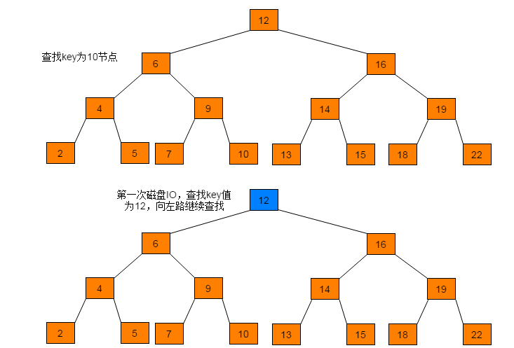

 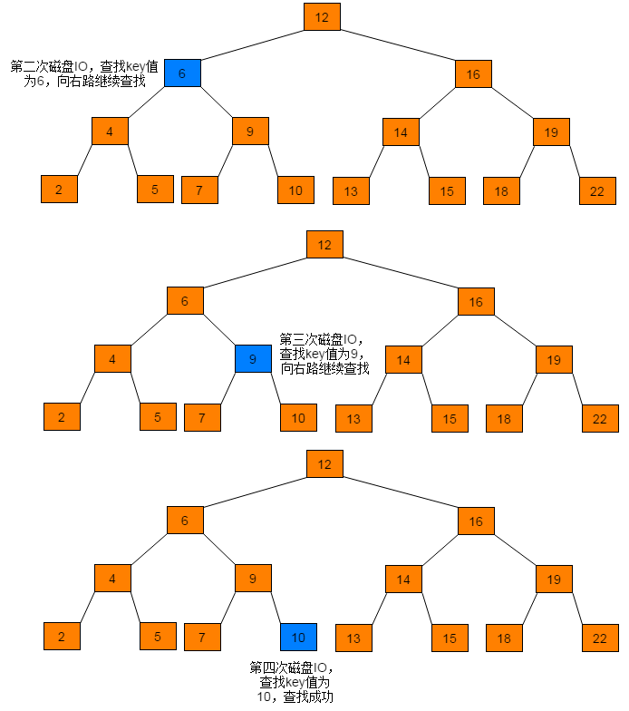

> 【图  1.1】

​	

​	通过查找过程可以看出，磁盘IO次数与树的高度相关，在最坏情况下，磁盘IO次数等于树的高度。由于磁盘IO过程是相对耗时效率较低的，如果树中的结点数据是存储在磁盘上的，**每访问一个结点需要进行一次磁盘的读取操作，那么树的高度就很重要了**，因此，在设计数据存储结构时需要降低树的高度，即将一棵“瘦高”的树变得“矮胖”。
  当数据数目相同，在保持有序前提下，降低树高度，只需将节点中存储的key值增加，即二叉搜索树中每个节点只有一个key，现将**一个节点中存储多个key，得到的树即为B树**。

## 1.4 认识一个普通的B树

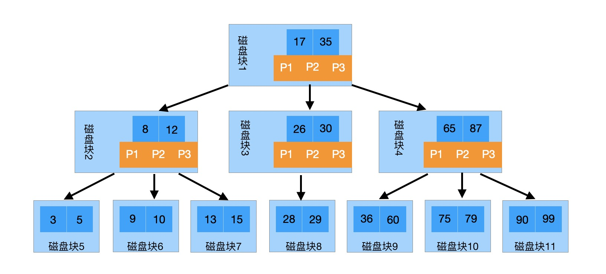

# 2. 查找

## 2.1 查找过程

来模拟下查找文件29的过程：

> (1) 根据根结点指针找到文件目录的根磁盘块1，将其中的信息导入内存。**【磁盘IO操作1次】**
>
>  (2) 此时内存中有两个文件名17，35和三个存储其他磁盘页面地址的数据。根据算法我们发现17<29<35，因此我们找到指针p2。
>
>  (3) 根据p2指针，我们定位到磁盘块3，并将其中的信息导入内存。**【磁盘IO操作2次】**
>
>  (4) 此时内存中有两个文件名26，30和三个存储其他磁盘页面地址的数据。根据算法我们发现26<29<30，因此我们找到指针p2。
>
>  (5) 根据p2指针，我们定位到磁盘块8，并将其中的信息导入内存。**【磁盘IO操作3次】**
>
> (6) 此时内存中有两个文件名28，29。根据算法我们查找到文件29，并定位了该文件内存的磁盘地址。

## 2.2 性能分析

​	**B-树的查找其实是对二叉搜索树查找的扩展， 与二叉搜索树不同的地方是，B-树中每个节点有不止一棵子树。在B-树中查找某个结点时，需要先判断要查找的结点在哪棵子树上，然后在结点中逐个查找目标结点。**

​	而且B类树是平衡树，每个结点到叶子结点的高度都是相同，这也保证了每个查询是稳定的，查询的时间复杂度是**O(log2N)**。

# 3. 插入

## 3.1 插入流程

> （1）根据要插入的key的值，对B树执行查找操作，查找到待插入数据的当前节点位置。
>
> （2）判断当前结点key的个数是否小于等于m-1，若满足，则结束直接插入数据，否则，进行第（3）步。
>
> （3）以结点中间的key为中心分裂成左右两部分，然后将这个中间的key插入到父结点中，这个key的左子树指向分裂后的左半部分，这个key的右子支指向分裂后的右半部分，然后将当前结点指向父结点，继续进行本步骤。

## 3.2 插入图解

 

下面以5阶B树为例，介绍B树的插入操作，在5阶B树中，结点最多有4个key,最少有2个key。

------

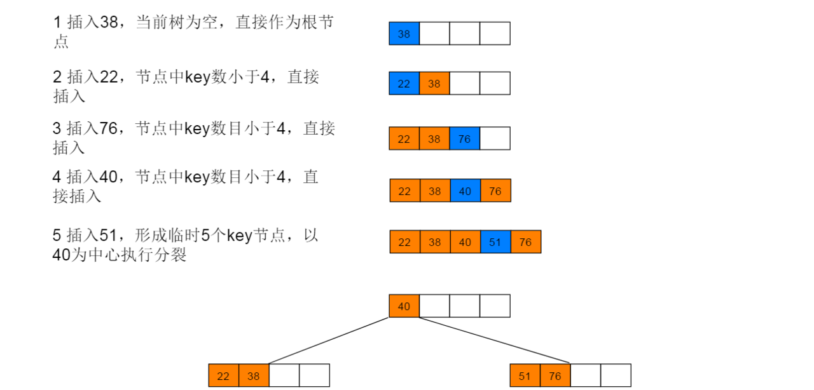

---------

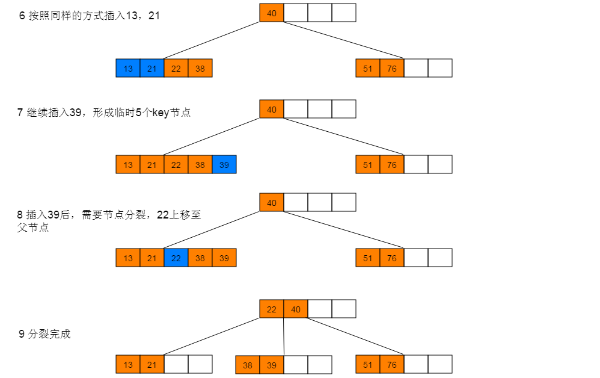

------

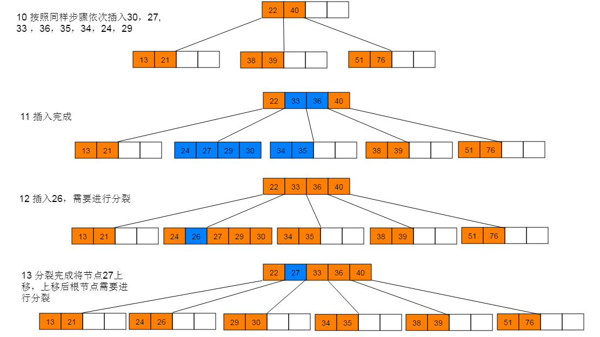

------

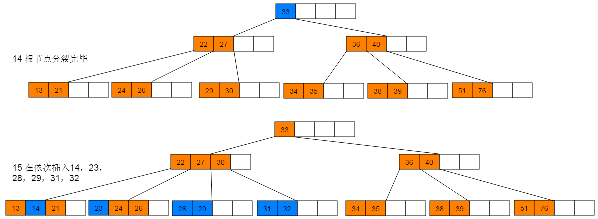

## 3.3 性能分析

  B树插入过程首先需要执行一次查找操作，B树的查找操作的时间复杂度为O(mlogmn)。其中m为B树的阶数，n为B树中key的数目。在插入过程，最耗时的情形即为：插入数据后导致根节点发生分裂，分裂节点的操作是常数级，分裂操作向上回溯的时间复杂度为O(h)。因此，B树的插入操作的时间复杂度近似于查找操作，即O(mlogmn)

# 4. 删除

## 4.1 删除流程

> （1）如果当前需要删除的key位于非叶子结点上，则用后继key（这里的后继key均指后继记录的意思）覆盖要删除的key，然后在后继key所在的子支中删除该后继key。此时后继key一定位于叶子结点上，这个过程和二叉搜索树删除结点的方式类似。删除这个记录后执行第2步
>
> （2）该结点key个数大于等于Math.ceil(m/2)-1，结束删除操作，否则执行第（3）步。
>
> （3）如果兄弟结点key个数大于Math.ceil(m/2)-1，则父结点中的key下移到该结点，兄弟结点中的一个key上移，删除操作结束。否则，将父结点中的key下移与当前结点及它的兄弟结点中的key合并，形成一个新的结点。原父结点中的key的两个孩子指针就变成了一个孩子指针，指向这个新结点。然后当前结点的指针指向父结点，重复第（2）步

## 4.2 删除图解

------

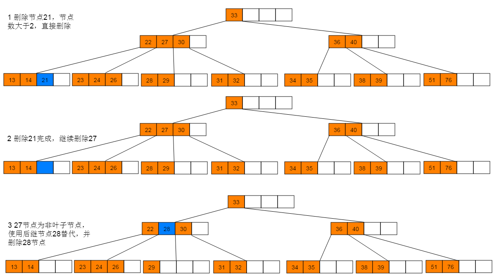

------

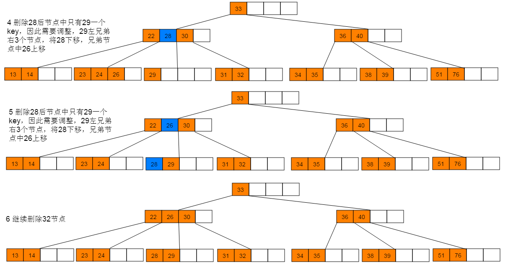

------

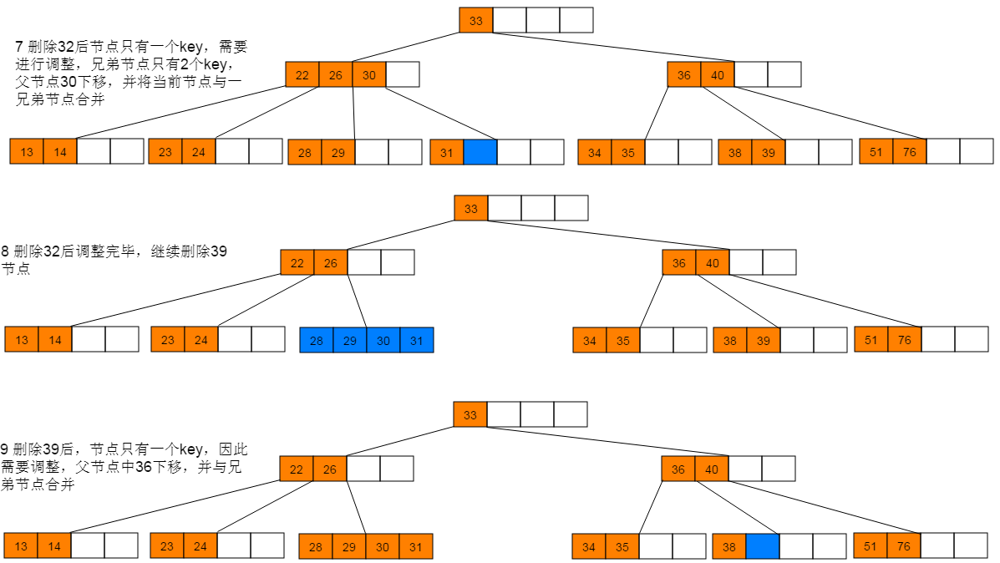

------

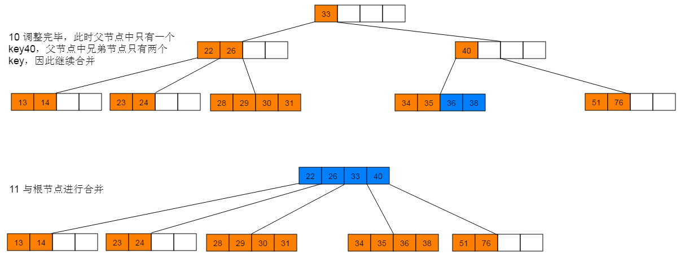

## 4.3 性能分析

​	B树的删除操作同样需要执行查找过程，时间复杂度为O(mlogmn)。删除数据过程与插入过程类似，最坏情况需要回溯O(h)。因此B树的删除操作的时间复杂度近似为O(mlogmn)。

# 5.总结

​	**B树是一种平衡的多路查找树。**其设计思路主要是通过节点中存储不止一个key，来降低树的高度。同等比较次数下，树的高度小保证磁盘IO次数相对较少，提高查找效率。

