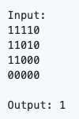
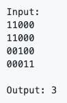
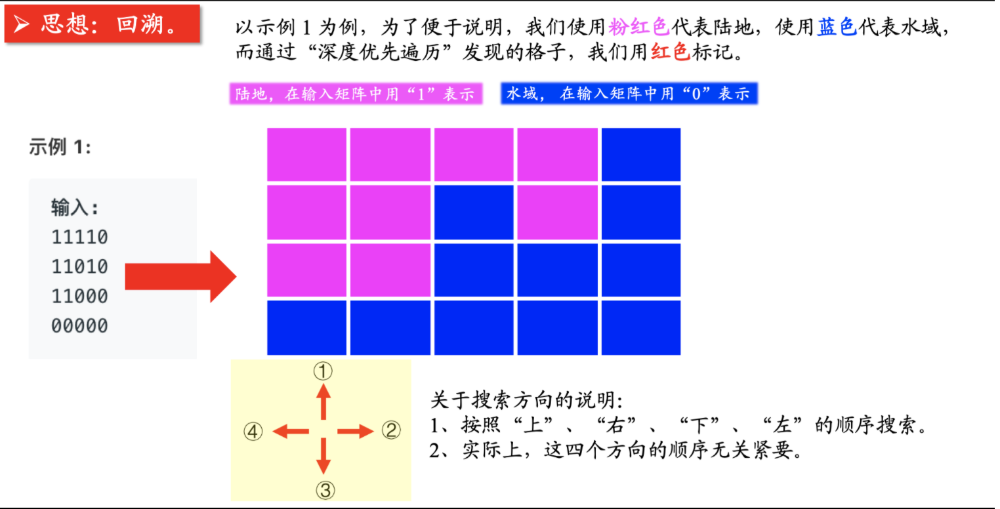

# 问题
给你一个由 '1'（陆地）和 '0'（水）组成的的二维网格，请你计算网格中岛屿的数量。岛屿总是被水包围，并且每座岛屿只能由水平方向或竖直方向上相邻的陆地连接形成。此外，你可以假设该网格的四条边均被水包围。


示例1：



示例2：




# 深度优先遍历DFS




```


/**
 * 方法一：深度优先遍历
 */
public class Solution {

    //           x-1,y
    //  x,y-1    x,y      x,y+1
    //           x+1,y
    // 方向数组，它表示了相对于当前位置的 4 个方向的横、纵坐标的偏移量，这是一个常见的技巧
    private static final int[][] directions = {{-1, 0}, {0, -1}, {1, 0}, {0, 1}};
    // 标记数组，标记了 grid 的坐标对应的格子是否被访问过
    private boolean[][] marked;
    // grid 的行数
    private int rows;
    // grid 的列数
    private int cols;
    private char[][] grid;

    public int numIslands(char[][] grid) {
        rows = grid.length;
        if (rows == 0) {
            return 0;
        }
        cols = grid[0].length;
        this.grid = grid;
        marked = new boolean[rows][cols];
        int count = 0;
        for (int i = 0; i < rows; i++) {
            for (int j = 0; j < cols; j++) {
                // 如果是岛屿中的一个点，并且没有被访问过
                // 就进行深度优先遍历
                if (!marked[i][j] && grid[i][j] == '1') {
                    count++;
                    dfs(i, j);
                }
            }
        }
        return count;
    }

    // 从坐标为 (i,j) 的点开始进行深度优先遍历
    private void dfs(int i, int j) {
        marked[i][j] = true;
        // 得到 4 个方向的坐标
        for (int k = 0; k < 4; k++) {
            int newX = i + directions[k][0];
            int newY = j + directions[k][1];
            // 如果不越界、没有被访问过、并且还要是陆地
            if (inArea(newX, newY) && grid[newX][newY] == '1' && !marked[newX][newY]) {
                dfs(newX, newY);
            }
        }
    }

    // 封装成 inArea 方法语义更清晰
    private boolean inArea(int x, int y) {
        // 等于号不要忘了
        return x >= 0 && x < rows && y >= 0 && y < cols;
    }

    public static void main(String[] args) {
        Solution solution = new Solution();
        char[][] grid1 = {
                {'1', '1', '1', '1', '0'},
                {'1', '1', '0', '1', '0'},
                {'1', '1', '0', '0', '0'},
                {'0', '0', '0', '0', '0'}};
        int numIslands1 = solution.numIslands(grid1);
        System.out.println(numIslands1);

        char[][] grid2 = {
                {'1', '1', '0', '0', '0'},
                {'1', '1', '0', '0', '0'},
                {'0', '0', '1', '0', '0'},
                {'0', '0', '0', '1', '1'}};
        int numIslands2 = solution.numIslands(grid2);
        System.out.println(numIslands2);
    }
}
```
## 复杂度分析
时间复杂度：O(MN)O(MN)，其中 MM 和 NN 分别为行数和列数。

空间复杂度：O(MN)O(MN)，在最坏情况下，整个网格均为陆地，深度优先搜索的深度达到 M NMN。


# 广度优先遍历 BFS

我一开始在编写的时候，等到队列出队的时候才标记 “已经访问”，事实上，这种做法是错误的。因为如果不在刚刚入队列的时候标记 “已经访问”，相同的结点很可能会重复入队。


```

import java.util.LinkedList;

/**
 * 方法二：广度优先遍历
 */
public class Solution2 {


    private int rows;
    private int cols;

    public int numIslands(char[][] grid) {
        //           x-1,y
        //  x,y-1    x,y      x,y+1
        //           x+1,y
        int[][] directions = {{-1, 0}, {0, -1}, {1, 0}, {0, 1}};

        rows = grid.length;
        if (rows == 0) {
            return 0;
        }
        cols = grid[0].length;
        boolean[][] marked = new boolean[rows][cols];
        int count = 0;
        for (int i = 0; i < rows; i++) {
            for (int j = 0; j < cols; j++) {
                // 如果是岛屿中的一个点，并且没有被访问过
                // 从坐标为 (i,j) 的点开始进行广度优先遍历
                if (!marked[i][j] && grid[i][j] == '1') {
                    count++;
                    LinkedList<Integer> queue = new LinkedList<>();
                    // 小技巧：把坐标转换为一个数字
                    // 否则，得用一个数组存，在 Python 中，可以使用 tuple 存
                    queue.addLast(i * cols + j);
                    // 注意：这里要标记上已经访问过
                    marked[i][j] = true;
                    while (!queue.isEmpty()) {
                        int cur = queue.removeFirst();
                        int curX = cur / cols;
                        int curY = cur % cols;
                        // 得到 4 个方向的坐标
                        for (int k = 0; k < 4; k++) {
                            int newX = curX + directions[k][0];
                            int newY = curY + directions[k][1];
                            // 如果不越界、没有被访问过、并且还要是陆地，我就继续放入队列，放入队列的同时，要记得标记已经访问过
                            if (inArea(newX, newY) && grid[newX][newY] == '1' && !marked[newX][newY]) {
                                queue.addLast(newX * cols + newY);
                                // 【特别注意】在放入队列以后，要马上标记成已经访问过，语义也是十分清楚的：反正只要进入了队列，你迟早都会遍历到它
                                // 而不是在出队列的时候再标记
                                // 【特别注意】如果是出队列的时候再标记，会造成很多重复的结点进入队列，造成重复的操作，这句话如果你没有写对地方，代码会严重超时的
                                marked[newX][newY] = true;
                            }
                        }
                    }
                }
            }

        }
        return count;
    }

    private boolean inArea(int x, int y) {
        // 等于号这些细节不要忘了
        return x >= 0 && x < rows && y >= 0 && y < cols;
    }

    public static void main(String[] args) {
        Solution2 solution2 = new Solution2();
        char[][] grid1 = {
                {'1', '1', '1', '1', '0'},
                {'1', '1', '0', '1', '0'},
                {'1', '1', '0', '0', '0'},
                {'0', '0', '0', '0', '0'}};
        int numIslands1 = solution2.numIslands(grid1);
        System.out.println(numIslands1);

        char[][] grid2 = {
                {'1', '1', '0', '0', '0'},
                {'1', '1', '0', '0', '0'},
                {'0', '0', '1', '0', '0'},
                {'0', '0', '0', '1', '1'}};
        int numIslands2 = solution2.numIslands(grid2);
        System.out.println(numIslands2);
    }
}
```

## 复杂度分析
时间复杂度：O(MN)O(MN)，其中 MM 和 NN 分别为行数和列数。

空间复杂度：O(min(M, N))O(min(M,N))，在最坏情况下，整个网格均为陆地，队列的大小可以达到 min(M, N)min(M,N)。


# 使用并查集

## 并查集
在计算机科学中，并查集是一种树型的数据结构，用于处理一些不交集（Disjoint Sets）的合并及查询问题。有一个联合-查找算法（union-find algorithm）定义了两个用于此数据结构的操作：

Find：确定元素属于哪一个子集。它可以被用来确定两个元素是否属于同一子集。
Union：将两个子集合并成同一个集合。


### 使用并查集解决本问题的思想很简单：

1、如果当前是“陆地”，尝试与周围合并一下；

2、如果当前是“水域”，就把所有的“水域”合并在一起，为此，我设置了一个虚拟的结点，表示“所有的水域都和这个虚拟结点是连接的”。
## 注意
最终岛屿的数量就是并查集中连通分量的数目。

把整个grid传入UnionFind计算count
二维矩阵m*n,在一维数组的位置是：（第几行×矩阵宽度）+ 在第几列
历遍grid时，前面已经执行过，不用往回查


```

class Solution {
    public int numIslands(char[][] grid) {
        if (grid == null || grid.length == 0 ){
            return 0;
        }
        int m = grid.length;
        int n = grid[0].length;
        UnionFind uf = new UnionFind(grid);
        for (int i = 0; i< m; i++){
            for(int j = 0; j< n; j++){
                if (grid[i][j] == '1') {
                    //二维矩阵m*n,z在一维数组的位置是：（第几行×矩阵宽度）+ 在第几列
                    //前面已经执行过，不用往回查
                    if (i + 1 < m && grid[i+1][j] == '1') {
                        uf.union(i * n + j, (i+1) * n + j);
                    }
                    if (j + 1 < n && grid[i][j+1] == '1') {
                        uf.union(i * n + j, i * n + j + 1);
                    }
                }
            }
        }
        return uf.count;
    }

    class UnionFind{
        int[] parent;
        int count;
        public UnionFind(char[][] grid) {
            int m = grid.length;
            int n = grid[0].length;
            parent = new int[m * n];
            for (int i = 0; i < m; ++i) {
                for (int j = 0; j < n; ++j) {
                    if (grid[i][j] == '1') {
                        //二维变一维
                        parent[i * n + j] = i * n + j;
                        count++;
                    }
                }
            }
        }

        public int find(int p){
            while(p!= parent[p]){
                //压缩路径，optional
                parent[p] = parent[parent[p]];
                p = parent[p];
            }
            return p;
        }

        public void union(int p, int q){
            int rootP = find(p);
            int rootQ = find(q);
            if (rootP == rootQ) return;
            parent[rootP] = rootQ;
            count--;
        }
    }
}
```
## 复杂度分析
时间复杂度：O(MN * alpha(MN))O(MN∗α(MN))，其中 MM 和 NN 分别为行数和列数。注意当使用路径压缩（见 find 函数）和按秩合并（见数组 rank）实现并查集时，单次操作的时间复杂度为 alpha(MN)α(MN)，其中 alpha(x)α(x) 为反阿克曼函数，当自变量 xx 的值在人类可观测的范围内（宇宙中粒子的数量）时，函数 alpha(x)α(x) 的值不会超过 55，因此也可以看成是常数时间复杂度。

空间复杂度：O(MN)O(MN)，这是并查集需要使用的空间。


